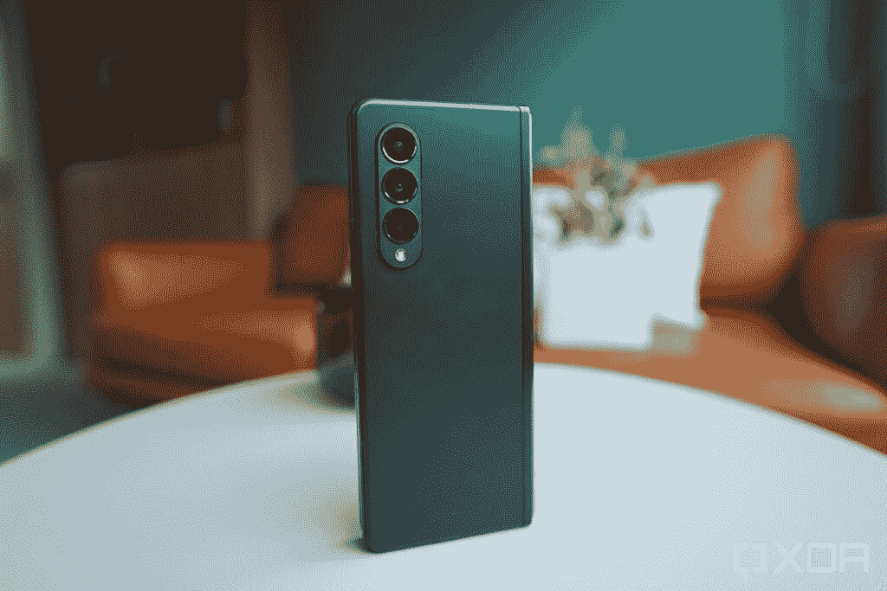

# Galaxy Z Fold 4 可能会采用与 Galaxy S22 相同的 3 倍长焦相机

> 原文：<https://www.xda-developers.com/galaxy-z-fold-4-same-telephoto-camera-galaxy-s22-series/>

三星将在今年晚些时候推出第四代可折叠手机 Galaxy Z Fold 4 和 Galaxy Z Flip 4。虽然该公司迄今为止尚未分享任何有关这些设备的细节，但最近的泄露表明， [Galaxy Z Fold 4 可能会像](https://www.xda-developers.com/galaxy-z-fold-4-integrated-s-pen/) [Galaxy S22 Ultra](https://www.xda-developers.com/samsung-galaxy-s22-ultra-review/) 一样配备集成的 S Pen 。如果 GalaxyClub 最近的一份报告可信，即将推出的旗舰产品 foldable 也可能采用与 Galaxy S22 系列相同的 3 倍长焦相机。

不知道的是，三星没有对去年的 Galaxy Z Fold 3 进行任何重大的摄像头改进。这款设备配备了与 Galaxy Z Fold 2 和 Galaxy S20 相同的相机硬件，鉴于其 1800 美元的价格，这是一个很大的失望。然而，根据新泄露的消息，三星可能最终准备好给 Galaxy Z Fold 系列带来它应得的相机升级。

泄露的消息称，即将发布的 Galaxy Z Fold 4 将采用与 Galaxy S22 系列相同的 10MP 3x 长焦变焦相机。如果这被证明是真的，这将是对 Galaxy Z Fold 3 上 12MP 2x 长焦相机的一个重大改进。然而，据报道，这款设备将采用与其前代产品相同的 10MP 自拍相机。

 <picture></picture> 

Samsung Galaxy Z Fold 3

可悲的是，泄漏并没有照亮其余的摄像头传感器。但这并不意味着三星不会给主摄像头和超宽摄像头增加规格。Galaxy Z Fold 4 可能会采用与 Galaxy S22 系列相同的 50MP 主摄像头和 12MP 超宽摄像头。然而，目前我们没有任何证据证实这一点。

我们希望在发布前的几个月里了解更多关于 Galaxy Z Fold 4 和 Galaxy Z Flip 4 的信息。一旦我们有更多的细节，我们一定会让你知道。

值得注意的是，三星的第四代可折叠手机可能不会被称为 Galaxy Z Fold 4 和 Galaxy Z Flip 4。该公司最近[在一些地区](https://www.xda-developers.com/samsung-galaxy-foldables-remove-z-branding/)从其可折叠品牌中删除了“Z ”,三星有可能在即将推出的可折叠产品中完全删除它。