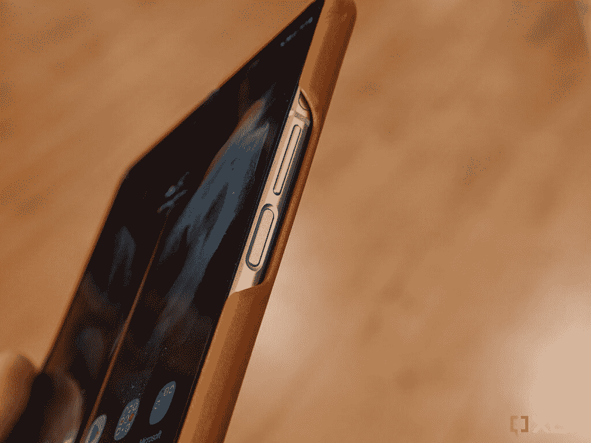

# Galaxy Z Fold 4 和 Galaxy Z Flip 4 可能不会配备显示指纹扫描仪

> 原文：<https://www.xda-developers.com/galaxy-z-fold-4-z-flip-4-side-mounted-fingerprint/>

# 据报道，Galaxy Z Fold 4 和 Galaxy Z Flip 4 将配备侧装式指纹扫描仪

关于即将到来的 Galaxy Z Fold 4 和 Galaxy Z Flip 4 的新泄漏消息称，Samsugn 不会在这些设备上提供显示指纹传感器。

据报道，三星将在今年第三季度揭开第四代可折叠手机 Galaxy Z Fold 4 和 Galaxy Z Flip 4 的外壳。虽然我们距离发布还有几个月的时间，但关于即将到来的设备的泄露已经开始出现。例如，本周早些时候，我们了解到 Galaxy Z Fold 4 [可能会采用与 Galaxy S22 系列](https://www.xda-developers.com/galaxy-z-fold-4-same-telephoto-camera-galaxy-s22-series/)相同的 3 倍长焦镜头。现在，来自 *Business Korea* 的一份新报告称，三星将不会在其下一代可折叠手机上提供内置指纹传感器。

根据该报道，几家媒体和业内人士此前预测，三星将基于三星向世界知识产权组织(WIPO)申请的专利，在其第四代可折叠手机上提供显示指纹扫描仪。虽然这可能是真的，但据报道，三星现在已经重新考虑了它的决定，它现在计划在 Galaxy Z Fold 4 和 Galaxy Z Flip 4 上提供侧装指纹扫描仪。

 <picture></picture> 

Side-mounted fingerprint scanner on the Galaxy Z Fold 3

与 [Galaxy Z Fold 3](https://www.xda-developers.com/samsung-galaxy-z-fold-3-review/) 和 [Galaxy Z Flip 3](https://www.xda-developers.com/samsung-galaxy-z-flip-3-review/) 上的指纹扫描仪一样，即将推出的机型上的指纹扫描仪将集成到侧面的电源按钮中。侧装式指纹扫描仪在可折叠手机上确实更有意义，因为它让用户在打开显示屏的同时自然解锁他们的设备。

虽然三星可能已经放弃了在 Galaxy Z Fold 4 和 Galaxy Z Flip 4 上提供显示指纹扫描仪的计划，但其他原始设备制造商仍在探索这一选项。根据最近的报道，Vivo 即将推出的可折叠产品 Vivo X Fold 将在主显示屏和盖显示屏上安装超声波显示指纹扫描仪。Vivo 将在下周早些时候宣布该设备，我们迫不及待地想看到 Vivo 的实现。

*与可折叠平板电脑上的侧装式解决方案相比，您更喜欢内置指纹扫描仪吗？请在下面的评论区告诉我们。*

* * *

**来源:** [商朝](http://www.businesskorea.co.kr/news/articleView.html?idxno=90436)

*特色图片:Galaxy Z Fold 4 上的侧装式指纹扫描仪*