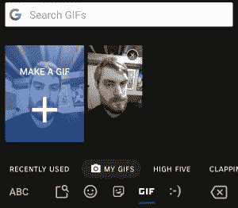

# Gboard 8.2.2 暗示自定义 GIF 创建即将消失，为新的隐私控制做准备，并在分屏模式下自动启用浮动键盘

> 原文：<https://www.xda-developers.com/gboard-8-2-2-custom-gif-creation-going-away-prepares-opting-out-personalization-automatically-enabling-floating-keyboard-split-screen-multi-window/>

Gboard 版本 8.2.2 正在谷歌 Play 商店的测试频道中推出。表面上看，似乎没有太多变化。像往常一样，有很多变化在等着被发现。虽然没有任何主要的新功能，但对隐私控制和设置页面的设计有一些值得注意的调整。然而，最重要的是，谷歌可能很快会停止对 GIF 创建工具的支持。

APK 拆卸通常可以预测应用程序未来更新中可能出现的功能，但我们在这里提到的任何功能都可能不会出现在未来的版本中。这是因为这些功能目前还没有在 live build 中实现，可能会在未来的版本中随时被 Google 拉出来。

## GIF 相机功能的结束

去年，谷歌推出了一款 GIF 制作工具，带有 Gboard beta 的[7.2 版本。这个工具可以让你录制一段 3 秒钟的自己的视频，然后转换成 GIF 格式，你可以通过 Gboard 的“我的 GIF”部分发送出去。这是一个有趣的工具，可以发送傻傻的 gif 给你的朋友和家人。](https://www.xda-developers.com/gboard-gif-creation/)

 <picture></picture> 

Making a GIF in Gboard. Credits: Joe Fedewa//XDA.

可悲的是，新的字符串表明该特性将在未来的 Gboard 版本中消失。从好的方面来看，谷歌将在该功能被取消之前给你机会保存你现有的 gif。

```
 <string name="makeagif_dep_banner">The GIF Camera feature will go away soon.</string>
<string name="makeagif_dep_button_retry">RETRY</string>
<string name="makeagif_dep_button_review">REVIEW</string>
<string name="makeagif_dep_button_save">SAVE</string>
<string name="makeagif_dep_general">The GIF Camera feature will go away soon.</string>
<string name="makeagif_dep_mygifs_done">The GIF Camera feature will go away soon. Any custom GIFs have been saved. Send Feedback by pressing here.</string>
<string name="makeagif_dep_mygifs_error_permission">We need permissions to save your GIFs</string>
<string name="makeagif_dep_mygifs_error_save">Error saving your GIFs. Please try again</string>
<string name="makeagif_dep_mygifs_needsave">The GIF Camera feature will go away soon. Save your custom GIFs</string>
<string name="makeagif_dep_mygifs_saved">Save Completed</string>
<string name="makeagif_dep_mygifs_saving">Saving your GIFs to the gallery</string>
<string name="makeagif_dep_mygifs_unused">The GIF Camera feature will go away soon. Send Feedback by pressing here.</string> 
```

## 自动启用浮动键盘

在分屏模式下使用键盘可能会很痛苦，所以谷歌正在开发一个新功能，当你进入多窗口、自由模式或风景模式时，它会自动切换[浮动键盘模式](https://www.xda-developers.com/gboard-android-floating-keyboard-mode/)。

```
 <string name="pref_key_disable_auto_floating_keyboard_in_freeform">disable_auto_floating_keyboard_in_freeform</string>
<string name="pref_key_disable_auto_floating_keyboard_in_landscape">disable_auto_floating_keyboard_in_landscape</string>
<string name="pref_key_disable_auto_floating_keyboard_in_multi_window">disable_auto_floating_keyboard_in_multi_window</string> 
```

在 XDA 公认的开发者 Quinny899 的帮助下，我成功激活了这个功能。我录制了下面的视频，展示了当我在分屏状态下关注文本输入框时，Gboard 自动进入浮动模式。

## 更好的隐私控制

谷歌正在高级设置页面测试新的更好的隐私设置。关闭个性化将阻止 Gboard 适应你的打字习惯，而关闭[联合学习](https://ai.googleblog.com/2017/04/federated-learning-collaborative.html)将禁用通过应用内谷歌搜索小工具显示相关查询的设备上模型。最后，测试中的一项新设置将允许用户删除 Gboard 在他们身上收集的所有单词和数据。

## 材料主题设置

对设置的微小调整使 Gboard 更加符合谷歌应用套件的其余部分。设置页面正在重新设计，以遵循谷歌材料主题指南。不再有分隔首选项的线条，标题背景现在是白色的，而文本是黑色的，文本字体现在是 Google Sans。

*上图:Gboard 8.1.8 中的旧设置设计。下图:Gboard 8.2.2 中的素材主题设置。*

* * *

你可以从下面的谷歌 Play 商店或者从 APKMirror 下载最新的 Gboard 测试版。一旦我们看到有迹象表明这些变化将对用户生效，我们会让你知道。