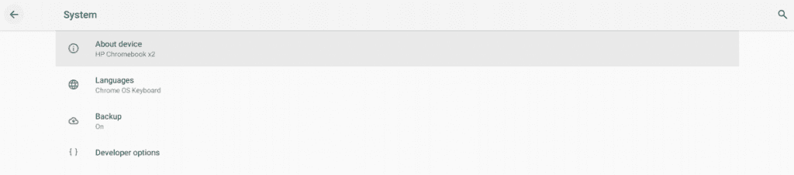

# Gboard 在 Chrome OS 72 中工作，因为惠普 Chromebook X2 获得了 Android 馅饼

> 原文：<https://www.xda-developers.com/gboard-chrome-os-hp-chromebook-x2-android-pie/>

**2018 年 11 月 17 日更新**:在最初发表这篇文章后的一天，我让 Gboard 开发惠普 Chromebook X2。下面是原文，最后是我的更新。

在 Chrome OS 历史的大部分时间里，购买新设备时只有几种外形可供选择。你可以买一台传统的笔记本电脑，一台可转换/混合笔记本电脑，或者一台 Chromebox。随着[宏碁 Chromebook Tab 10](https://www.xda-developers.com/acer-chromebook-tab-chrome-os-tablet/) 和[惠普 Chromebook X2](https://www.xda-developers.com/hp-chromebook-x2-linux-app-support/) 的推出，突然有两种新的外形需要考虑:平板电脑和可拆卸设备。随着谷歌自己的 [Pixel Slate](https://www.xda-developers.com/google-pixel-slate-detachable-chrome-os-tablet/) 可拆卸 Chromebook 越来越接近其[发布日期](https://www.xda-developers.com/google-pixel-slate-pre-orders-open/)，Chrome OS 团队正在努力为新的外形优化操作系统。我们已经看到一系列以平板电脑为中心的改进在 [Chrome OS 70](https://www.xda-developers.com/google-chrome-os-70-tablet-ux-overhaul/) 中推出，但缺少的一个功能是 Android 键盘支持。现在，似乎对 Gboard 和其他 Android 键盘应用的支持迫在眉睫。

我在 Chrome OS 72 金丝雀频道上的惠普 Chromebook X2 最近收到了一个支持 Android Pie 的更新。也就是说，Android 运行时现在基于最新的 Android 9 Pie 代码，完全跳过了 Android 8.0 和 Android 8.1 Oreo。谷歌 Pixelbook 是第一款获得 Android Pie 支持的 Chromebook，但现在看起来其他 chrome book 正在获得更新的 ARC++子系统。我们一直在等待的功能之一是[对 Android 键盘应用](https://www.xda-developers.com/chrome-os-gboard-app-shortcuts-android-p/)的支持，因为默认的 Chrome OS 键盘应用远不如 Gboard 功能丰富。

 <picture></picture> 

Android Pie-based ARC++ on the HP Chromebook X2

在我每晚更新到最新版本后，我注意到在输入法设置中有一个新的“键盘应用”部分。现在，我已经启用了几个与 ARC IME 相关的标志来期待这个新特性，但这是我第一次在一个实际的构建中看到它。遗憾的是，列出的两个键盘选项都无法通过此菜单启用。我必须进入我的 Chromebook X2 上的 Android 子系统的外壳，并输入一个命令来启用 IME，这就是我如何让“Gboard”出现在主设置菜单中，并作为键盘设置中的一个选项。尽管如此，即使在更新到 7.7.13.220405912-beta-x86_64 版本的应用程序后，我也无法将 Gboard 实际设置为我的默认键盘应用程序。

一旦 Chromebooks 正式开始支持 Android 键盘应用，我们会让大家知道。不过，它真的很近，所以期待很快看到它工作。

* * *

## 更新 Chrome OS 72 中的 Android 键盘支持

我们现在可以确认 Android 键盘支持在最新的 Chrome OS 72 版本中是可用的。我们设法让 Gboard 工作起来，尽管似乎还有一些问题需要解决，因为它经常死机，并且不接受任何进一步的输入。如果你想自己尝试一下，以下是步骤:

1.  首先，你必须在 Chrome OS 72 上，目前在 Dev 和 Canary 频道。
2.  转到 chrome://flags，寻找#arc-input-method 标志。启用它并重新启动。
3.  打开谷歌 Play 商店，安装 Gboard 或你选择的其他 Android 键盘应用程序。
4.  在 Chrome OS 设置中或从快速设置面板中设置它并使其成为你的默认输入法。
5.  当您将设备置于平板电脑模式时，您的 Android 键盘应用程序现在应该开始工作。