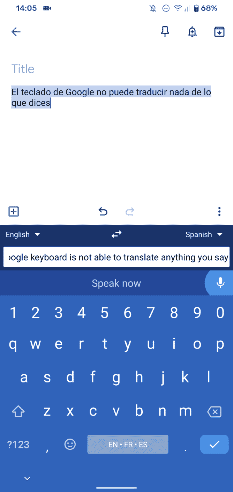

# Gboard 增加了实时语音转录和翻译功能

> 原文：<https://www.xda-developers.com/gboard-real-time-voice-transcription-translation/>

# Gboard 增加了实时语音转录和翻译功能

谷歌正在推出该公司键盘应用 Gboard 翻译功能的升级版。它现在可以进行实时转录和翻译。

随着 9.7 测试版的推出，谷歌的键盘应用又有了重大升级。在[推出智能补全](https://www.xda-developers.com/gboard-rolls-out-smart-completion-and-undo-autocorrect-on-backspace-tests-new-google-assistant-dictation/)，添加“退格时撤销自动更正”开关，并测试新的谷歌助手听写支持后，谷歌现在为 Gboard 的所有用户推出实时语音转录和翻译。

正如 [*Android Police*](https://www.androidpolice.com/2020/08/11/gboard-rolls-out-real-time-transcription-and-translation-apk-download/) 所指出的，转录和翻译文本对 Gboard 来说并不新鲜，但它们现在已经结合在一起了。你以前可以在键盘应用程序中翻译文本，或者在演讲中听写文本，但翻译模式不允许你在演讲中输入文本。现在，随着翻译界面在 Gboard 测试版中打开，你可以点击右边的麦克风图标开始转录你的声音。一旦你听到声音提示，用你的母语说话，你会看到文本被翻译成你选择的语言。

 <picture></picture> 

Via Android Police

*Android Police* 表示文本输入有点慢，但根据他们的经验，这不是一个 dealbreaker。毕竟 app 是在做转录和翻译的双重职责。虽然似乎支持所有语言组合(甚至自动语言检测)，但翻译框中似乎有一个字符限制(大约 200 个字符)，所以请记住这一点。

谷歌翻译已经具备了实时翻译的能力，但是在谷歌的键盘应用中加入类似的功能还是不错的。这增加了一层便利性，可以轻松地从您正在使用的任何应用程序中转录和翻译。

谷歌向 AndroidPolice 证实，实时语音转录和翻译正在向每个人推出，所以请在未来几天关注这项功能。你可以从下面嵌入的谷歌 Play 商店链接或者从 [APKMirror](https://www.apkmirror.com/apk/google-inc/gboard/gboard-9-7-03-323382208-release/) 安装最新版本的 Gboard 应用程序，以增加你获得该功能的机会。