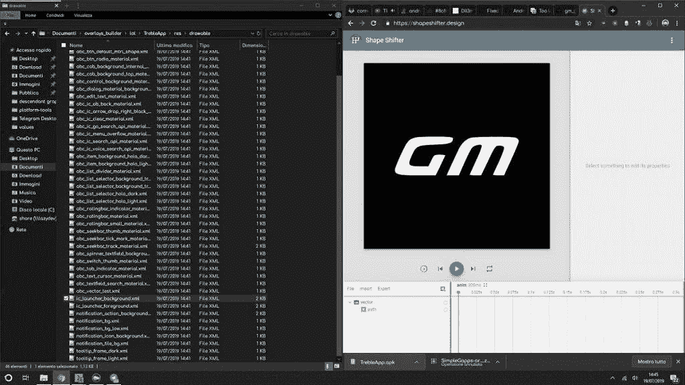

# [更新:声明]通用汽车公司喜气洋洋地为他们的安卓 Q 测试版更名了一辆来自 XDA 的 GSI

> 原文：<https://www.xda-developers.com/general-mobile-android-q-beta/>

**更新 1(美国东部时间 2019 年 7 月 22 日晚上 7 点 18 分):**通用汽车发布了一份声明，称他们的 Android Q 测试版是基于 XDA 论坛的两位开发者的工作。我们已经嵌入了他们的完整声明。

谷歌 Android 操作系统的下一个主要版本 Android 10 Q，已经在 Pixel 智能手机和十几款非谷歌手机上推出了测试版。Android Q 测试版有很多非谷歌的选择，包括华为 Mate 20 Pro、一加 7 Pro、小米 Mi 9、LG G8 ThinQ 等手机。一个也提供 Android Q 测试版的智能手机品牌是通用移动，尽管他们[没有在谷歌的官方网站上列出测试版。这个土耳其品牌](https://developer.android.com/preview/devices/index.html)[为其通用移动 9 Pro 和通用移动 8 设备提供](https://www.generalmobile.com/tr/destek/android-q/beta)Android 10 测试版。这个品牌是如何在不属于正式计划的情况下发布测试版的？他们使用了通用的系统映像。然而，甚至连官方的 GSI 也没有发布——他们实际上发布了一个基于 GSI 的作品，该作品主要由 XDA 知名开发者埃尔法诺阿卜迪和胡森开发，最早由 XDA 资深成员埃内萨斯蒂姆发现。

据[土耳其媒体](http://www.hurriyet.com.tr/teknoloji/general-mobile-telefonlara-android-q-beta-guncellemesi-geldi-41271496)报道，通用移动上周公布了他们的 Android Q builds。尽管测试版注册程序已经关闭，如果你是注册会员，土耳其粉丝论坛 [*GSMTurkey*](https://gsmturkey.net/threads/general-mobile-android-q-beta-v1-0.8657/) 仍然有 Q builds 的下载链接。幸运的是，通用汽车的官方 *GSMTurkey* 论坛账号发布了这个帖子，提供了对版本真实性的验证。最初论坛帖子的[引用](https://gsmturkey.net/threads/general-mobile-android-q-beta-v1-0.8657/#post-89157)和 [Bing 的缓存](http://cc.bingj.com/cache.aspx?q=https%3A%2F%2Fgsmturkey.net%2Fthreads%2Fgeneral-mobile-android-q-beta-v1-0.8657%2F&d=1821345320935&mkt=tr-TR&setlang=tr-TR&w=nxGf_OgJRK96VYkZTSipoR4eThJOAblN)显示最初的帖子已被编辑，以向 erfanoabdi 和 phhusson 提供学分。两个开发者都没有因为他们的作品被使用而感到不安(至少，在通用汽车认可他们之后，他们不再感到不安)，但一个 Android 智能手机品牌正在使用第三方开发者拼凑的作品，并将其冒充为他们的“Android Q beta”，这仍然令人发笑。

## 通用移动的安卓 Q 测试版——证明它是一个社区 GSI

erfanoabdi 和 phhusson 的指纹遍布通用汽车发布的 Q builds。通用 Mobile 9 Pro 的 Q beta 测试版在网上[有售](https://github.com/AndroidDumps/gm_gm9pro_dump/tree/GM9PRO-user-10-QGM5.190530.015-5642755-release-keys/)，但我们也下载了该版本以证实这一发现。首先，在/system 中，有两个名为“ [ph](https://github.com/AndroidDumps/gm_gm9pro_dump/tree/GM9PRO-user-10-QGM5.190530.015-5642755-release-keys/system/system/ph) ”和“ [phh](https://github.com/AndroidDumps/gm_gm9pro_dump/tree/GM9PRO-user-10-QGM5.190530.015-5642755-release-keys/system/system/phh) ”的文件夹，phhusson 说他创建这两个文件夹是为了保存基于每个设备动态覆盖其他文件所需的文件。接下来， [rw-system.sh](https://github.com/AndroidDumps/gm_gm9pro_dump/blob/GM9PRO-user-10-QGM5.190530.015-5642755-release-keys/system/system/bin/rw-system.sh) 脚本有很多 if 语句，根据 GSI 安装在什么设备上来修改系统的不同部分；让 erfanoabdi 的 GSI 在尽可能多的智能手机上兼容，这基本上是一个巨大的挑战。甚至还有 erfanoabdi 的[签名](https://github.com/AndroidDumps/gm_gm9pro_dump/blob/GM9PRO-user-10-QGM5.190530.015-5642755-release-keys/system/system/etc/init/Pstuffs.rc#L1)还在里面的文件，以及[包名](https://github.com/AndroidDumps/gm_gm9pro_dump/blob/GM9PRO-user-10-QGM5.190530.015-5642755-release-keys/system/system/product/overlay/pixelrecents.apk)里有他用户名的 apk。

 <picture></picture> 

General Mobile [changed the logo](https://twitter.com/Khode_Erfan/status/1152221901860876288) of phhusson's Treble app to make it their own.

似乎通用汽车几乎没有对 erfanoabdi [在我们的论坛上分享的 Q GSI 做任何修改。GM 基本上改变了一些构建属性并发布了该构建。对他们来说，使用社区 GSI 而不是谷歌的官方 GSI 是有意义的，因为社区 GSI 有大量的硬件修复，但 phhusson 说，也有很多改变对 Android 馅饼供应商的形象没有用。事实上，通用汽车甚至不屑于重新命名一个社区 GSI，这意味着他们没有从谷歌那里收到 Android Q beta 源代码，所以如果他们想制作一个真正的 Q build，他们必须等待谷歌将源代码上传到 AOSP。或者，他们可以无耻地从我们的](https://forum.xda-developers.com/project-treble/trebleenabled-device-development/rom-android-p-developer-preview-t3816659)[项目三重论坛](https://forum.xda-developers.com/project-treble)中拉出一个 GSI，并作为“官方”Android Q beta 发布。令我们感到有趣的是，他们选择了后者。

* * *

## 更新 1:通用移动的声明

通用汽车公司通过电子邮件与我们分享了以下声明:

我们联系了 erfanoabdi 和 phhusson，他们都证实通用汽车公司确实联系过他们。

本文于美国东部时间 2019 年 7 月 23 日中午 12:42 更新，声明由通用移动直接发送至 XDA。