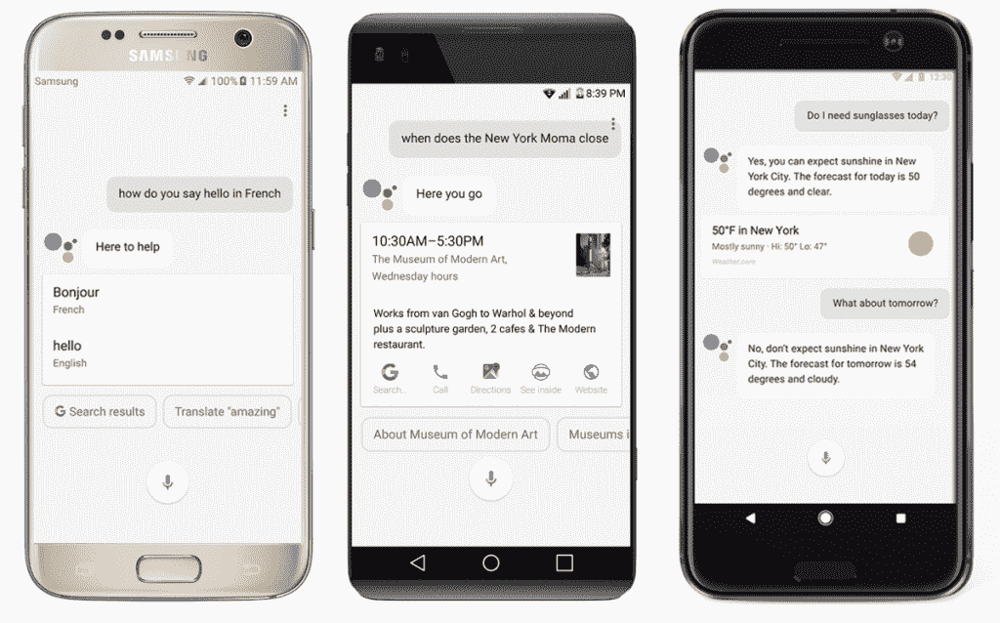

# 以下是如何在没有 Root 的 Android 5.0+平板电脑上获得谷歌助手

> 原文：<https://www.xda-developers.com/get-google-assistant-on-android-lollipop-marshmallow-nougat-tablets-without-root/>

谷歌助手是谷歌对亚马逊 Alexa 的回应——一种智能的个人服务，自去年谷歌 I/O 期间首次推出以来，已经以多种方式发展，并扩展到多个新平台。虽然最初是谷歌 Pixel 和 Pixel XL 手机独有的(在谷歌 Allo 应用程序中以更有限的方式提供)，但我们论坛上的优秀用户能够让助手[在任何植根于牛轧糖的手机](https://www.xda-developers.com/google-assistant-summary-what-we-know-and-dont-know/)上运行。早在三月份，谷歌宣布他们将为[某些国家](https://www.xda-developers.com/google-assistant-now-available-for-all-android-6-0-devices/)所有运行 Android 6.0+的智能手机提供 Assistant。毫无疑问，这是一个惊喜，但也是受欢迎的。

 <picture></picture> 

Google Assistant on Android Smartphones

从那以后，[由于官方 SDK 的发布，即使是台式机和笔记本电脑](https://www.xda-developers.com/how-to-get-google-assistant-on-your-windows-mac-or-linux-machine/)也可以利用 Assistant。我们当中那些拥有 [Android Wear 2.0 兼容](https://www.xda-developers.com/android-wear-2-0-is-official-with-support-for-android-pay-and-google-assistant/)智能手表、某些 [Android TV 型号](https://www.xda-developers.com/google-assistant-is-coming-to-android-tv-android-wear-2-0-and-more-devices/)以及一些装有 Android Auto 的车辆的人也可以利用 Assistant。但是有一种设备在这个越来越长的谷歌祝福设备列表中明显不见了——平板电脑。谷歌发言人证实，3 月份推出的更广泛的助手[将不包括运行 6.0+](https://www.xda-developers.com/google-confirms-assistant-rollout-will-not-extend-to-tablets/) 的 Android 平板电脑。

这从未阻止我们在 XDA 试图找出绕过(在我们看来)这些武断限制的方法。多亏了 XDA 成员 [Nikhilkumar038](https://forum.xda-developers.com/member.php?u=7475042) ，我们现在有办法**在任何运行棒棒糖、棉花糖或牛轧糖的安卓平板电脑上使用谷歌助手，而不需要 root！**

我在两台不同的设备上进行了测试——一台运行 Android 5.1.1 Lollipop 的三星 Galaxy Tab Pro 12.2 和一台运行 Android 6.0.1 Marshmallow 的三星 Galaxy Tab S 10.5。这在理论上应该也适用于运行 Android Lollipop 的智能手机。

* * *

## 平板电脑谷歌助手教程

这种方法的工作方式是通过在[谷歌应用](https://play.google.com/store/apps/details?id=com.google.android.googlequicksearchbox)中启动一个隐藏的(但幸运的是可访问的)活动，名为 com . Google . Android . apps . GSA . static plugins . opa . HQ . opahqactivity。这可以通过使用一个应用程序来轻松完成，该应用程序可以列出并启动您安装的应用程序中所有可用的活动。 [Activity Launcher](https://play.google.com/store/apps/details?id=de.szalkowski.activitylauncher) 是一款专门用于此目的的应用，尽管众所周知的 [Nova Launcher](https://play.google.com/store/apps/details?id=com.teslacoilsw.launcher) 有一个内置功能，可以在你已经安装了这个启动器的情况下启动活动。如果你还没有更新你的谷歌应用到最新的稳定版本。

### 方法 1 -使用活动启动器

1.  打开活动启动器
2.  点击顶部的“最近活动”标签，选择“所有活动”等待所有活动加载。
3.  向下滚动，直到找到谷歌应用程序。点击它，展开谷歌应用下所有可用的活动。
4.  找到 com . Google . Android . apps . GSA . static plugins . opa . HQ . opahqactivity，你可以点击一次或者在你的启动器上创建一个快捷方式。
5.  现在，你会发现自己在新的助手“探索”屏幕中，谷歌对可用的集成进行分类，如何使用它们，以及快速访问自定义快捷方式。
6.  滑动到顶部的“你的东西”标签。
7.  点击“添加提醒”来触发谷歌助手。这个动作的作用是启动 activity com . Google . Android . apps . GSA . static plugins . opa . opa activity——它通常不能在非根设备上访问。
8.  现在，您将完成 hotword 设置过程。教它识别你的声音，就大功告成了！现在你可以通过说“好的谷歌！”来访问谷歌助手

### 方法 2 -使用 Nova 启动器

1.  在主屏幕上找到一个空白点，长按以添加新内容。
2.  点击“Widgets”
3.  在“Nova Launcher”下，点击并按住“Activities ”,将其拖至主屏幕。
4.  向下滚动，找到“谷歌应用”
5.  点击展开，选择 com . Google . Android . apps . GSA . static plugins . opa . HQ . opahqactivity。
6.  这将在您的主屏幕上添加一个新的“Google Assistant”图标，这是此活动的快捷方式。点击此图标。
7.  现在，你会发现自己在新的助手“探索”屏幕中，谷歌对可用的集成进行分类，如何使用它们，以及快速访问自定义快捷方式。
8.  滑动到顶部的“你的东西”标签。
9.  点击“添加提醒”来触发谷歌助手。这个动作的作用是启动 activity com . Google . Android . apps . GSA . static plugins . opa . opa activity——它通常不能在非根设备上访问。
10.  现在，您将完成 hotword 设置过程。教它识别你的声音，就大功告成了！现在你可以通过说“好的谷歌！”来访问谷歌助手

### 警告

首先，也是最明显的警告是，你不能通过长按 home 键来访问 OK Google。长按 home 键反而会在 Tap 上启动 Google Now。我知道你们中的许多人实际上更喜欢有现成的助手，所以我不能为此扣掉太多分。不过，这确实意味着你必须使用你的声音来访问助手，考虑到大多数人在哪里存放和使用他们的平板电脑(在家里)，我想这不是太大的问题。如果你愿意，你可以保留我们在本教程中制作的主屏幕快捷方式，随时点击“添加提醒”来手动调出助手，但这种方式不太方便。

接下来，不幸的是，谷歌可能会在谷歌应用的未来更新中修补这种方法。这并不是第一次有公司在我们公布了非官方功能后删除了它，所以我建议你尽快设置好。幸运的是，如果你真的想更新谷歌应用程序，你可以拒绝更新，这比如果你打算使用[原始 Bixby remap 方法](https://www.xda-developers.com/how-to-remap-the-bixby-button-on-the-galaxy-s8-s8-to-launch-google-assistant/)永远不更新你的三星 Galaxy S8 要现实得多。

* * *

请继续关注 XDA 门户网站，了解更多类似的教程。再次感谢 XDA 会员 Nikhilkumar038】在我们的论坛上发布这个方法！