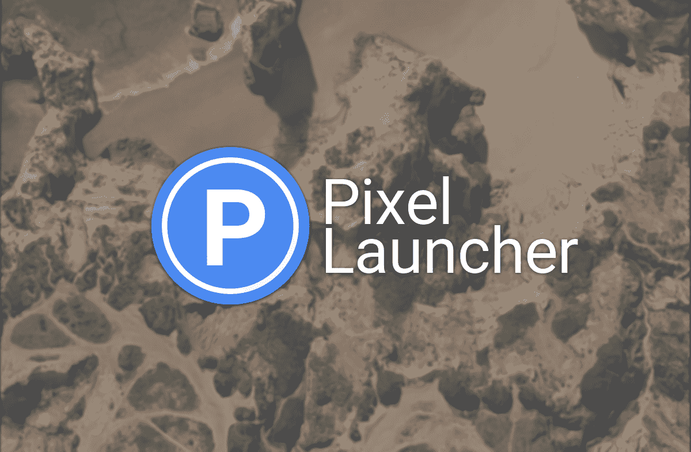
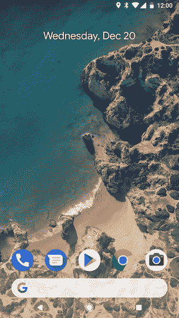
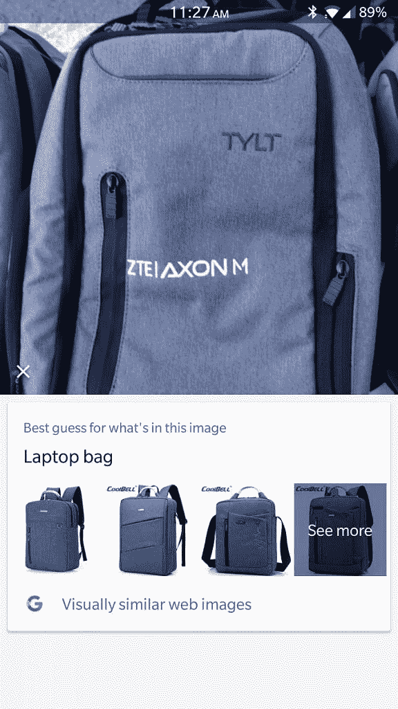

# 如何让任何手机感觉像 Pixel 2

> 原文：<https://www.xda-developers.com/get-pixel-2-features-android/>

从任何角度来看，谷歌 Pixel 2 都是一款出色的智能手机。它有一个快速的[高通骁龙 835](http://xda-developers.com/tag/snapdragon-835) 片上系统，优质材料，以及最好的智能手机摄像头之一。但事实证明，你不需要花钱买一部新手机来获得 Pixel 2 和 [Pixel 2 XL](http://xda-developers.com/tag/pixel-2-xl) 的一些最佳功能。

所以，想知道如何在你的手机上获得 Pixel 2 功能，或者如何用增强的相机应用程序、永远在线的音乐 ID、新的启动器等来装饰旧手机？你来对地方了。

*由[凯尔威格斯](https://www.xda-developers.com/author/kyle-wiggers/)*

* * *

## 如何在任何手机上安装谷歌 Pixel 2 启动器

 <picture></picture> 

Pixel Launcher

谷歌 Pixel 2 的启动器不像普通的安卓主屏幕。在应用程序 dock 和软件导航键之间的底部附近，有一个无处不在的半透明谷歌搜索栏，有一个突出的谷歌图标和圆形边缘。(值得注意的一个很酷的功能:当你搜索应用程序时，你可以直接把它们的图标放到主屏幕上。)有一个新的动画，可以在启动器周围点击和拖动应用程序快捷方式，当你到达所有应用程序列表的底部或顶部时，会有一个类似 iOS 的弹性滚动效果。

与 Pixel Launcher 的早期版本一样，您经常使用的应用程序会出现在应用程序抽屉顶部的一行中。一目了然，一个新的小工具，显示当前天气(基于您的位置)，即将到来的日历事件，和交通信息就在主屏幕上。

很棒的东西，对吧？幸运的是，由于 XDA 资深会员 [paphonb](https://forum.xda-developers.com/member.php?u=6018897) 的工作，很容易在任何智能手机上安装和运行谷歌 Pixel 2 启动器。[无根 Pixel Launcher](http://xda-developers.com/tag/rootless-pixel-launcher) ，由 Pixel 2 launcher 和 AOSP (Android 开源项目)Launcher 拼接而成，拥有谷歌 Pixel 2 launcher 的一些最佳功能——外加额外功能。它支持带有日历图标的图标包，日历图标随日期变化，自动使用 Android 7.1 Nougat 的圆形图标，打开键盘时调整所有应用程序列表的大小，等等。

以下是如何安装无根像素启动器:

1.  前往官方无根 Pixel Launcher Github 页面，下载最新的 APK 文件。你有两个选择:一个针对内存小于 1GB 的设备优化的 APK(**launcher 3-l3go-optimized . apk**)，或者标准版(**launcher 3-aosp-optimized . apk**)。在功能上，它们是相同的。
2.  #### 在手机上启动安卓**下载**管理器，点击列表中的最新项目，安装下载的 APK 文件。

3.  #### 遵循屏幕上的安装说明。安装完成后，系统会提示您选择一个默认的启动程序；选择**发射 3** 。

* * *

## 如何在任何手机上安装谷歌摄像头

 <picture></picture> 

Portrait Mode on the Google Pixel 2\. Source: [Google](https://research.googleblog.com/2017/10/portrait-mode-on-pixel-2-and-pixel-2-xl.html)

Pixel 2 的另一个令人羡慕的功能是[谷歌相机](http://xda-developers.com/tag/google-camera)，这是一个具有 HDR+(高动态范围增强)的人工智能增强相机应用程序，它将十张照片的连拍照片合并成一张具有增强亮度和对比度的合成照片。其他值得注意的功能包括零快门延迟(ZSL)，最大限度地减少了相机中点击快门按钮和录制画面之间的时间差；支持 RAW，这让你可以在拍摄后更好地控制照片的颜色；慢动作 60FPS 和 4K 视频录制；和电子图像稳定(EIS)。

那只是冰山一角。谷歌相机最令人印象深刻的功能之一是人像模式，它有选择地模糊照片的背景，同时将前景聚焦，这种效果被称为“散景”。它是通过一种机器学习算法来实现的，该算法分析十幅图像的合成图像，以识别和隔离照片中的物体或人，以及从两组像素的组合成像数据中创建的深度图。

由于 XDA 开发者社区的辛勤工作，越来越多的智能手机可以使用谷歌相机 HDR+端口。更好的消息是:该端口比谷歌像素相机应用程序更加可定制，允许你调整设置，如 HDR 算法，连拍照片设置，全景分辨率，甚至原始图像的压缩级别。最新版本兼容高通[骁龙](http://xda-developers.com/tag/snapdragon) 820/821 和三星 [Exynos](http://xda-developers.com/tag/exynos) 芯片组，以及带有广角镜头的手机，如 [LG V30](http://xda-developers.com/tag/lg-v30) 。

请注意，谷歌 Pixel HDR+端口需要 Camera2 API，因此它与一些设备不兼容，包括三星 Galaxy Note 8、诺基亚 8、小米 Mi A1 和 Essential Phone。

以下是如何在任何手机上安装谷歌摄像头的方法:

1.  #### 从 XDA 论坛下载[最新的谷歌相机 HDR+端口](https://forum.xda-developers.com/lg-v30/themes/cstark27-google-camera-mod-wide-angle-t3747263)。如果您有 LG G5、G6、V20 或 V30，请下载支持广角镜头的版本。

2.  #### 在手机上启动安卓**下载**管理器，点击列表中的最新项目，安装下载的 APK 文件。

3.  #### 遵循屏幕上的安装说明。

如果你发现自己对谷歌相机 HDR+端口的菜单有点不知所措，请查看[论坛帖子](https://forum.xda-developers.com/lg-v30/themes/cstark27-google-camera-mod-wide-angle-t3747263)获取入门提示。

* * *

## 如何在任何手机上获得 Pixel 2 的动态壁纸

 <picture></picture> 

Google Pixel Launcher on the Pixel 2

Pixel 2 配备了名为[动态壁纸](http://xda-developers.com/tag/live-wallpapers)的动画背景。一张是葡萄牙拉各斯海滨的俯视图，显示海浪冲击海岸；另一张摄于犹他州纪念碑谷的照片展示了热气球；还有一些展示了维苏威火山以及火星和月球的实时图像。

也有交互式壁纸，包括液体状的粘性物，可以随着点击和滑动而变形和重塑(Gooey)，在屏幕边缘反弹的抽象形状(Glimmer)，以及基于你所在位置的风模式的可视化表示。

以下是如何在任何手机上获得 Pixel 2 的动态壁纸:

2.  一旦应用安装完成，下载 Android 开发者 Pranav Pandey 的新动态壁纸。
3.  前往手机的主屏幕。按住启动器上的任意位置，直到出现选择屏幕；轻触**壁纸**。滚动到列表底部——你应该会看到一个新的标签为 **Live Wallpapers** 的部分。
4.  选择你想要使用的壁纸。

* * *

## 如何在任何手机上获得“正在播放”

 <picture></picture> 

Shazam

有没有在收音机里听到一首不熟悉的歌曲，希望能调出唱片目录？Pixel 2 的[现在正在播放](http://xda-developers.com/tag/now-playing)，这是一个类似于 Spotify、Shazam 和 Hound 的环境音乐 ID 功能，为你做了艰苦的工作。它用手机的麦克风记录音频样本，将其与离线的、特定国家的、定期更新的数万首歌曲的数据库进行比较。据谷歌称，由于漂亮的机器学习算法，它能够在“几秒钟内”识别大多数歌曲。

不幸的是，现在的游戏依赖于大量专有的谷歌代码，这使得它很难移植到其他设备上。但有一种方法可以复制现在的播放，那就是使用 [Shazam](http://xda-developers.com/tag/shazam) ，一款具有类似环境聆听功能的歌曲识别应用。

以下是在任何手机上获取环境音乐 ID 的方法:

1.  #### 从 Play Store 安装 **[Shazam](https://play.google.com/store/apps/details?id=com.shazam.android&rdid=com.shazam.android)** 。

2.  #### 启动 Shazam，然后点击并按住屏幕中间的 Shazam 图标以打开****自动 Shazam** 功能，该功能会在后台持续收听歌曲，并在您将手机置于睡眠状态时继续收听。**

***   #### 点击**从弹出消息中打开**，并授予应用程序录制手机音频的权限。

    *   当 Shazam 识别出一首歌曲时，你会在 Android 的通知栏中看到提醒。**

 *** * *

## 如何在任何手机上安装谷歌镜头

 <picture></picture> 

Google Lens

[在 Google I/O 2017 上宣布的 Google Lens](http://xda-developers.com/tag/google-lens) ，利用人工智能来识别照片中的地标、书籍、艺术品、鲜花、食物和小摆设。但它不仅仅是一个视觉搜索引擎——例如，将谷歌镜头指向一个包含网络名称和密码的 Wi-Fi 标签，就会自动将你的手机连接到网络。它的其他技巧包括显示商业评论和评级，解析传单和文档中的电子邮件地址、电话号码等。

在谷歌镜头的技术预览版期间，它是 Pixel 智能手机的专属。但它后来被集成到了谷歌照片、谷歌的图库和 Android 设备的云存储应用程序中。

以下是如何在任何手机上安装谷歌镜头的方法:

1.  #### 从 Play Store 下载 [**Google 相册**](https://play.google.com/store/apps/details?id=com.google.android.apps.photos&referrer=utm_source%3Daboutpage) 。

2.  拍摄任何东西的照片，然后在 Google 相册中调出。然后点击**镜头的**图标。

* * *

## 如何在任何手机上获取 ARCore

 <picture></picture> 

ARCore

[ARCore](http://xda-developers.com/tag/arcore) ，谷歌面向 Android 的增强现实开发平台，基于软件；与谷歌命运多舛的[项目 Tango](http://xda-developers.com/tag/project-tango) 不同，它不需要特殊的硬件或传感器来绘制周围环境的深度，并将数字对象投影到现实世界的表面上。它与越来越多的设备兼容，并使用运动跟踪、平面检测和光线估计的组合来将虚拟对象锚定在垂直和水平平面上。

Pixel 2 和 Pixel 2 XL 是首批支持 ARCore 的智能手机，但这并没有阻止开发者将其移植到其他设备上。 [ARCore for All](https://www.xda-developers.com/arcore-for-all-google-augmented-reality/) ，一个开源项目，让 ARCore 在技术上“不受支持”的设备上运行，如 OnePlus 3T。

1.  #### 下载并安装 [**ARCore for All**](https://drive.google.com/open?id=0B6YRx5-YRIlld2dlX1EtdDBLYlk) APK 文件。

2.  #### 从 Google 下载并安装 [**ARService**](https://github.com/google-ar/arcore-android-sdk/releases/download/sdk-preview/arcore-preview.apk) 。

3.  如果一切按计划进行，你应该可以使用需要 ARCore 支持的应用。**