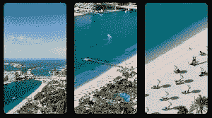
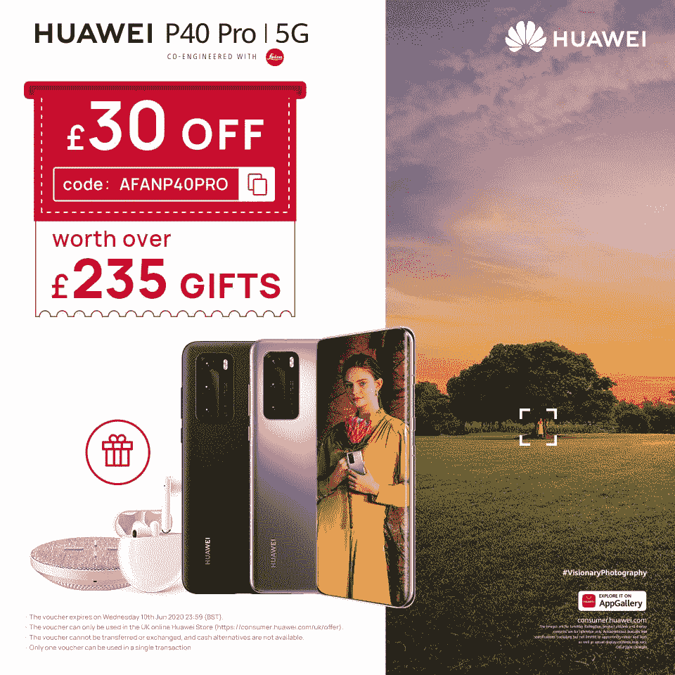
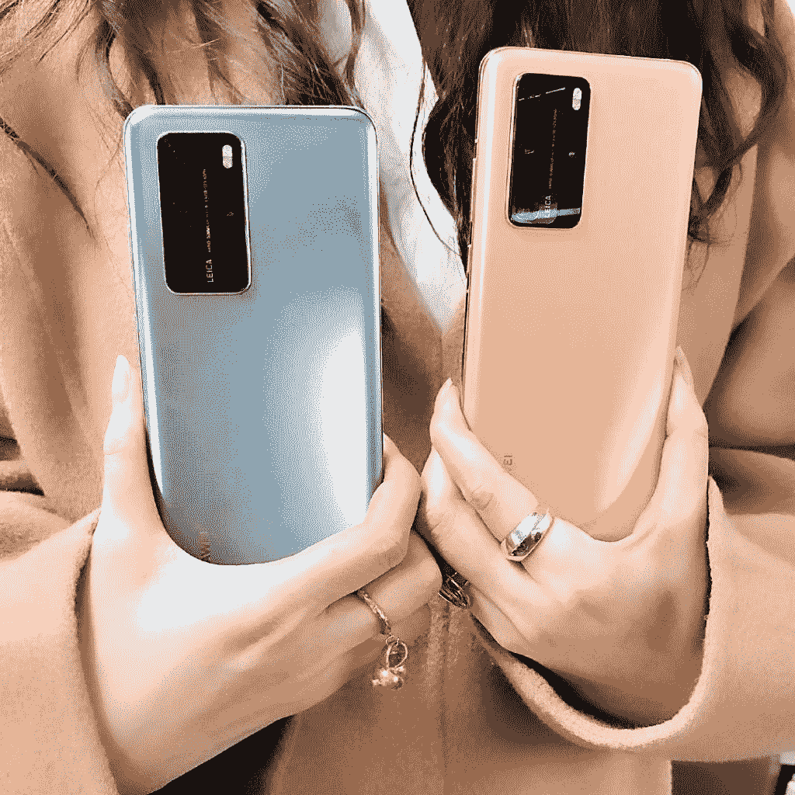
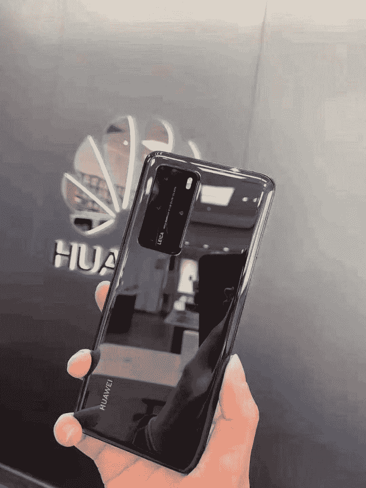

# 立即购买华为 P40 Pro，享受额外 30 英镑的优惠和价值 235 英镑的独家礼品

> 原文：<https://www.xda-developers.com/get-the-huawei-p40-pro-today-with-an-extra-30-off-and-exclusive-235-of-gifts/>

许多人认为华为 P40 Pro 是目前市场上最好的摄影手机。[限时抢购，可额外获得 30 的华为 P40 Pro 和 235 的免费赠品](http://xda.tv/hp40)。 *TIPA 世界奖*提名该手机为最佳拍照智能手机，这要归功于该设备上令人惊叹的拍照技术。P40 Pro 有一个 1/1.28 的 50MP 摄像头

 <picture></picture> 

Huawei P40 Pro with 100x SuperZoom Array

英寸超视觉传感器。它可以吸收大量的光线，这意味着在弱光环境下拍摄的照片看起来非常棒。将这一点与实时深度感应相机相结合，您可以在照片中创建专业级的散景效果。

使用 100 倍超变焦阵列获得远处物体的详细照片。在 3 倍光学变焦、20 倍混合变焦或 100 倍最大变焦之间进行选择，获得任何智能手机中最佳的变焦相机。

华为 P40 Pro 还配有 40MP 超宽电影摄像机。这款相机具有 1/1.54 英寸的传感器，超低光视频，超慢动作视频，长焦视频和 4K 延时。这是一款功能齐全的电影摄像机，旨在为用户提供拍摄完美照片所需的所有工具。

 <picture></picture> 

Huawei P40 Pro Promotion

**现在您可以以 30 英镑的价格购买华为 P40 Pro，并获得价值 235 英镑的礼品。**

*促销日期:*

*促销详情:*

*   **30 折正价**
*   **免费华为 Freebuds 3**
*   **免费超快速无线充电板**
*   **免费上等蒲案**

## 如何在购买后收到免费礼物

在您使用促销代码收到您的华为 P40 Pro 后，您将能够在线填写表格来兑换价值 235 英镑的礼品。

###### 我们感谢华为赞助这篇文章。我们的赞助商帮助我们支付与运行 XDA 相关的许多费用，包括服务器成本、全职开发人员、新闻撰稿人等等。虽然您可能会在门户内容旁边看到赞助内容(这些内容将始终被标记为赞助内容),但门户团队对这些帖子不承担任何责任。赞助内容、广告和 XDA 仓库完全由一个独立的团队管理。XDA 绝不会通过接受金钱来赞扬一家公司，或以任何方式改变我们的观点或看法，从而损害其新闻诚信。我们的意见不能被收买。