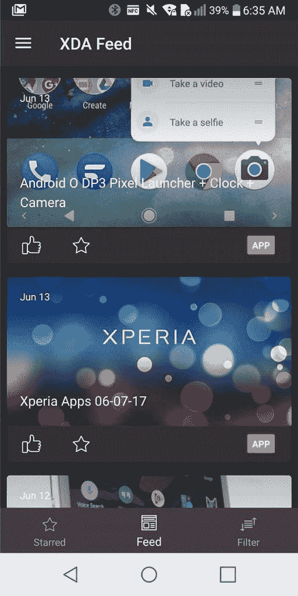
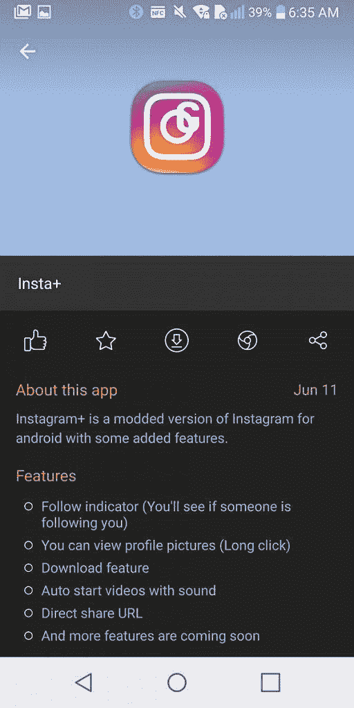
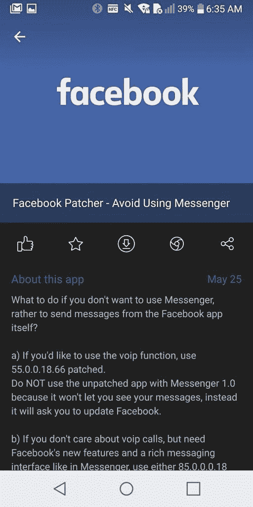
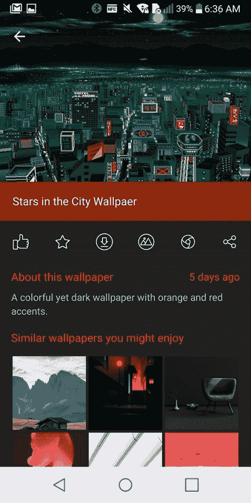
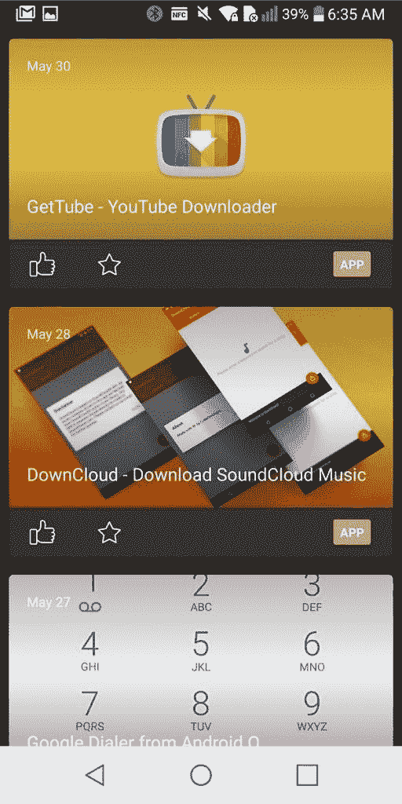
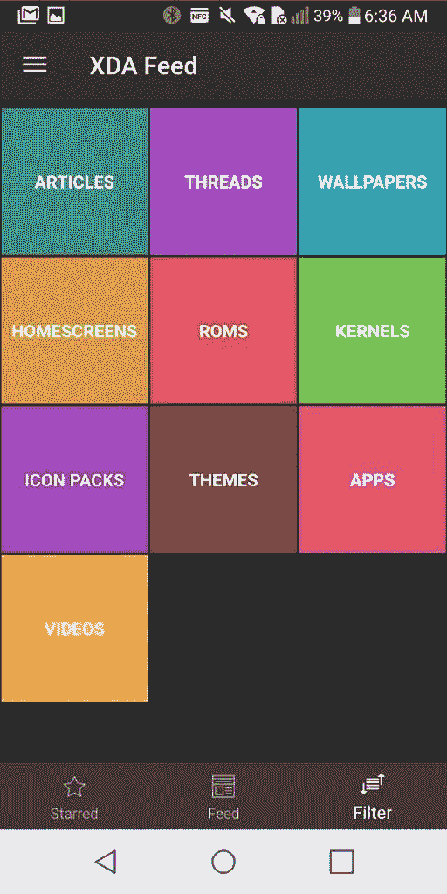
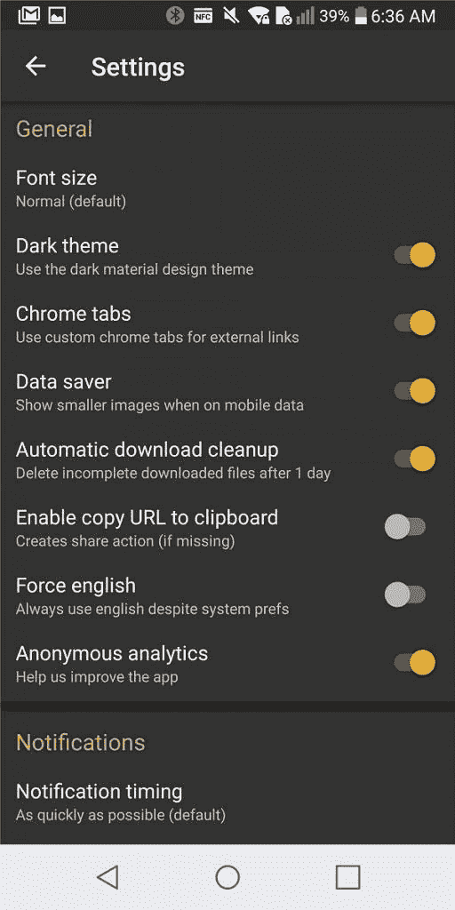

# 获取任何手机的 XDA 饲料

> 原文：<https://www.xda-developers.com/get-xda-feed-for-any-phone/>

# 获取任何手机的 XDA 饲料

XDA 饲料是最好的方式来保持与最新的修改，应用程序，主题和新闻为您的 Android 手机。免费下载。

XDA 团队一直在努力开发 XDA Feed 应用程序，以便将其应用到新设备上。今天，我们宣布了该应用的通用版本，[现已在 Play store](https://play.google.com/store/apps/details?id=com.xda.feed) 上架。如果你有一个以前不被官方支持的设备，现在你可以在任何设备上享受 feed。这个新版本将推送兼容所有设备的 mods、应用、主题和新闻。这是从论坛上获取最新内容的最佳方式。

你现在可以在 Feed 中做的另一件事是建议链接，这样社区可以帮助你找到 XDA 最好的内容。通过这种方式，我们可以让用户推荐最好的东西，从而更好地服务于过多的设备。因此，投入和帮助！从滑出菜单中，点击建议内容，只需粘贴一个 URL，添加一些细节，它就会进入我们的提要维护者的队列。嘣！

[第四段]

 <picture></picture> 

Find mods and apps that are made for all Android devices.

[/第四段][第四段]

 <picture></picture> 

View descriptions and features of a specific mod, then download it right from feed.

[/第四段][第四段]

 <picture></picture> 

Star your favorite posts from feed to access them later.

[/第四段][第四段]

 <picture></picture> 

Choose exactly what type of content that you want to be notified about.

[/第四段]

[第四段]

 <picture></picture> 

Find tons of fresh wallpapers and themes posted regularly.

[/第四段][第四段]

 <picture></picture> 

Get a constant feed of the newest mods from the forums.

[/第四段][第四段]

 <picture></picture> 

Filter the content in feed so that you're only shown what you want to see.

[/第四段][第四段]

 <picture></picture> 

Toggle settings to change the look and behavior of feed.

[/第四段]

[**获取 XDA 饲料**](https://play.google.com/store/apps/details?id=com.xda.feed)

[**官方线程**](https://forum.xda-developers.com/android/apps-games/feed-t3585865)