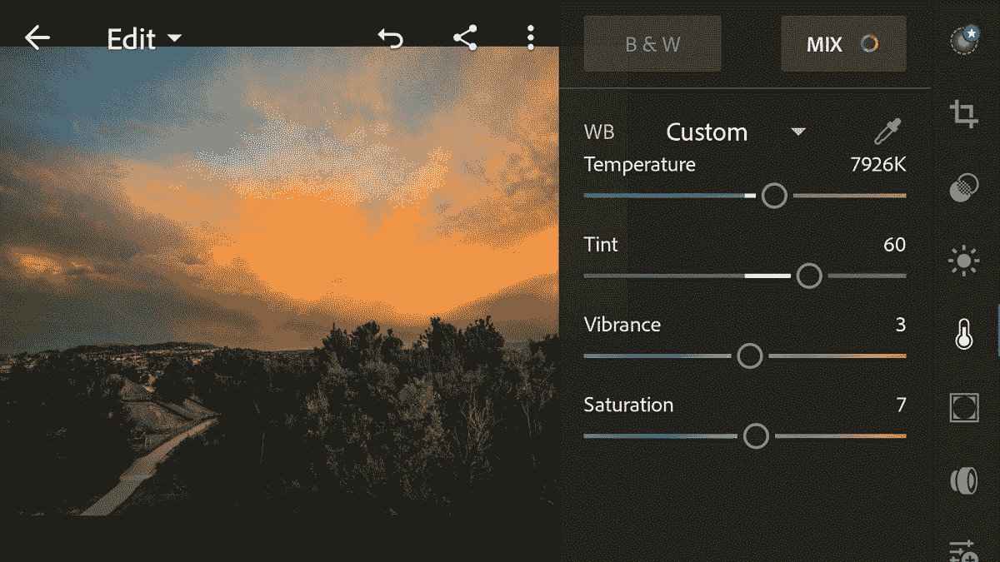
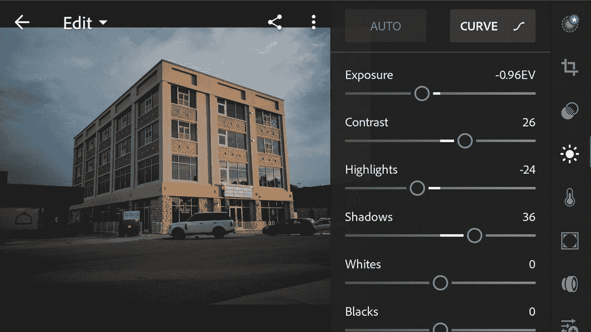
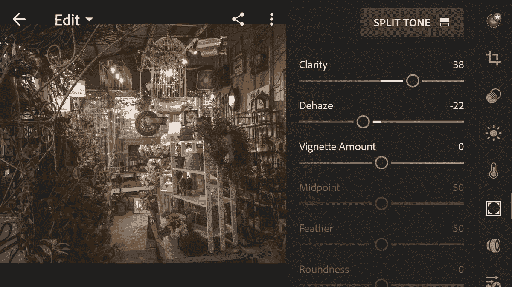

# 获得荣誉 9 的最佳照片

> 原文：<https://www.xda-developers.com/getting-the-best-photos-from-the-honor-9/>

# 获得荣誉 9 的最佳照片

使用 Honor 9 和一些最简单的照片编辑来获得一些令人惊叹的照片。观看这个 XDA 电视视频，看看它是如何做到的。

最近 Honor 一直在制造带摄像头的手机，用起来真的很有趣。荣誉 9 有一个惊人的摄像头，改进了我们在荣誉 8 中看到的双摄像头设置。

在专业相机模式下拍摄时，您可以 RAW 格式保存图像的副本。我们拍摄了一些原始照片，并在 Adobe Lightroom 中编辑它们，得到了一些令人惊讶的结果。Honor 9 是一款非常强大的手机，配有麒麟 960 和 6GB 内存。这使得编辑大量的图像文件变得容易和快速。这一点，再加上这款手机上令人敬畏的摄像头，使 Honor 9 成为一款拍摄和编辑高质量照片的绝佳设备。

 <picture></picture> 

Use Adobe Lightroom to adjust the colors in your photos.

 <picture></picture> 

Lightroom is easy to use and it's a lot of fun to edit your photos this way.

 <picture></picture> 

You can get all kinds of different looks out of your photos with just the smallest amount of adjustments,

虽然你基本上可以在任何 Android 手机上这样做，但高质量的摄像头和快速的处理能力使 Honor 9 的体验更好。如果你想真正进入手机摄影，开始养成使用 Lightroom 的习惯。你会很快掌握它的窍门，它真的可以改善你的照片。

 <picture></picture> 

Photo taken on the Honor 9 without any edits.

 <picture></picture> 

Edit the photo in Lightroom to get a hazy/cozy look.

请观看视频，了解整个过程。当利用荣誉 9 的力量时，在 Lightroom 中改进您的照片只需要一分钟。

[**获取 Adobe Lightroom**](https://play.google.com/store/apps/details?id=com.adobe.lrmobile)

[**荣誉 9 论坛**](https://forum.xda-developers.com/honor-9)