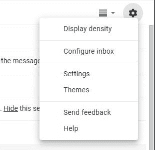
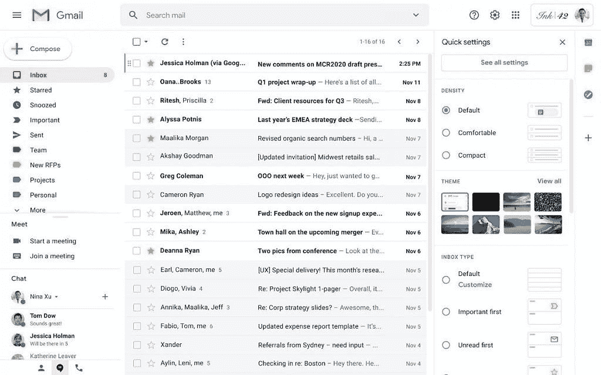

# Gmail for web 获得了一个更有用的快速设置菜单

> 原文：<https://www.xda-developers.com/gmail-for-web-more-useful-quick-settings-menu/>

# Gmail for web 获得了一个更有用的快速设置菜单

谷歌终于修改了 Gmail 网站上的快捷设置菜单，让它变得更加有用，不再是快捷菜单。

Gmail 是世界上最受欢迎的电子邮件服务之一，每天有数百万人使用这个网络客户端。Gmail 在网络上的通用界面在过去几年里已经有了很大的改进，但是浏览设置仍然是一个挑战。谢天谢地，谷歌终于修改了快速设置菜单，让它变得更加有用。

 <picture></picture> 

Current menu

目前，网络上的 Gmail 在你的个人资料照片下的右上角有一个设置图标。点击这个图标会弹出一些快捷选项和快捷方式来显示完整的设置和主题。从菜单本身你能做的并不多，它更像是一个启动平台。谷歌将很快把设置图标移到屏幕的最顶端，靠近谷歌应用程序启动器。菜单本身变得越来越有用。

 <picture></picture> 

New Quick Settings

新的快速设置菜单允许 Gmail 用户在被发送到设置的不同部分之前做更多的事情。您可以自定义显示的文本和信息的密度，选择不同的收件箱类型，添加阅读窗格以快速查看电子邮件内容，以及应用不同的主题。所有这一切都直接从菜单中发生，不需要去完整的设置页面。

G Suite 用户和 Gmail 个人账户都可以使用 Gmail 的新网页菜单。谷歌表示已经开始推出，但可能需要一个月的时间才能让每个人都得到它。这是一个服务器端的开关，所以你不能强迫它。这是网络客户端急需的更新，我们已经迫不及待了。

* * *

**来源:[谷歌](https://gsuiteupdates.googleblog.com/2020/05/new-gmail-quick-settings-optimize-inbox.html)**