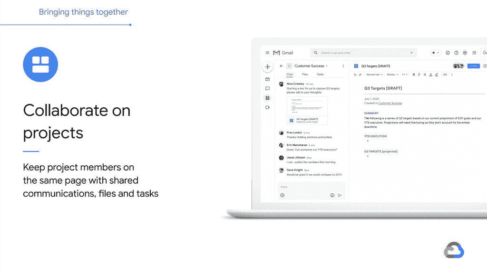

# [更新:官方消息]谷歌正准备将文档、聊天和会议更深入地整合到 Gmail 中

> 原文：<https://www.xda-developers.com/gmail-integrate-docs-chat-meet-rooms/>

**更新(美国东部时间 7/15/20 @下午 4:10):**谷歌已经正式确认将文件、聊天和会议与 Gmail for G Suite 整合。

新冠肺炎·疫情改变了科技界的许多事情。例如，视频通话一眨眼就变成了一项更受欢迎的功能。各公司都在努力适应新的需求，我们已经看到谷歌对其通讯平台进行了多次调整。上个月，Google [在 Gmail 应用中为 Google Meet 推出了一个专用标签](https://www.xda-developers.com/gmail-for-android-ios-google-meet-tab/)。事实证明，这只是开始。

软件工程师 Tahin Rahman ( [@tahins](https://twitter.com/tahins) )从谷歌即将到来的[云下一个 20 年活动](https://www.xda-developers.com/google-cloud-next-2020-online-only-event-coronavirus-fears/)的演示中找到了一些幻灯片。这些幻灯片显示了谷歌将 Google Meet、Google Chat、Google Rooms 和 Google Docs 更深入地整合到 Gmail 应用程序中的计划。前三种服务将在移动应用程序中获得各自的专用标签。

底部的四个选项卡是邮件、聊天、房间和会议。Mail 是典型的 Gmail 界面，Chat 是即时消息对话，Rooms 是谷歌类似 Slack 的团队/群组消息服务，Meet 是视频通话。集成也不仅仅是标签。聊天和房间也会在你没有及时回复的情况下发送后续提醒。

这四个标签也将成为 Gmail 的网页版。它们将出现在左侧栏中，每个服务都有自己的部分，包含文件夹、对话、房间和通话的快捷方式。网页版还将进一步整合谷歌文档，这意味着你可以在 Gmail 内部协作处理文档。从本质上讲，谷歌希望将 Gmail 转变为生产力的一站式服务。

 <picture></picture> 

Docs integration

提到的大多数服务主要由 G Suite 用户使用，所以不清楚这种新的集成是否也会推广到消费者。公开的 Gmail 应用程序中已经提供了 Meet，但像 Rooms 这样的服务确实更专注于企业用户。如果聊天和房间确实在 Gmail 应用程序中显示为选项卡，我们希望它们像当前的会议选项卡一样是隐藏的。请继续关注本周/本月晚些时候的更多信息。

**来源:[塔辛拉赫曼](https://twitter.com/tahins/status/1283095999766949888)| Via:[9 to 5 谷歌](https://9to5google.com/2020/07/14/gmail-redesign-leak/)**

* * *

## 更新:官方

没过多久，谷歌就证实了今天早些时候的泄密事件。Gmail for G Suite 用户已经正式集成了上面提到的文档、会议、聊天和房间。我们不知道谁将获得这一更新，但谷歌表示，它将作为“早期访问预览”在本周向 G 套件客户提供，并在今年晚些时候向所有 G 套件客户推出。虽然谷歌正在考虑，但是还没有把它带给消费者的计划。

我们在最初的帖子中不知道的一个很棒的功能是所有服务都支持的勿扰状态。这意味着您可以在一个地方将所有服务的通知静音。还有搜索功能，可以从所有的服务中找到东西。如上所述，这是一个重大举措，重点是提高依赖这些应用程序的人们的工作效率。

**来源:[谷歌](https://cloud.google.com/blog/products/g-suite/introducing-your-new-home-for-work-in-gsuite)**