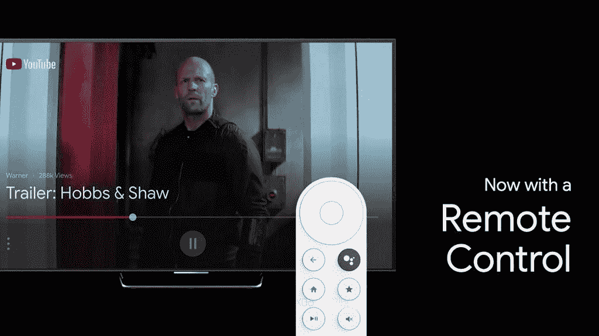

# 谷歌回归安卓电视硬件早就应该了，我就是为此而来的

> 原文：<https://www.xda-developers.com/google-android-tv-dongle-long-overdue/>

谷歌与流媒体硬件的关系有点偶然。虽然该公司已经销售了几代 Chromecast 设备，但他们对 Android TV 采取了基本不干涉的态度。有趣的是，谷歌实际上发布了第一款 Android 电视设备 Nexus Player，该设备在 2018 年初就停止了支持。从那以后，我们一直在等待一款新的谷歌品牌的 Android 电视设备(而且是一款[不是开发者设备](https://www.xda-developers.com/google-android-10-android-tv-adt-3-developer/))。谢天谢地，这一时刻似乎终于要来了，从我们独家获得的[谷歌即将推出的安卓电视加密狗](https://www.xda-developers.com/google-android-tv-dongle-remote-ui/)的渲染图中可以看出这一点。

要谈论谷歌的媒体硬件方法，我们必须一直追溯到 Android TV 的前身[谷歌电视](https://en.wikipedia.org/wiki/Google_TV)。像 [NBC、ABC、CBS 和 Hulu](https://www.wsj.com/articles/SB10001424052702303339504575566572021412854) 这样的内容提供商从未接受过谷歌电视，限制了可用的内容。用户发现谷歌电视的体验相当笨重，因为许多设备都配有一个大控制器，包括许多按钮，甚至还有一个 QWERTY 键盘用于导航。谷歌认为人们会用键盘做什么？在谷歌浏览器上浏览互联网，用 Adobe Flash 观看网络视频内容。显然，这并不是如今人们在电视上观看内容的方式。

从 2010 年到 2014 年，谷歌电视已经上市 4 年了，但谷歌从未利用该平台制造自己的设备。事后看来，这是一个明智的决定。取而代之的是，谷歌追求其基于手机的、无需遥控的流媒体平台:Google Cast。2013 年，谷歌发布了第一款 Chromecast，推出了一系列被认为相当成功的媒体流。毕竟，它们很便宜，非常丰富，并且由于通过 Google Play 服务集成了 Android，因此得到了广泛的服务支持。它们本质上是即插即用的媒体流，可以将“哑”电视变成“智能”电视，大多数智能手机用户都非常了解基于应用程序的控制。

不幸的是，Chromecast 是其自身简单性的受害者。事实上，你不需要一个物理遥控器来导航一个用户界面是非常方便的，但是有时候会感觉受到限制。如果一群人正试图决定看什么，那么聚在一个小小的智能手机周围试图挑选你们都喜欢的内容会很有趣。有朋友或保姆过来吗？让他们加入你的网络并安装一两个应用程序，让他们可以在你的电视上看一些东西，这很有趣。此外，Chromecast 控件消失的所有时间都是因为[你的手机在后台取消了控制应用程序的通知](https://www.xda-developers.com/phone-software-killing-apps-background/)。

对一些人来说，Chromecast 永远无法取代像 Android TV 这样成熟的操作系统。我猜这就是为什么亚马逊 Fire TV 和 Roku [以 Chromecast 为代价获得了如此大的采用。](https://www.multichannel.com/news/roku-and-fire-tv-control-70-percent-of-smp-market)

这就把我们带到了 Nexus 播放器问世近 6 年后的现在。看起来谷歌终于准备推出另一款 Android 电视设备，并给予该平台更多关注。我几乎从一开始就是安卓电视的用户，我值得信赖的 NVIDIA SHIELD 电视可以说是我拥有的最好的安卓设备。但令人难过的是，NVIDIA 的 2015 年 SHIELD TV 在近 5 年后仍是顶级竞争者，这就是为什么我觉得谷歌回归 Android TV 硬件早就应该了，我对此兴奋不已。

我已经使用 NVIDIA SHIELD TV 很长时间了，这确实是一款非常棒的产品。该系列的[最新更新](https://www.xda-developers.com/nvidia-shield-tv-pro-shield-tv-stick-announced/)也很棒。问题是我不是一个游戏玩家，NVIDIA 吹嘘的许多功能对我来说都是浪费。它们会干扰我的体验吗？不，但我对它的看法和我对三星手机的看法一样:我不想要一堆我永远用不到的额外功能。这就是我喜欢 Pixel 手机的原因，也是我对谷歌的 Android TV 加密狗感兴趣的原因。

谷歌的“少即是多”的设计理念并不适合所有人，但它是我非常欣赏的东西。许多电视盒子尖锐、棱角分明的设计不适合我的生活，还有一个边缘和面料都是圆形的谷歌 Nest 扬声器。硬件设计很重要，但电视加密狗几乎不会出现。另一方面，遥控器的设计相当重要。

 <picture></picture> 

This could be the remote for Google's Android TV dongle.

NVIDIA 谢天谢地[今年更新了 SHIELD 电视遥控器的设计](https://www.xda-developers.com/nvidia-shield-tv-remote-available/)。旧的遥控器几乎不可能从沙发垫缝隙中伸出来。我们不知道谷歌的遥控器会是什么样子，但迄今为止泄露的设计似乎很有希望。我们可以期待一个光滑，哑光完成和深思熟虑的按钮位置。物理音量按钮也是一种很好的触摸方式(这是旧款 SHIELD remote 所缺乏的)。

我想所有这些都是在说，我很高兴看到谷歌对 Android 电视硬件和软件的愿景能够协同工作。自从 Nexus Player 发布以来，谷歌在硬件生产方面取得了巨大的进步。“谷歌制造”从智能手机到智能音箱到智能显示器，泵出了一些优秀的设备。这些产品完美地融入了我的日常生活。与 Android TV 的早期相比，谷歌并不那么害怕在硬件外观方面领先。多年来，Android TV 本身已经非常成熟，大多数主要内容提供商都为其提供支持，许多电视制造商将它集成到他们的电视中，许多运营商向客户分发白色标签机顶盒。

谷歌做安卓电视设备已经很久了，但总比不做好。

*注意:特色图片是基于我们公布的泄露渲染图，我认为谷歌的 Android 电视可能看起来像是一个模型。*