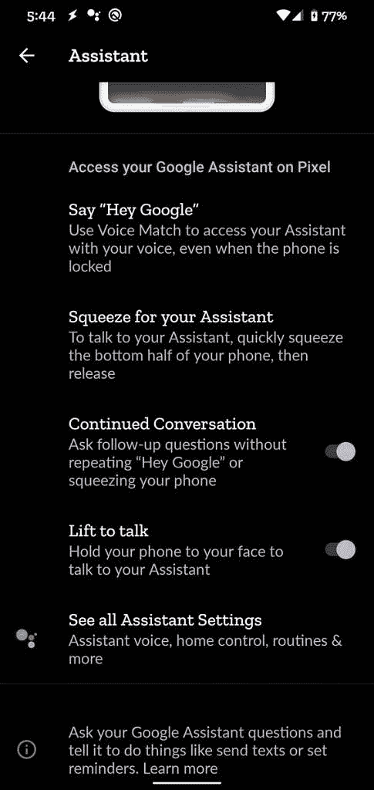

# 谷歌应用 10.83 在 Pixel 4 上测试谷歌助手的“按键通话”

> 原文：<https://www.xda-developers.com/google-app-10-83-lift-to-talk-assistant-pixel-4/>

由于多次泄露，我们在[发布](https://www.xda-developers.com/google-pixel-4-specs-features-pricing-availability/)之前就知道了关于 Pixel 4 智能手机的几乎所有事情。然而，一些传闻中的新像素设备的功能还没有实现。据说其中一个功能是在最新的 Pixel 上启动谷歌助手的新方式:提高通话。据[*9 to 5 谷歌*](https://9to5google.com/2019/10/05/pixel-4-assistant-raise/) 报道，raise to talk 是一项让你举起手机开始与谷歌助手对话的功能。虽然新的 Pixel 没有推出该功能，但我们在[两个](https://www.xda-developers.com/google-assistant-continued-conversation-pixel-4-raise-to-talk/) [单独的](https://www.xda-developers.com/google-app-10-74-6-hints-pixel-4s-assistant-coming-canada-uk-singapore/)场合确认该功能正在开发中。现在，我们设法让该功能在谷歌应用 10.83 版中部分工作，同时揭示了它可能如何工作的更多细节。

APK 拆卸通常可以预测应用程序未来更新中可能出现的功能，但我们在这里提到的任何功能都可能不会出现在未来的版本中。这是因为这些特性目前还没有在实时构建中实现，并且可能会被开发人员在未来的构建中随时引入。

一旦(或者更确切地说，如果)该功能上线，你会在设置>应用与通知>助手中看到一个新的“按键通话”开关。对这项功能的描述是，你可以“把手机举到脸前和你的助手通话”

当我启用该功能时，每当我解锁 Pixel 4 时，谷歌助手都会激活。然而，这似乎是其行为中的一个错误，因为谷歌助手应该只在手机检测到你已经把它举到你面前时才激活。事实上，每次谷歌助手启动时，我都会在底部看到一个 toast 通知，通知我一些东西“缺少传感器数据”，包括陀螺仪、加速度计、滑动和存在。来自陀螺仪和加速度计的数据可能用于确定像素 4 的方向，以及它是否从其当前位置被抬起或简单地轻微移动。“滑动”和“存在”传感器可能指的是从 Soli 雷达提取的数据，该雷达为 Pixel 4 上的运动感应手势提供动力。因此，看起来谷歌助手的“电梯通话”可能仅限于发布时的 Pixel 4。

**[谷歌 Pixel 4 论坛](https://forum.xda-developers.com/pixel-4)**| |**|[谷歌 Pixel 4 XL 论坛](https://forum.xda-developers.com/pixel-4-xl)**

我希望谷歌设法实现这个功能，这样就不会有太多的误报，因为我肯定不希望每次我举起手机解锁时谷歌助手都激活。如果这项功能开始推出，或者我们设法让它充分发挥作用，我们会让你知道。你可以从下面的谷歌 Play 商店链接下载最新版本的谷歌应用。

* * *

*感谢 PNF 软件为我们提供了使用许可 [JEB Decompiler](https://www.pnfsoftware.com/?aid=xdadev) ，这是一款针对 Android 应用的专业级逆向工程工具。*