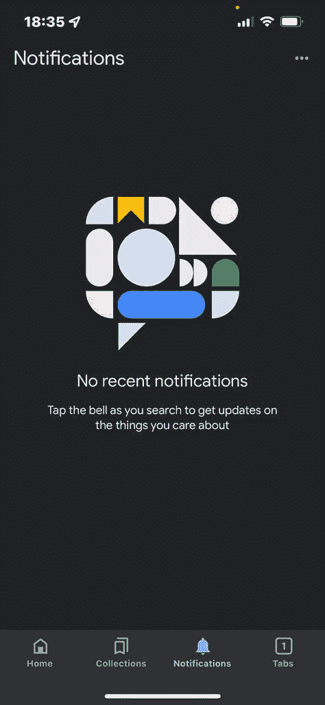
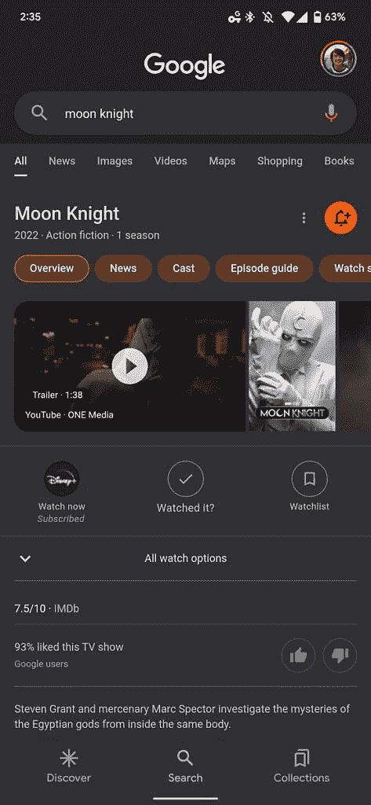

# iOS 版的谷歌应用有了新的通知标签

> 原文：<https://www.xda-developers.com/google-app-ios-notifications-tab/>

据报道，谷歌将在 iOS 版谷歌应用中增加一个新的“通知”标签，以帮助用户跟踪热门话题的通知。根据谷歌最近的一份报告，新的通知标签已经开始向一些用户推出，但是并不是所有的设备都有。

iOS 上的谷歌应用目前有三个标签——主页、收藏和标签。主页选项卡包括发现提要，收藏选项卡显示您保存的所有项目，选项卡选项卡使您可以访问内置浏览器。Google 现在增加了一个新的通知标签，可以让你快速访问所有你想关注的热门话题的推送通知。

 <picture></picture> 

Notifications tab in Google app for iOS (Credit: 9to5Google)

要获得任何主题的通知，您首先必须在搜索中点击知识面板右上角的铃铛图标。一旦完成，只要有与所选主题相关的提醒，谷歌应用就会向您发送通知，您将能够在新标签中访问这些通知。根据谷歌搜索支持页面，*“通知只适用于某些热门话题，比如人物、地点或事物。”*

 <picture></picture> 

Notification bell in Google Search's Knowledge Panels (Credit: 9to5Google)

如前所述，新的通知选项卡目前还不能广泛使用。然而，我们预计谷歌将在未来几天向更多用户推出这项服务。值得一提的是，谷歌 Android 应用程序没有类似的通知选项卡，谷歌也没有透露是否计划为 Android 发布该应用程序。一旦我们有了更多的信息，我们会尽快通知你。

不知道的是，谷歌 Android 应用程序目前有四个标签——发现、快照、搜索和收藏。由于谷歌正在取消快照，新的通知标签可能会在未来的版本中取代它的位置。

* * *

**来源:** [9to5Google](https://9to5google.com/2022/04/04/google-ios-app-notifications/)