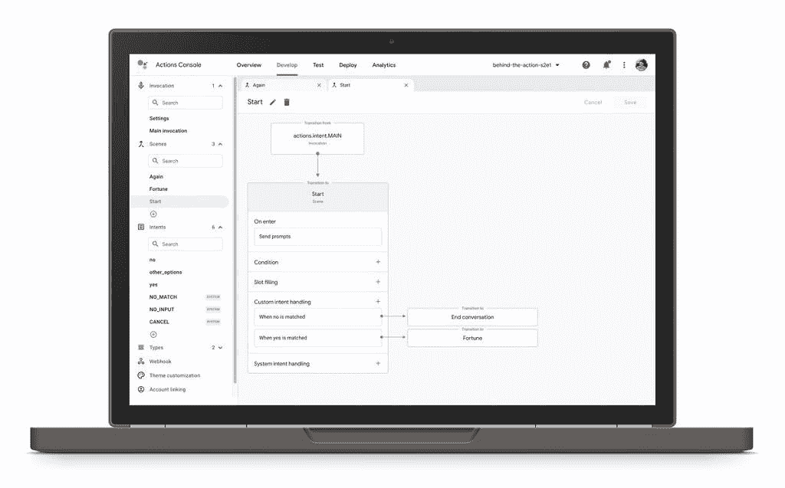
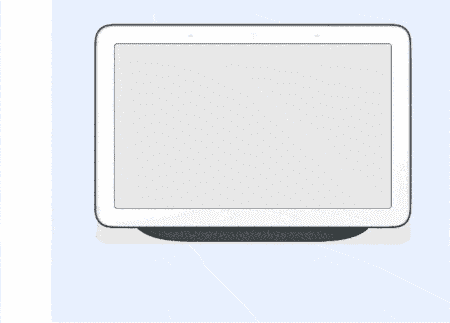
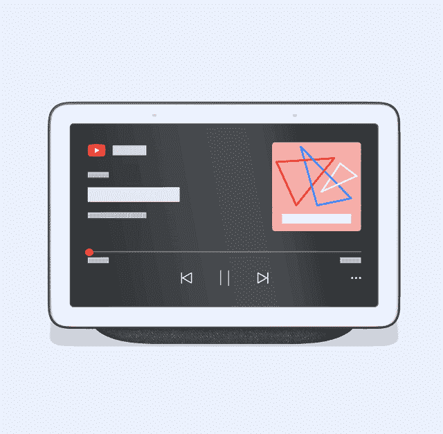

# 对于开发者来说，谷歌助手的语音操作现在变得更加容易了

> 原文：<https://www.xda-developers.com/google-assistant-actions-builder/>

谷歌助手本身是一个非常强大的工具，但当你把它与其他应用程序和服务一起使用时，它会变得更好。今天在语音技术大会 [Voice Global 2020](https://www.voicesummit.ai/global) 上，谷歌宣布了几项改进，让开发者更容易用 Assistant 构建新体验。这项工作的最前沿是新的基于 web 的 Actions Builder IDE，但这仅仅是个开始。

**动作生成器**

[Actions Builder](https://developers.googleblog.com/2020/06/voice-global-2020-new-improvements-to-core-platform.html) 是一个新的图形界面，允许开发人员使用 Google Assistant 可视化对话流。开发者可以管理自然语言理解训练数据，获得先进的调试工具。Actions Builder 集成到操作控制台中，以便在一个地方轻松构建、调试、测试、发布和分析操作，而不是在操作控制台和 Dialogflow 之间来回切换。

 <picture></picture> 

Actions Builder

**更新动作 SDK**

接下来是更新的 [Actions SDK](https://developers.googleblog.com/2020/06/voice-global-2020-new-improvements-to-core-platform.html) ，面向喜欢使用自己的工具的开发人员。现在有了一个基于文件的动作表示和使用本地 IDE 的能力。SDK 支持自然语言理解和对话流的本地创作，还支持训练数据的批量导入和导出。Actions SDK 还为喜欢使用自己的源代码控制和持续集成工具的开发人员提供了一个命令行界面。最后，在改进运行时引擎的同时，还引入了一个新的对话模型，以便更容易设计对话，并让用户获得更快、更准确的响应。

**家庭存储、更新的媒体 API 和连续匹配模式**

 <picture></picture> 

Home Storage

另一个新功能叫做[家庭存储](https://developers.google.com/assistant/conversational/save-data)。这为家庭图上连接的设备提供了公共存储解决方案。开发人员可以为单个用户保存上下文，比如游戏的最后一个保存点。更新的媒体 API 允许更长形式的媒体会话，并允许用户在 Google Assistant 设备上继续播放。例如，用户可以从特定时刻开始回放或恢复会话。

 <picture></picture> 

Media API Improvements

连续匹配模式是另一个新功能，通过识别定义的单词和短语，谷歌助手可以立即响应命令，获得更流畅的体验。谷歌给出了一个游戏的例子，这个游戏叫做“猜图”连续匹配模式允许用户用声音猜测图画，直到他们猜对为止。谷歌助手将宣布麦克风将暂时保持监听状态，以便用户知道他们可以自由发言。

**用于智能显示器的放大器**

最后，谷歌宣布[加速移动页面(AMP)](https://developers.google.com/amp) 将出现在 Nest Hub 等支持谷歌助手的智能显示器上。符合 AMP 标准的文章(如新闻文章)将于今年夏天晚些时候在智能显示器上显示。我们不确定这在智能显示器上会是什么样子，但谷歌表示，未来几个月将会有更多更新。

* * *

谷歌表示，在 90 个国家，每月有超过 5 亿人使用 30 多种语言的助手。谷歌正在投资改进 Assistant，以使其使用起来更加自然，这一努力的很大一部分必须涉及开发者和其他第三方。例如，[谷歌的对话双工](https://www.xda-developers.com/tag/googleduplex/)人工智能已被用于联系企业，以更新超过 50 万个企业名录。作为另一个例子，谷歌提到 Bamboo Learning 如何将他们的教育平台引入谷歌助手，以便家庭可以在家里教他们的孩子数学、历史和阅读方面的有趣课程。