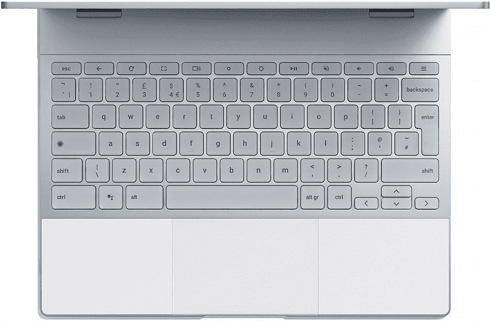

# 随着构建配置的增加，Chrome OS 上的谷歌助手工作仍在继续

> 原文：<https://www.xda-developers.com/google-assistant-chrome-os-build-configurations/>

当谷歌助手首次宣布用于移动设备时，用户对采用它犹豫不决，因为它缺乏(在某些方面仍然如此)从现在开始的功能。从那以后，Assistant 获得了大量的[附加功能和集成](https://www.xda-developers.com/tag/google-assistant/)，甚至围绕它的[专用硬件](https://www.xda-developers.com/tag/google-home/)。它甚至出现在高端[谷歌 Pixelbook](https://www.xda-developers.com/high-end-google-pixelbook-launch/) 上，并准备最终在其他 [Chrome OS](https://www.xda-developers.com/google-pixelbook-google-assistant-chrome-os/) 设备上推出。自从我们之前的报道以来，我们有新的信息分享关于谷歌助手在 Chromebooks 上的进展。

首先，Chrome OS 现在可以通过内置的谷歌助手从源代码中编译[。有趣的是，提交提到避免与“未来基于 finch 的版本”冲突在 Chrome 操作系统中，“finch”指的是用户可以在 chrome://flags 中切换的功能标志。](https://chromium-review.googlesource.com/c/chromiumos/overlays/chromiumos-overlay/+/954442)

接下来，我们发现了关于即将推出的代号为“ [poppy](https://www.xda-developers.com/detachable-chromebooks-soraka-poppy-wake-on-voice/) 的可拆卸 Chromebook 的更多信息根据[的新承诺](https://chromium-review.googlesource.com/c/chromiumos/platform/ec/+/953784)，这款设备将有一个专用的助手按钮，很像谷歌的 Pixelbook。

 <picture></picture> 

Google Pixelbook's Keyboard with Dedicated Assistant Button. Source: Google.

最后，谷歌正在为 Chromebooks 上的 Assistant 开发一个网络选择界面原型。当用户在 Chromebook 上激活助手时，可能会显示此页面。原型网页是活的，所以我们在下面的 YouTube 视频中记录了它目前的样子。请记住，这可能并不代表最终的注册过程会是什么样子，但它似乎像谷歌会显示的视频类型。

现在，Chromebooks 上的 Assistant 还没有确定的发布日期。很明显，我们正在取得进展，看起来这项服务离 beta 测试越来越近了。由于它被限制在一个构建配置中，这就限制了它只能被那些想要为他们的设备编译最新的 Chromium 操作系统的大胆的开发者使用。一旦该功能准备好通过 Chrome flag 启用，我们将向读者更新它在非 Pixelbook 设备上的工作情况。