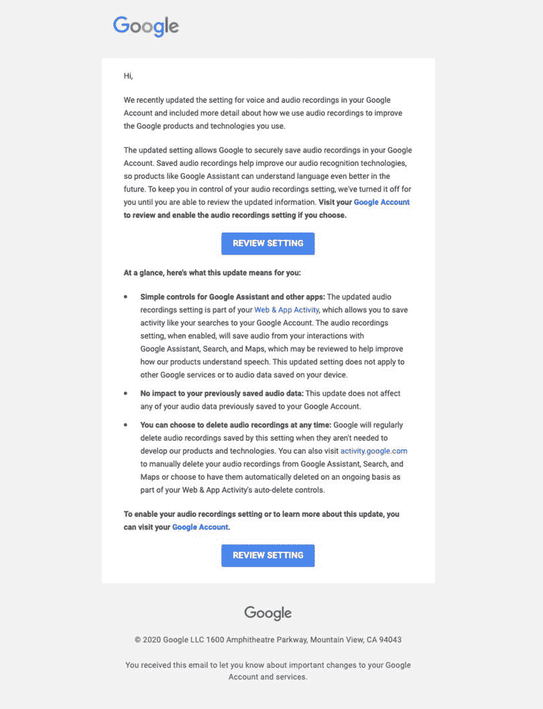

# 默认情况下，谷歌不再为所有助理用户存储录音

> 原文：<https://www.xda-developers.com/google-assistant-disables-saving-audio-recordings-all-users/>

从今天开始，谷歌已经决定不让所有用户将他们的音频存储在公司里。此举是谷歌重新实施一个程序的结果，该程序将使用人类来分析和评价音频片段。

如果你想让这个搜索巨头存储你的音频记录，你实际上必须通过启用语音和音频活动(VAA)设置来选择加入该程序。

据报道，谷歌正在向任何与谷歌助手互动的人发送电子邮件，无论是通过智能扬声器还是通过谷歌地图等应用程序。The Verge 分享了一份电子邮件的副本，其中解释说谷歌使用保存的录音来改进搜索巨头的音频识别技术。

 <picture></picture> 

Email sent to some users. Via: [The Verge](https://www.theverge.com/2020/8/5/21354805/google-email-audio-privacy-opt-in-human-reviewers-assistant)

如果你选择加入谷歌的计划，你可以通过你的网络和应用活动仪表板随时删除它们。该公司表示，还将删除开发产品和技术不需要的录音。

正如 *The Verge* 所指出的，你的音频记录首先会与你的账户相关联，谷歌将使用这些片段来改善语音匹配。接下来，你的音频将被“匿名化”,并由审查人员进行审查，其中一些审查人员来自第三方供应商。

谷歌的新政策变化是在这家搜索巨头和其他大型科技公司被披露存储和审查音频记录之后。这种做法去年成为一大丑闻，导致公司对其做法更加透明。谷歌去年对其音频保留政策进行了重大修改，称不允许人们在没有用户许可的情况下查看录音。今天的新节目似乎正在将这些新政策付诸行动。

在接下来的几天里，你会收到一封电子邮件，解释这个新程序，并提供如何删除你的录音的信息。

* * *

**Via:** *[濒临](https://www.theverge.com/2020/8/5/21354805/google-email-audio-privacy-opt-in-human-reviewers-assistant)*