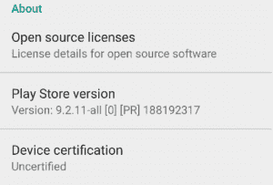

# 谷歌现在阻止未经认证的设备上的 GApps，但允许自定义 ROM 用户加入白名单

> 原文：<https://www.xda-developers.com/google-blocks-gapps-uncertified-devices-custom-rom-whitelist/>

**美国中部时间 2018 年 3 月 27 日上午 08:51 更新**:你是否和其他人一样，在[未经认证的设备注册页面](https://www.google.com/android/uncertified/)注册你的 Android ID 时遇到了麻烦？你并不孤单。显然，它并没有寻找“Android ID ”,尽管它是这么说的。相反，它接受你的 **IMEI** 。非常感谢 XDA 会员的提示！

**美国中部时间 2018 年 3 月 27 日下午 02:19 更新**:显然，它寻找的真正号码是 GSF 设备 ID。[更多详情请点击这里](https://www.xda-developers.com/how-to-fix-device-not-certified-by-google-error/)。

因为 Android 是开源的，它给了设备制造商随心所欲定制软件的自由。然而，为了确保 Android 设备之间的一致性，谷歌聪明地利用了他们流行的谷歌应用和服务套件，要求设备制造商遵循[兼容性定义文件](https://source.android.com/compatibility/cdd) (CDD)下的一套特定规则。设备制造商必须遵循 CDD，通过[兼容性测试套件](https://source.android.com/compatibility/cts/) (CTS)，这样他们才能被允许在自己的设备中预装谷歌应用和服务。以前，未经认证的设备仍然可以使用谷歌应用程序(社区简称为“Gapps”)，但现在谷歌似乎正在打击——同时仍然允许自定义 ROM 用户使用 Gapps！

本周早些时候，我们收到一个匿名消息，来自一个自称是业内人士的人。这个人说他们为一家 OEM/ODM 工作，通知我们谷歌已经开始**完全封锁新建固件访问 Gapps** 。这一变化显然于 3 月 16 日生效，并影响到在此日期之后制作的任何软件版本(显然，Google Play 服务会检查`ro.build.fingerprint`的版本日期)。

 <picture></picture> 

Message in Settings page of the Google Play Store if device is uncertified.

我联系了我自己在该行业的联系人，他们说这一变化已经酝酿了一年，因为谷歌事先向设备制造商发出了警告，但我的联系人无法在他们自己的测试设备上重现这个问题。事实上，在网上快速搜索就会发现，人们遇到这个问题至少已经有一年了，但通过清除 Google Play 服务的数据就可以轻松解决这个问题。这一新变化可能意味着这一变通办法将不再有效，因为谷歌的 A/B 测试已经结束，限制现在将得到更广泛的执行。

昨天，我们论坛的一名成员，XDA 资深会员[利亚姆·达文波特](https://forum.xda-developers.com/member.php?u=5823687)，[在他们自己的设备上遇到了这个问题](https://forum.xda-developers.com/showpost.php?p=76004552&postcount=1361)。这是很长一段时间以来我们第一次看到用户遇到这种问题。

正如你在上面的图片中所看到的，用户被禁止登录他们的谷歌账户，因为他们的设备未经认证。根据您是用户还是设备制造商的工程师，这里有几个选项。用户可以向他们购买设备的公司指出这一警告消息，希望获得认证设备，或者如果他们是定制 rom 用户(如使用 [LineageOS 15.1](https://www.xda-developers.com/lineageos-15-android-oreo-officially-announced/) )，那么他们需要在此页面输入他们的 Android ID [，以便被列入白名单。获得 Android ID 的一个简单方法是在 ADB shell 中输入“`settings get secure android_id`”。](https://www.google.com/android/uncertified/)

对于设备制造商来说，你必须去[这个网页](https://www.android.com/gms/contact/)联系谷歌注册设备。根据我的联系人所说，谷歌的这一举措是为了确保设备制造商不能简单地绕过谷歌的 CTS，并在发货设备时承诺用户可以简单地侧装 Google Play 应用程序和服务。这样做会带来这些警告，这将使设备制造商感到羞耻，并迫使他们通过正确的认证渠道。

当我们第一次从我们的线人那里听说这个变化时，我们最初担心它对自定义 rom 场景的影响。谢天谢地，谷歌似乎承认了我们的存在，并将允许我们继续非正式地使用谷歌应用和服务。向谷歌致敬！