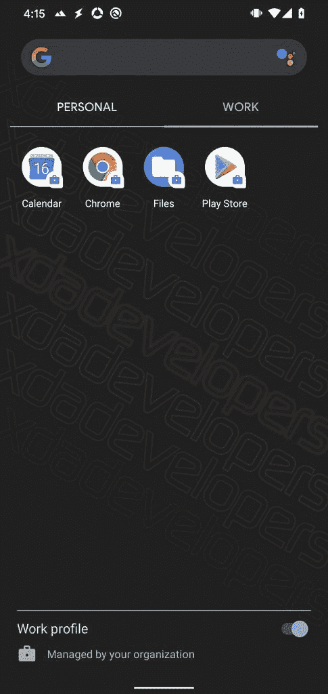

# 谷歌日历提示跨档案工作和个人日历支持

> 原文：<https://www.xda-developers.com/google-calendar-cross-profile-work-calendar/>

Android 中的工作配置文件将所有应用程序和同步的帐户信息与个人配置文件隔离开来，因此用户不会意外地将工作和个人生活中的信息混淆。虽然工作简介可以帮助员工管理工作与生活的平衡，避免意外泄露信息，但也带来了一些不便。例如，许多工作管理的日历应用程序不支持跨档案日历同步，这意味着用户必须在个人和工作档案中检查他们的日历应用程序，以确保他们不会错过重要的会议或活动。甚至谷歌日历也不支持跨档案日历可见性。

然而，在 Android 10 中，[谷歌增加了在个人日历中显示工作日历细节的支持](https://developer.android.com/work/versions/android-10#access_to_work_profile_calendars)，反之亦然。通过跨个人资料日历可见性，您可以在您的个人日历中查看工作事件，如果您试图编辑在工作日历中创建的事件，您将被引导从您的工作资料编辑日历应用程序中的事件。这保持了个人资料和工作资料之间的适当分离，同时也为员工提供了更多便利。然而，为了支持跨配置文件的日历可见性，日历应用程序必须更新以支持新的 API。在最新版本的 Android 谷歌日历应用程序中有证据表明，谷歌正准备启用跨档案日历支持。

APK 拆卸通常可以预测应用程序未来更新中可能出现的功能，但我们在这里提到的任何功能都可能不会出现在未来的版本中。这是因为这些特性目前还没有在实时构建中实现，并且可能会被开发人员在未来的构建中随时引入。

在谷歌日历的最新版本 2020.14-1 中，我们发现了暗示跨档案日历联系的新字符串。一组字符串将作为推广消息的一部分出现，通知用户他们可以“在这里看到所有[他们的]活动，包括[他们的]个人日历。”另一组字符串描述了设置中的首选项，用户必须启用该设置才能在其工作日历应用程序中显示来自其个人日历应用程序的日历事件。启用此偏好设置将“让您在查看个人事件的同时也能看到工作事件。”一旦启用，“你就可以快速跳转到你的个人日历应用程序来更改事件。”为了保护隐私，“您的日历仍然是分开储存的。”

```
 <string name="cross_profile_drawer_promo_text">To see all your events here, include your personal calendars</string>
<string name="cross_profile_drawer_promo_title">Add your personal calendars</string>
<string name="cross_profile_learn_more">Learn more</string>
<string name="cross_profile_promo_dismiss">Dismiss</string>
<string name="crossprofile_connection_off">Not connected</string>
<string name="crossprofile_connection_on">Connected</string>
<string name="crossprofile_preference_activate_info">"Turning this on lets your work Calendar app show the calendar events from your personal Calendar app. This lets you see your work events alongside your personal events. You can then quickly jump to your personal Calendar app to change them. To Protect your privacy, your calendars are still stored separately."</string>
<string name="crossprofile_preference_activate_link">Turn on in Settings</string>
<string name="crossprofile_preference_deactivate_info">To keep your calendars separate across apps, update access in Settings. Once turned off, your personal Calendar events will stop showing in your work Calendar app.</string>
<string name="crossprofile_preference_deactivate_link">Turn off in Settings</string>
<string name="menu_crossprofile_preferences">Personal calendars</string>
<string name="work_profile_header_title">Work profile</string> 
```

我使用 [Island](https://forum.xda-developers.com/android/apps-games/closed-beta-test-incoming-companion-app-t3366295) 应用程序建立了一个本地工作档案，但我无法让跨档案日历可见性工作。这项功能很可能会在谷歌日历应用的未来更新中推出，或者通过服务器端的配置更改来启用。一旦该功能推出，我们会通知大家。

 <picture></picture> 

Work Profile on a Google Pixel 4 running Android 10