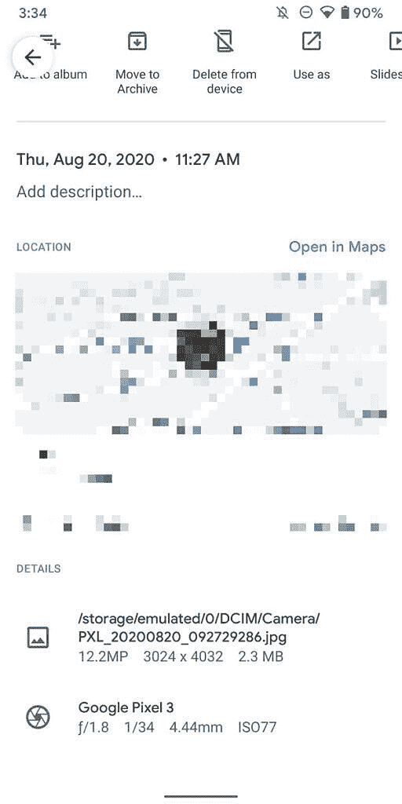
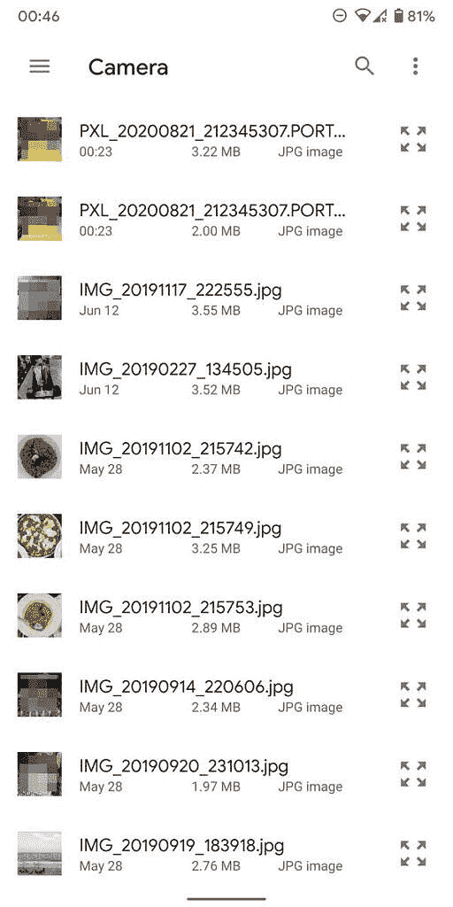

# 谷歌相机 7.5 改变了文件命名方案，并停止在单独的文件夹中保存人像照片

> 原文：<https://www.xda-developers.com/google-camera-7-5-changes-file-naming-scheme-stops-saving-portrait-photos-separate-folders/>

谷歌相机 7.5 是谷歌像素智能手机的最新版本的相机应用程序，早些时候[被发现](https://www.xda-developers.com/google-camera-7-5-pixel-4a-5g-pixel-5-audio-zoom-expanded-social-share/)抛出了关于[像素 4a 5G(树莓)](https://www.xda-developers.com/google-pixel-4a-5g-pixel-5-live-image-specs-leak/)和[像素 5(红鳍)](https://www.xda-developers.com/google-pixel-5-specs-snapdragon-765g-90hz-display-wide-angle-camera-8gb-ram/)的提示，以及关于音频缩放、扩大社交分享和更多相机模式等功能的提示。同一版本的应用程序还带来了更多的变化，特别是照片的文件命名方案的变化，并最终停止了将肖像照片保存在单独的文件夹中的行为。

根据 AndroidPolice 的报道，谷歌相机 7.5 版本将切换到一个不同的文件命名方案。按照惯例，这个版本不会像大多数智能手机那样以前缀“IMG”作为文件名的开头，而是以“PXL”作为前缀，然后是日期和时间。这一更改将应用于所有照片和视频，因此运动照片、夜视点击和人像将以相同的前缀开始，而具有不同的后缀。一个可能意想不到的副作用是，运动照片现在会出现在其余图像的旁边。

 <picture></picture> 

The new naming scheme in Google Camera 7.5

进一步说，在谷歌相机 7.5 中，人像照片将不再保存到自己的文件夹中，这是一个很可能受到所有人赞赏的举动。在旧版本中，你点击的任何人像照片都会保存在 DCIM/Camera 目录下的单独文件夹中，坦白地说，这是一个糟糕的实现。使用大多数图库解决方案将意味着您必须冒险进入每个单独的文件夹来查看图像，此外，您的照片不会按时间顺序显示，并且删除图片仍会给您留下空文件夹。整个情况一团糟，如果您有多台设备，并且使用一个集中的解决方案进行在线备份，情况会更糟。

 <picture></picture> 

Portrait photos now get saved in the main folder, as they should have in the first place

令人欣慰的是，肖像照片的问题现在应该在新的命名方案下得到解决，因为照片直接保存在 DCIM/Camera 文件夹下。这个问题本来也可以在命名方案没有改变的情况下得到解决，但这是您目前得到的改变的组合。新的谷歌相机 7.5(T1)可以在 T2 的安卓 11(T3)测试版上下载，所以如果你运行的是最新版本，就试试吧。

* * *

来源:AndroidPolice ( [1](https://www.androidpolice.com/2020/08/20/soon-everyone-you-share-photos-and-videos-with-will-know-youve-got-a-pixel/) )，( [2](https://www.androidpolice.com/2020/08/22/google-camera-7-5-no-longer-saves-portrait-photo-pairs-in-standalone-folders/) )