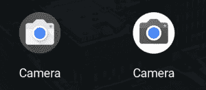

# 谷歌相机应用出现在一些 Chromebooks 上，如 Pixelbook

> 原文：<https://www.xda-developers.com/google-camera-chromebook-pixelbook/>

# 谷歌相机应用出现在一些 Chromebooks 上，如 Pixelbook

谷歌 Nexus 和谷歌 Pixel 智能手机上的谷歌相机应用程序已经开始出现在谷歌 Pixelbook 等一些 Chromebooks 上。

谷歌 Pixel 智能手机的拍照能力在很大程度上归功于谷歌相机应用程序背后的优秀软件。相机应用程序的 HDR+和肖像模式功能使谷歌 Pixel 在图片性能方面成为顶级智能手机，这也是为什么每个人[都希望看到应用程序移植到他们的智能手机](https://www.xda-developers.com/download-google-camera-port/)。相比之下，大多数 Chromebooks 的相机质量，甚至是高端的谷歌 Pixelbook，都很糟糕。但谷歌可能会改变这种情况，因为一些用户注意到谷歌相机应用程序出现在他们的 Chromebook 上。

Reddit 上的一些用户注意到，最新的 Chrome OS Dev 频道更新神秘地添加了第二个相机应用图标。对于大多数用户来说，这两个图标打开的是同一个旧的相机应用程序。然而，对于谷歌 pixel book(/u/[slide readit](https://www.reddit.com/user/SlideReadIt))上的一个用户来说，新的应用程序图标打开了 Android 上的谷歌相机应用程序。

 <picture></picture> 

Left: Old Camera app. Right: Google Camera app.

我们决定搜索 Chromium Gerrit，看看哪个提交对这个新添加负责。我们发现了一个[相关的提交](https://chromium-review.googlesource.com/c/chromium/src/+/1137054)，它“在启动器中创建一个持久的摄像机图标。”描述进一步指出，当点击这个新图标时，将“动态确定”是打开股票 Chrome OS 相机应用程序还是谷歌相机应用程序。一份附带的[错误报告](https://bugs.chromium.org/p/chromium/issues/detail?id=861952)称，谷歌相机应用程序将在支持 ARC++ (Android 应用程序)并已完成 Chrome OS 相机应用程序迁移的 Chromebooks 上打开。据推测，这意味着迄今为止只有谷歌 Pixelbook (eve)满足这两个要求，这就是为什么只有 Pixelbook 能够推出新的相机应用程序。

我们假设旧的相机应用程序图标将在稍后的日期消失，因为它将被新的应用程序图标取代，新的应用程序图标可以动态启动 Chrome OS 相机应用程序或新的谷歌相机应用程序。我们不知道谷歌像素相机应用程序的这个端口是否会带来类似 HDR+或人像模式的功能。我们认为这款新的相机应用程序可能是为[即将推出的谷歌 Pixelbook](https://www.xda-developers.com/google-pixelbook-v2-launch-fall-event/) (2018)设计的，因为[现有的谷歌 Pixelbook](https://www.xda-developers.com/google-pixelbook-great-experience/) 没有后置摄像头。