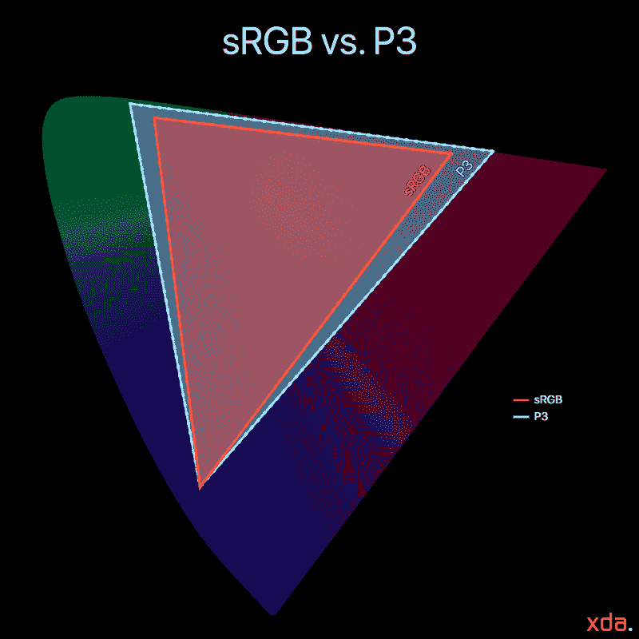

# 谷歌像素 4 可能支持通过谷歌相机拍摄宽彩色照片

> 原文：<https://www.xda-developers.com/google-camera-coming-with-wide-color-capture-support-possibly-with-google-pixel-4/>

智能手机摄像头每年都在变得越来越好，对于我们日常携带的便携式手机来说，Android 似乎处于图像质量的最前沿。然而，所有 Android 智能手机摄像头都缺少一个重要的方面，那就是它们图像的颜色范围。虽然许多人认为最新的 Android 旗舰上的摄像头比最新的 iphone 拍摄的照片更具视觉冲击力，但苹果的一个优势是，它们能够捕捉比任何 Android 手机更广泛的颜色。谷歌 Pixel 4 可能会改变这一点。

 <picture></picture> 

sRGB gamut vs. P3 wide-color gamut

iPhones 捕捉 P3 色域中的图像，这是一个比 Android 手机中使用的 sRGB 色彩空间大 25%的颜色范围。自 2016 年 iPhone 7 发布以来，苹果一直在所有设备中支持这一功能，而谷歌直到三年后才开始宣布未来的支持。现在，当在 Android 设备上查看 iPhone (7 和更高版本)捕获的图像时，如果 iPhone 相机图像捕获的颜色在 sRGB 颜色范围之外，Android 显示器将不会正确地显示那些更鲜艳的颜色，而是将它们裁剪为 sRGB 颜色空间中最接近的范围内颜色。这实际上是由于 Android 的应用程序缺乏色彩管理，但这与宽彩色照片捕捉密切相关，因为色彩管理是首先查看宽彩色照片所必需的。就 Android 目前的状况而言，有一系列颜色没有在 Android 生态系统中得到适当利用，其直接竞争对手苹果公司已经在整个平台上实现了标准化，包括社交媒体，这已经有三年了。

上个月，谷歌宣布宽彩色照片将登陆安卓系统，但没有给出具体的时间表。然而，去年我们发现来自[泄露像素 3](https://www.xda-developers.com/google-pixel-3-xl-specs-features-pics-rumors/) 的照片样本包含一个显示 P3 嵌入式颜色配置文件，这与苹果设备用于捕捉图像的宽色域相同。这让我们对谷歌 Pixel 3 支持宽色彩捕捉充满希望，但当它发布时，谷歌似乎恢复了这一功能，并继续在古老的 sRGB 色彩空间捕捉图像。这并不是因为传感器不支持它——几乎所有的移动传感器都能够捕捉 sRGB 色域以外的颜色——应用程序只需要适当地支持它(谷歌并没有让这变得容易，但这是另一个话题)。在我的 [Pixel 3 XL](https://www.xda-developers.com/google-pixel-3-xl-display-review-what-google-needs-to-improve-for-the-pixel-4/) 显示器评测中，我推测即将发布的谷歌 Pixel 4 将支持捕捉宽彩色照片，现在有一些证据表明谷歌确实在努力支持这一点。

最近，XDA 的高级成员 [cstark27](https://forum.xda-developers.com/member.php?u=2712580) 在谷歌相机应用程序中发现了允许宽色域 P3 色彩捕捉的代码，他友好地为我们编译了一个版本，可以切换该功能以进行测试。

这些图像正如预期的那样，正确地捕捉了 sRGB 色彩空间之外的颜色，并正确地应用了我们在泄露的照片样本中看到的显示 P3 嵌入式颜色配置文件。下面是一个快速循环，在 sRGB 捕捉和新的 P3 宽彩色捕捉之间来回切换:

**GIF 的工作空间是 sRGB，sRGB 的图像被转换成 P3 并被分配回 sRGB，以在非宽彩色显示器上展示色差。[链接到具有正确配置文件的静止图像](https://flic.kr/s/aHsmEtzxKH)(必须在具有正确色彩管理应用程序的宽色域支持的显示器上观看)*

这种差异在对比中相当微妙，但在 P3 拍摄的花朵看起来更逼真，花瓣和阴影之间的颜色对比度更高。景色越丰富多彩，这种差异就越明显——一个比我的花园更加茂盛的绿色花园，会显得更加光彩照人。Android 的下一步是采用丰富的支持来显示这些带有色彩管理支持的宽彩色图像。眼下，三星的 Gallery 应用是唯一一个对照片进行颜色管理的相关 Android 应用；Android 上的社交媒体平台无法正常显示苹果用户分享的任何彩色照片。Google Photos 也开始实施色彩管理，在过去的一年中包含了对它的支持，但 Google 一直在向少数用户零星地推出它。

随着 cstark27 的发现和谷歌宣布宽彩色摄影，我们推测谷歌终于开始加大对宽彩色的支持，并且他们很可能在今年晚些时候在谷歌 Pixel 4 上展示[激进的新相机时对此大做文章。](https://www.xda-developers.com/google-pixel-4-teaser/)