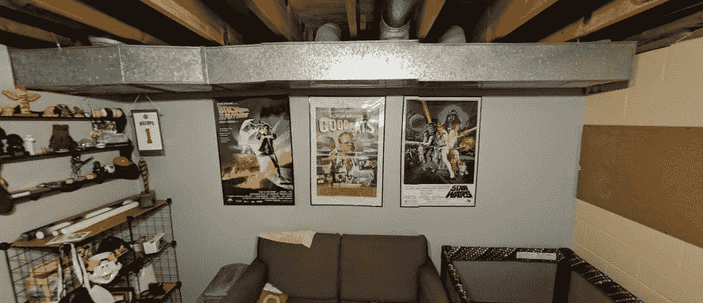

# 谷歌相机 5.3 准备添加对脸部广角失真的校正

> 原文：<https://www.xda-developers.com/google-camera-distortion-correction/>

# 谷歌相机 5.3 准备添加对脸部广角失真的校正

谷歌正致力于修复谷歌相机在广角和全景模式下拍摄照片时的失真。

广角镜头已经成为智能手机相机的一大亮点。它们允许你后退一步，在框架中获得更多。然而，广角镜头也不是没有缺点。使用这些镜头时，失真是一种常见的副作用。照片的外边缘可能会出现扭曲，甚至会影响面部。谷歌正在努力解决这个问题，使这个问题在谷歌相机应用程序的广角模式下不那么明显。

以下字符串来自最新的 Google Camera v5.3，取自 Google Pixel 2 XL 上的 Android P [Beta 3(开发者预览版 4)](https://www.xda-developers.com/android-p-beta-3-google-pixel/) 。他们提到固定视角扭曲的人脸。

```
 <string name="pref_acat_summary">Adjust faces to look more natural when angle of view distorts them.</string>
<string name="pref_acat_title">Correct wide-angle distortion on face</string> 
```

谷歌 Pixel 手机没有你在 LG G7 上可以找到的第二个广角摄像头，但谷歌摄像头在全景部分有一个漂亮的人造“广角”模式。当你需要在相框里放更多东西时，这非常方便。当将照片拼接在一起时，拍摄这些类型的照片会产生许多奇怪的失真。如果你要和很多人一起拍一张大大的集体照，你要确保面部表情好看。

 <picture></picture> 

Wide-angle mode on Pixel 2 Android P DP3

要亲自尝试广角功能，请打开谷歌相机应用程序，然后滑动打开菜单。选择全景并从顶部选择一种样式(水平、垂直、广角或鱼眼)。相机应用程序会引导你完成拍照的步骤。当你完成后，照片将被拼接在一起，希望这个新技巧可以修复人脸。