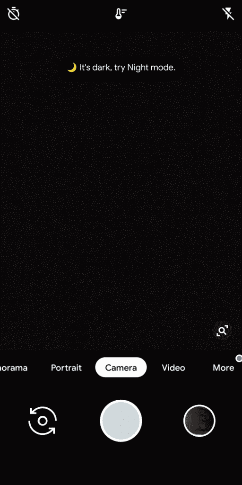

# 在小米 Mi Mix 2S，Mi 8 上获得 MIUI Global 10 上的谷歌相机夜视功能[Root]

> 原文：<https://www.xda-developers.com/google-camera-night-sight-miui-global-10-xiaomi-mi-mix-2s-mi-8-root/>

小米 Mix 2S 和小米 Mi 8 都是很棒的摄影设备，在目前处于封闭测试阶段的最新版本的中国 MIUI 中，它们变得更好。该公司正在将 Mi Mix 3 的一些功能带回以前具有相同硬件的设备。虽然这意味着你将获得像 Mi Mix 3 的新夜间模式这样的功能，但它也恰好完全支持谷歌相机，没有任何问题。这包括[革命夜景](https://www.xda-developers.com/google-pixel-night-sight-google-camera-review/)和 HDR+。可悲的是，这是中国最新版本 MIUI 封闭测试版中的 *only* ，但你实际上可以在最新的全球稳定版本中绕过它——你需要的只是 Magisk。值得庆幸的是，小米设备相对容易解锁并开始闪烁，所以你可以参考给定设备的论坛，了解如何解锁你的引导程序。

[**小米 Mi Mix 2S 论坛**](https://forum.xda-developers.com/xiaomi-mi-mix-2s) [**小米 Mi 8 论坛**](https://forum.xda-developers.com/mi-8)

[](https://www.flickr.com/photos/145036207@N04/albums/72157703529462754 "Xiaomi Mi Mix 2S Night Mode Google Camera")

*小米 Mix 2S 的样照*

* * *

## 在小米 Mix 2S 和小米 Mi 8 上获得 MIUI Global 10 的谷歌相机夜视功能

### 步骤 1 -安装魔术

首先，你需要安装 Magisk。这是因为你需要安装一个 Magisk 模块来添加所需的库，这些库取自 MIUI 的最新中文封闭测试版。安装 Magisk 需要使用 TWRP。您需要设置 adb 和 fastboot。当你有，为你的设备下载下面的 TWRP 图像。

[**TWRP 为小米 Mi Mix 2S**](https://forum.xda-developers.com/xiaomi-mi-mix-2s/development/recovery-twrp-mix-2s-t3790922) [**TWRP 为小米 Mi 8**](https://forum.xda-developers.com/mi-8/development/recovery-twrp-3-2-3-0-mi-8-t3837745)

如果你愿意，你可以刷新这些文件，但是重启 MIUI 会覆盖你的恢复分区。更简单的方法是重新启动你的引导程序(fastboot ),输入下面的内容，用你下载的实际镜像文件替换名字。

```
 fastboot boot twrp_file_name.img 
```

现在也将 Magisk 下载到您的计算机上。

[**下载最新 Magisk zip**](https://forum.xda-developers.com/apps/magisk/official-magisk-v7-universal-systemless-t3473445)

一旦你在 TWRP 使用你的设备，进入“高级”并选择“Adb 侧载”现在我们要闪存 Magisk。在您的计算机上键入以下内容，再次用实际的 zip 文件名替换名称。

```
 adb sideload Magisk_file_name_here.zip 
```

重启你的设备进入 MIUI。第一次启动可能会比你习惯的时间长一点。

### 步骤 2 -刷新 Magisk 模块

这是奇迹发生的地方，也是主要变化的来源。这个模块是由一位名叫 Lenzhang 的中国开发者组装的，他活跃在小米 Mi Mix 2S 开发电报组。你可以在下面链接的帖子中找到“模块库修复”Magisk 模块。

[**Magisk 模块启用夜视**](https://forum.xda-developers.com/showpost.php?p=78091570&postcount=426)

打开 Magisk Manager，转到“模块”，单击底部的加号按钮，导航到您刚刚下载的 zip 文件。接下来，重启。

如果你想知道这个模块是做什么的，它增加了一个取自 MIUI 最新中国封闭测试版的相机库。这是让谷歌相机几乎完美运行的库，将其复制到 MIUI 的以前版本似乎可以在兼容的硬件上很好地工作。

### 步骤 3 -安装谷歌摄像头

最后，你需要下载最新版本的谷歌相机应用程序。由于我们上面安装的 Magisk 模块的性质，任何由 B-S-G 制作的在小米 Mi 8 上工作的端口也将在小米 Mi Mix 2S 上工作。这是因为两台设备使用相同的摄像头硬件。您可以从下面下载最新版本。默认配置足以让您运行，您实际上不需要做任何其他事情。

[**小米 Mix 2S 和小米 Mi 8**](https://www.celsoazevedo.com/files/android/google-camera/dev-bsg/) 的最新谷歌摄像头端口

 <picture></picture> 

In the darkness, the Google Camera app will suggest trying out Night Sight.

最新版本的谷歌相机应用程序几乎一切正常，除了 60 FPS 的 4K 和慢动作。然而，使用 HDR+，谷歌镜头或夜间模式都没有问题，反正这些都是谷歌相机的主要功能。