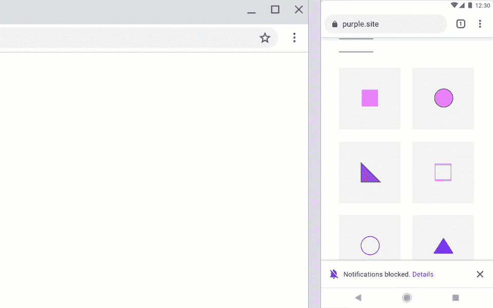

# 【更新 2:在 Chrome 80 中启用】谷歌 Chrome 恼人的通知提示将很快不再那么侵扰

> 原文：<https://www.xda-developers.com/google-chrome-annoying-notification-prompts/>

**更新 2 (1/7/20 @美国东部时间下午 5:20):**谷歌不那么烦人的权限提示现在在 Chrome 80 中启用了。

**更新 1 (11/18/19 @美国东部时间上午 10:45):**Android 版 Chrome 中用于减少提示干扰的标志现在在 Canary 中起作用了。

在 2019 年浏览网页并不总是一种愉快的体验。网站不断要求你接受 cookies，获取你的位置，也许最烦人的是，发送通知。谷歌正在努力让这些提示在 Chrome 中不那么烦人。

很多人可能不知道你可以在 Chrome(网站设置)中禁用所有通知提示，但如果你喜欢保持启用，Chrome 很快就会让它们不那么碍事。Chromium nightly 中的一个名为“安静通知许可提示”的标志就是答案。

这个标志目前不起作用，很可能是因为代码还没有，但它应该很快就会出现在 Chrome Canary 中。它提供了几个不同的选项:默认、启用、启用(抬头通知)、启用(小信息栏)和禁用。因为这个标志现在没有功能，我们不知道*确切地说*这些不同的模式看起来像什么。然而，抬头通知是我们在 Android 中已经有一段时间的典型弹出窗口。“迷你信息栏”可能是地址栏顶部的一个小覆盖物。

如前所述，我们应该很快就会在 Chrome Canary 频道看到这一点(尽管这并不保证它会工作)。然后我们会看到提示看起来有多“安静”。任何被这些通知请求困扰的人都会希望在它一出现就启用它。谷歌首先允许网站发送通知，这造成了问题，但至少他们认识到了问题。

* * *

## 更新 1:现在工作

在 8 月份没有发挥作用的旗帜现在在金丝雀频道上的最新版本的 Android 版 Chrome 中出现了。启用时，通知提示会减少干扰，所以您仍然可以看到它们，但它们不会太碍事。该标志的标题是“安静通知权限提示”，您需要选择启用(强制安静通知)、启用(强制抬头通知)或启用(强制小信息栏)。必须重新启动浏览器才能应用更改。

**Via:[Techdows](https://techdows.com/2019/11/chrome-on-android-now-makes-notification-prompts-less-annoying.html)**

* * *

## 更新 2:在 Chrome 80 中启用

 <picture></picture> 

Desktop (Left), Mobile (Right)

谷歌“更安静”的通知提示终于在 Chrome 80 中占据了黄金时段。Chrome 中的通知可能是有用的，因此为了保护它们的价值，Chrome 80 将在特定条件下显示新的通知权限 UI。更新到 Chrome 80 后，用户将可以选择加入这一行为。但是，如果您是通常阻止通知请求的用户，它将自动启用。新的用户界面也会自动出现在选择加入率非常低的网站上。

用户可以通过进入**设置>站点设置>通知**来启用更安静的通知提示，然后选中复选框或切换“使用更安静的消息传递”

**来源:[铬](https://blog.chromium.org/2020/01/introducing-quieter-permission-ui-for.html?m=1)**