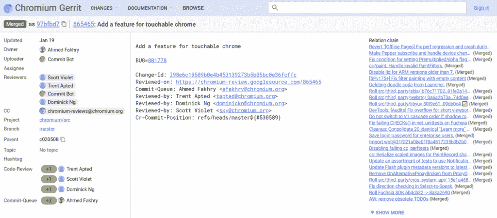

# Chrome OS 上的谷歌 Chrome 浏览器可能很快会针对触摸进行更好的优化

> 原文：<https://www.xda-developers.com/google-chrome-browser-chrome-os-optimized-touch/>

# Chrome OS 上的谷歌 Chrome 浏览器可能很快会针对触摸进行更好的优化

Chromium Gerrit 的一项新承诺表明，谷歌正在努力改善 Chrome OS 设备上谷歌 Chrome 浏览器的触摸屏行为。

在整个 2017 年，谷歌大幅扩展了其 [Chrome OS](https://www.xda-developers.com/future-chrome-os-devices-could-get-video-recording-support/) 操作系统的功能，实现了对 Android 应用程序的支持，简化了界面，并添加了其他功能。谷歌格外关注的一个方面是该平台的触摸屏功能，考虑到二合一设备越来越受欢迎，这并不奇怪。奇怪的是，Chrome 操作系统上的 Chrome 网络浏览器并没有提供特别强大的触摸屏支持，但是[的新承诺](https://chromium-review.googlesource.com/c/chromium/src/+/865465)表明它正在努力。

[我们发现的新承诺](https://chromium-review.googlesource.com/c/chromium/src/+/865465)表明谷歌打算在 Chrome 操作系统上优化 Chrome 的触摸输入。在 commit 的评论中有这样的说法，它仅限于 Chrome OS，至少现在是这样，它带有 if 语句#**if defined(OS _ CHROMEOS))**。因此，如果谷歌决定将其局限于 Chrome 操作系统，他们将不得不“丢弃”Chrome 的代码。这表明提交相当激烈，可能会完全改变 Chrome 在平板电脑或 PC 上使用触摸输入的感觉。

 <picture></picture> 

Source: Chromium Gerrit

Chrome OS 最初是为廉价、低功耗的笔记本电脑设计的。随着时间的推移，它扩展到了迷你 PC 和 2 合 1 平板电脑/笔记本电脑组合设备等设备。每当涉及到一种新的外形时，我们经常会看到谷歌为利用新硬件所做的工作。例如，2017 年 8 月，搜索巨头在 Chrome OS 中使[笔输入的行为类似于传统的触摸输入](https://www.xda-developers.com/chrome-os-pen-input-behave-touch/)。几个月后，[谷歌提交了一个浮动软键盘](https://www.xda-developers.com/chrome-os-adding-floating-keyboard/)。

最近的重大变化普遍提高了 Chrome OS 在笔记本电脑/平板电脑组合设备上的可用性，结果有几家公司在即将推出的设备上采用了该操作系统。虽然这个主提交已经被合并，但是其他的提交实际上还没有被合并。