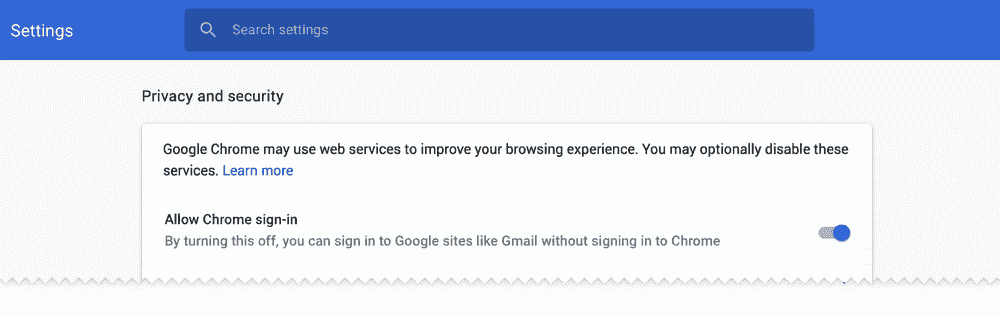

# 登录谷歌网站时，Chrome 不会自动同步数据

> 原文：<https://www.xda-developers.com/google-chrome-doesnt-auto-sync-data/>

# [更新:谷歌回应]不，当你登录谷歌网站时，Chrome 不会自动同步你的浏览历史

谷歌发现自己正处于互联网上对谷歌 Chrome 的一次变革的喧嚣之中。形势并不像人们最初想象的那样险恶。

**9/26 更新:**谷歌已经发表了一篇博文，进一步澄清了 Chrome 的登录情况。

上周末，谷歌发现自己陷入了一场因 Chrome 浏览器的变化而引发的网络小骚动。事实证明，情况并不像人们最初想象的那样糟糕。简而言之， [Chrome 69](https://www.xda-developers.com/google-chrome-material-design-theme/) 在用户登录谷歌产品时，会在状态栏中显示用户的谷歌个人资料照片。然而，这并不意味着*而不是*用户登录了 Chrome Sync。

抗议来自那些认为个人资料照片意味着他们登录了浏览器，他们的所有信息都被谷歌追踪的人。谷歌工程师阿德里安娜·波特·费尔特(Adrienne Porter Felt)在推特上解释了这里发生的事情。个人资料照片是为了提醒用户他们已经登录了谷歌服务，而不是浏览器。打开 Chrome Sync 还需要一个额外的步骤。

阿德里安娜解释说，创建这个功能是为了防止人们在共享计算机上登录谷歌服务。然后，用户可以通过点击个人资料照片轻松退出谷歌服务，而不是单独访问所有服务。它实际上只是一个显示您登录状态的提醒通知。

一些人仍然对这一改变不满意，因为它可以让更多的人打开 Chrome Sync。更多的人同步数据对谷歌来说显然是一件好事，但这似乎不是一个偷偷摸摸的把戏。用户仍然需要有意识地选择登录并同步他们的信息。

### 更新:谷歌的回应

Google 已经[发表了一篇博文](https://www.blog.google/products/chrome/product-updates-based-your-feedback/)，本质上与 Adrienne 的解释相同。

*我们想澄清的是，登录的这一变化并不意味着 Chrome sync 被打开。想要在其他设备上获得浏览历史、密码和书签等数据的用户必须采取额外的行动，例如[打开](https://support.google.com/chrome/answer/185277?co=GENIE.Platform%3DDesktop&hl=en)同步。*

新的用户界面会提醒用户登录了哪个谷歌账户。重要的是，这使我们能够更好地帮助共享单个设备(例如，家庭计算机)的用户。多年来，我们收到了共享设备用户的反馈，他们对 Chrome 的登录状态感到困惑。我们认为这些 UI 更改有助于防止用户无意中执行搜索或导航到可能会保存到不同用户的同步帐户的网站。

对于那些不喜欢这一变化的人来说，好消息是谷歌将在 Chrome 70 中进行修复。用户可以通过登录应用程序来关闭登录 Chrome 的功能。

