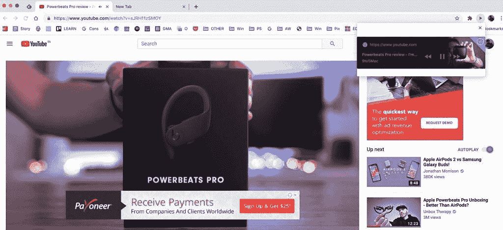

# [更新:截图]谷歌 Chrome 的媒体控件很快会弹出一个浮动的覆盖图

> 原文：<https://www.xda-developers.com/google-chrome-media-controls-popped-out-floating-stay-on-top/>

# [更新:截图]谷歌 Chrome 的媒体控件很快会弹出一个浮动的覆盖图

很快，谷歌 Chrome 工具栏中显示的媒体控件将能够分离出来，并悬浮在屏幕上的任何地方。

**更新 1(美国东部时间 07/10/2020 @ 04:32AM):**谷歌 Chrome 的媒体控件已经在其弹出式浮动头像中显示出来。滚动到底部了解更多信息。下面保留了 2020 年 6 月 29 日发表的文章。

谷歌一直致力于改进 Chrome 浏览器的媒体控件，最近他们在今年早些时候推出了稳定版的 T2。全局媒体控件允许您直接从工具栏管理正在播放的任何媒体，而不是从当前选项卡导航到正在播放媒体的选项卡/窗口。很快，看起来这些媒体控制会变得更加方便。

最近，一个针对全局媒体控件的特性请求被选中并添加到了 Chromium 代码中。该请求只是简单地声明:“增加将通知拖出对话框的能力。”这样就可以将控件从工具栏中分离出来，放在屏幕上的任何地方。该请求继续解释道:“我们希望用户能够点击并拖动一个通知到媒体对话框之外，并将其放在最上面。”

 *演员表:Chrome Story*

描述的第二部分是关键，因为它将允许控件停留在顶部。这一点很重要，否则，每次想要控制媒体播放时，您都必须打开全局媒体控件，因为当您现在单击离开时，控件会失去焦点。这项功能的代码已经被添加到 Chrome 中，并且很快将会有一个标志能够在金丝雀频道上启用这项功能。该标志可以在*chrome://flags/# global-media-controls 找到。*

如果你是一个经常打开很多标签页的人(我们大多数人可能都是)，Chrome 的媒体控件是一个真正的省时工具。工具栏中的快捷方式意味着您永远不必担心哪个标签正在播放媒体。将控件放在浮动窗口中可以省去额外的点击。这是件大事吗？也许不是，但这是个不错的选择。我们期待看到该功能的推出。

**来源 1:[Chrome Gerrit](https://chromium-review.googlesource.com/c/chromium/src/+/2269821)|来源 2: [Bug 追踪器](https://bugs.chromium.org/p/chromium/issues/detail?id=1022452&q=component%3AInternals%3EMedia%3EUI) | Via: [Chrome Story](https://www.chromestory.com/2020/06/drag-away-media-control/)**

* * *

通过一个标志，我们成功启用了谷歌 Chrome 的浮动媒体控件。

该标志可以在*chrome://flags/# global-media-controls 找到。*