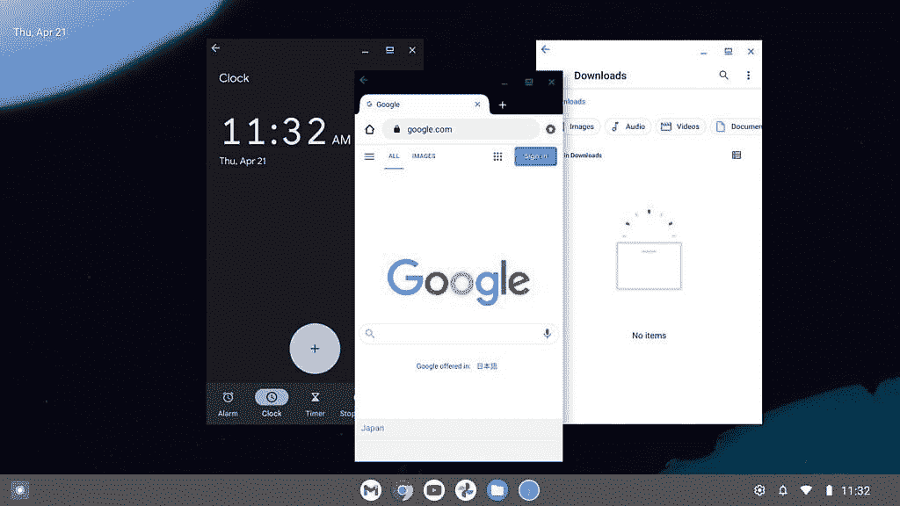

# 由于 Android Studio 中的桌面 AVD，Chromebooks 可能很快就会有更好的应用程序

> 原文：<https://www.xda-developers.com/google-desktop-avd-android-studio/>

自 2011 年宣布 ChromeOS 以来，谷歌定期更新 ChromeOS，进行深思熟虑的更改。 公司于 2016 年正式公布了用于 ChromeOS 的 谷歌 Play 商店，随后是 2018 年对 Linux 应用 的 [支持。2020 年，它又发布了 ChromeOS . dev——一个旨在帮助开发者为 ChromeOS 开发应用的网站。 自推出以来，ChromeOS.dev 通过教程、代码示例、公告等方式让开发者能够构建更好的应用。继上个月末将](https://www.xda-developers.com/linux-apps-chrome-os-overview-crostini/)意外加入桌面 Android 虚拟设备列表之后，谷歌现在已经将桌面 Android 虚拟设备(AVD)图像引入到 IDE [的 Electric Eel Canary 版本中。它旨在帮助开发者为 Chromebook 等大屏幕设备构建和测试应用程序，而无需购买 chrome book 进行测试。](https://www.xda-developers.com/google-play-games-on-windows-android-desktop-images/)

桌面 Android 虚拟设备基于 [Android 12](https://xda-developers.com/android-12) ，并带有可以帮助开发人员验证的功能， 对在 Chromebooks 上为用户提供卓越的用户体验充满信心。例如，它可以在自由窗口模式下启动 应用程序——在这种模式下，应用程序带有一个标题栏(类似于 Windows 或 macOS)，可以最大化、最小化、调整大小和关闭应用程序。 还有一个传统的任务栏，可以帮助在运行的应用程序之间切换， 在右下角有一个系统托盘，可以访问通知和快速设置，而不是先触摸设备上的滑动手势。

 <picture></picture> 

Freeform windows on Desktop AVD

与手机或平板电脑相比，在 Chromebooks 这样的桌面环境中，调整大小和在应用程序之间切换等活动更频繁，谷歌正在推动开发者采用的流体布局来支持 [可调整大小的活动](https://developer.android.com/guide/topics/large-screens/multi-window-support#resizeableActivity) 。

[video width = " 2560 " height = " 1440 " MP4 = " https://static 1 . xdaimages . com/WordPress/WP-content/uploads/2022/05/maximize-large . MP4 "]

尽管 ChromeOS.dev 的 [公告](https://chromeos.dev/en/posts/desktop-avd-in-android-studio) 侧重于对 Chromebooks 上运行的应用程序进行优化，但预计 大屏幕优化将惠及其他平台，包括 Windows 上的新 Google Play 游戏。如果你现在想尝试一下桌面 AVD，你可以做以下事情来试试:

还值得记住的是，桌面 AVD 支持 Google Play 服务，但不包括谷歌 Play 商店应用程序，开发者可以启用 root 访问来帮助进行故障诊断。

* * *

**来源:[ChromeOS Dev](https://chromeos.dev/en/posts/desktop-avd-in-android-studio)**