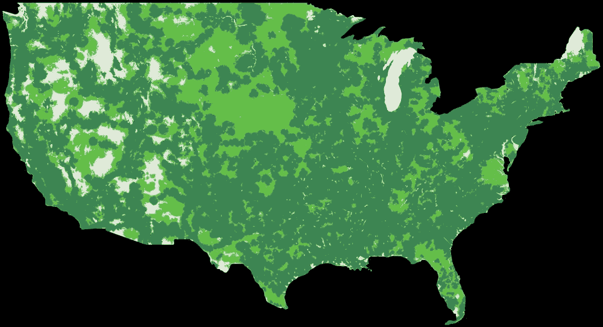

# Google Fi 发布 5G 覆盖地图，开始销售三星 5G 手机

> 原文：<https://www.xda-developers.com/google-fi-5g-coverage-map-sell-samsung-galaxy-5g-phones/>

这是一个重要的日子，之前被称为 Project Fi 的 Google Fi 开放了对更多设备的支持，包括来自苹果、一加和三星的设备。几年后，这项服务通过引入对三星最新 5G 手机，包括 Galaxy Note 20 的支持，正在[进一步扩展。](https://blog.google/products/google-fi/samsung-5g/)

最新认证的“专为 Fi 设计”三星设备的完整阵容如下:

Fi 的 5G 网络已经覆盖全国，所以大多数人应该会在他们的区域得到覆盖。如果你担心你所在地区的特定 5G 覆盖范围，你可以查看这张[覆盖地图](https://fi.google.com/coverage)，它将让你搜索整个美国。然而，值得注意的是，5G 仅在 T-Mobile 网络上，速度和性能等因素取决于运营商网络能力、设备配置等。例如，你需要一部 5G 智能手机，可以连接到 T-Mobile 的 6GHz 以下网络。

 <picture></picture> 

Google Fi's 5G Coverage Map of the United States. Explore the coverage in your area [here.](https://fi.google.com/coverage)

将自己的设备带到 Google Fi 通常意味着你无法获得网络切换、Wifi 和蜂窝网络之间的平滑过渡或垃圾邮件阻止等功能，但拿起一部专为 Fi 设计的手机可以确保你获得所有这些功能。从今天开始，你可以直接从 Fi 拿起这些三星 5G 手机[。如果您购买新的 Note 20 或 Note 20 Ultra，您将获得 300 美元的 Fi 积分，如果您购买新的 Galaxy S20，您将节省 300 美元，如果您购买 Galaxy A71 5G，您将节省 150 美元。](https://fi.google.com/coverage)

除了为三星最新的 5G 手机提供支持，谷歌 Fi 还认证了谷歌最新的 Pixel 5 和 Pixel 4a 5G，为 Fi 手机设计，这两款手机最近在谷歌的发布会上亮相。Pixel 5 将于 10 月 15 日在海外上市，然后于 10 月 29 日在美国和加拿大上市。