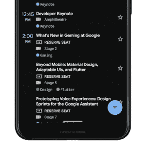

# 谷歌如何在 Android 10 中控制手势导航

> 原文：<https://www.xda-developers.com/google-gesture-navigation-android-10/>

在 Android 9 Pie 中试验了基于按钮的手势控制后，谷歌回到了绘图板[以提高 Android 手势导航的流动性和单手使用](https://www.xda-developers.com/google-defends-android-q-gesture-navigation/)。在 Android 10 中，谷歌找到了一个视觉上类似于 iOS 的解决方案:一个手势栏，可以向上滑动以回家，或者向左或向右滑动以在应用程序之间切换。由于手势栏比之前三按钮导航方案的专用空间薄得多，Android 10 的手势给了应用更多空间来在屏幕底部显示内容。为了解决缺乏专用后退按钮的问题，谷歌增加了从屏幕左边缘或右边缘向内滑动来触发后退动作。谷歌新的和改进的手势是朝着正确方向迈出的一步，尽管一些人仍然认为第三方的替代品更优越。

 <picture></picture> 

Android 10's new gesture navigation. Source: Google.

即使仍有改进的空间([并且肯定有](https://www.xda-developers.com/google-android-q-gesture-mess/))，谷歌仍在推动其 Android 合作伙伴采用这些新的导航手势，因为该公司不想让应用程序开发人员承受必须适应多种不同手势导航方案的负担。一加、三星、小米、华为、OPPO、Vivo 和华硕等 Android 设备制造商只是其中一些对手势导航有自己看法的公司。这些公司已经投入了大量的开发精力来构建他们自己的手势，所以谷歌[并没有强迫他们完全放弃他们的工作](https://www.xda-developers.com/android-q-navigation-gestures-mandatory/)。

> “用户越来越希望在 Android 中获得身临其境的体验，设备制造商已经做的一件事就是试图从软件方面来实现这一点。他们所做的是建立他们自己的手势导航。每个设备制造商对手势导航应该如何工作都有不同的印象。我们在平台方面认识到，这对开发者来说有点疯狂。当你试图开发、设计、测试你的应用程序时，想想 N 种不同的手势导航，这有点疯狂。因此，考虑到这一点，我们在 Q 中引入了这种手势导航，我们将在 3 个按钮上标准化 Q 的生态系统，我们的模式将继续发展。”–谷歌 Android 系统 UI 团队产品经理罗南·沙阿(Ronan Shah)在谷歌 I/O 2019 上。

相反，谷歌重写了其 Android 和谷歌应用兼容性的规则集，迫使 OEM 厂商放弃自己的手势，转而支持谷歌的手势，同时还限制了 OEM 厂商手势的功能。

## Android 10 手势兼容性要求

在每次主要的 Android 平台发布后，谷歌都会更新 Android 兼容性定义文件(CDD ),概述所有设备必须满足的新要求，才能被视为与最新版本的 Android 兼容。这是获得 Android 许可的先决条件之一，这是在营销中使用 Android 品牌所必需的。这也是获得批准分发谷歌移动服务的先决条件，谷歌移动服务是预装在大多数国际销售的 Android 设备上的谷歌应用程序、服务和库的套件。

在 Android 10 的 [CDD 中，谷歌用下面的措辞更新了关于手持设备(又名智能手机)的软件要求的第 2.2.3 节。这些声明告知原始设备制造商谷歌对导航手势的触发区域应该有多大的期望。](https://source.android.com/compatibility/10/android-10-cdd.html)

谷歌建议 home 动作的手势识别区域应该在距离屏幕底部 32dp (dp 代表密度无关像素)以内，但他们没有做出这一要求，因此 OEM 仍然可以提供浮动手势控制，如 [EMUI 的浮动导航 dock](https://www.xda-developers.com/emui-9-review-features-apps-huawei-honor-android-pie/) 。

如果 OEM 提供从屏幕左边缘或右边缘向内滑动的手势，那么谷歌要求触发区域距离边缘小于 40dp(理想情况下宽度为 24dp)。)请注意，这允许原始设备制造商为侧面手势创建不同的灵敏度选项，只要触发区域不超过 40dp。事实上，谷歌[在它自己的 Android 10 版本中提供了这个](https://www.xda-developers.com/android-q-beta-5-google-assistant-gesture-animation/)。默认情况下，back 手势的插入像素为 24dp，但可以降低到 18dp 或提高到 32dp 或 40dp。

在 CDD 的后面部分，特别是覆盖导航键的 7.2.3 部分，谷歌提供了关于后退、主页和最近应用动作的手势应该如何操作的详细要求。大多数需求都集中在确保系统行为对应用程序开发人员来说是一致的，但是有一些值得注意的陈述可能会影响用户体验。

虽然谷歌没有要求从底部边缘向上滑动触发主页动作，或者向上滑动并按住触发最近的应用概述，但谷歌确实要求从侧面滑动手势触发后退动作。值得注意的是，这将意味着由[三星的单手操作+](https://www.xda-developers.com/samsung-good-lock-swipe-gestures-galaxy-s9-note-8-s8/) 提供的可定制手势将被禁止，尽管由于单手操作+不是开箱即用的，它可能会获得通过。

如果 OEM 提供通过侧扫手势触发的浮动系统面板，则 OEM 必须将触发区域放在左侧或右侧的顶部 1/3，并且不得允许面板超过屏幕边缘尺寸的 1/3。然而，OEM 可能允许用户将触发区域设置在顶部 1/3 边缘以下。这种语言可能是为了适应三星的边缘面板功能而添加的。

Android 10 兼容性定义文件并没有对 OEM 厂商可以使用手势做什么设置太多限制，但正如我之前提到的，遵守 CDD 只是获得 Android 许可证和批准分发 GMS 的先决条件之一。谷歌有一个单独的文件，他们私下分发给所有授权的安卓合作伙伴；这份文件列举了公司必须遵守的技术要求，以便获准分发 GMS，并且它还有关于 Android 10 中手势导航的附加规定。我们获得了该文件的副本，标题为 GMS 要求 v7，日期为 2019 年 9 月 3 日。

## GMS 批准的手势导航要求

谷歌助手对谷歌来说是一项非常重要的服务，因此谷歌将其作为谷歌应用的一部分进行捆绑，并要求所有 Android 合作伙伴将其作为“常规”(非 Android Go)设备的 GMS 应用套件的一部分进行分发。然而，需求并不止于此。自 Android 5.1 以来，谷歌要求长按 Home 键触发辅助动作，默认情况下会调用谷歌助手，因为谷歌还要求谷歌应用程序是辅助动作的默认处理程序。不过，Android 10 中不再有专门的 home 键，所以谷歌对如何用手势触发助手提出了新的要求。

要用谷歌的手势导航触发谷歌助手，你必须从左下角/右下角对角滑动。谷歌要求所有运行 Android 10 的设备都要有这个手势，不管谷歌的手势是否是开箱即用的默认导航控件。如果 OEM 实现了自己的手势导航控件，那么它可以实现自己的触发器来启动助手应用程序，但具体的实现将受到谷歌的审查。例如，一加和小米等一些原始设备制造商让你长按电源按钮来启动助手。

Google 定义了三种类型的参考导航模型:

1.  经典的三按钮导航控制。这些按钮可以是屏幕按钮或硬件按钮，但它们之间必须有一定的距离。这三个按钮分别触发主页、后退和最近使用的应用程序。
2.  Android 9 Pie 的双按钮导航控件。这些不可能是硬件按钮，尽管这两个按钮之间一定还有一段距离。后退和主页按钮分别触发后退和主页操作，尽管最近的应用程序按钮已经与主页按钮合并，以便主页按钮的向上滑动触发最近的应用程序概览。
3.  Android 10 的新手势导航。

所有搭载 Android 10 的设备都必须实现 A 和 C，尽管由 OEM 来决定哪一个是开箱即用的默认设置。b 不再受支持，不能作为用户可选选项。

那么，原始设备制造商的替代导航控件在哪里呢？谷歌表示，虽然 Android 合作伙伴可能会提供自己的导航控件，但他们的替代产品不能在设置过程中呈现给用户，也不能通过通知或屏幕弹出窗口向用户宣传。虽然 A 和 C 需要显示在导航设置的顶层，但是任何可选的导航选项都必须放置在设置中更深的一个条目中。

这实际上意味着，替代的、可以说是更好的手势只会被高级用户发现，他们会仔细研究设置或在线阅读关于他们设备的文章。我们在[一加 7T 评论](https://www.xda-developers.com/oneplus-7t-review-premium-practical-smartphone/)中指出，一加不提供其 OxygenOS 全屏手势，随着 Android 10 的推出，其他设备可能也会如此，因为提供替代手势方案没有什么意义。一加 7 和一加 7 Pro 仍然使用旧的 OxygenOS 手势的可能原因是，谷歌强烈建议原始设备制造商在将设备升级到 Android 10 时不要删除现有的导航选项。

最后，Google 强烈建议原始设备制造商在将第三方启动器设置为默认时，不要将用户切换到不同的导航模式。具有讽刺意味的是，当你试图在 Android 10 中为 Google Pixel 设置一个默认的第三方启动器时，就会发生这种情况。谷歌承诺，他们将推出一个修复程序，使 Android 10 的手势与第三方启动器兼容，所以他们很可能添加了这一特定声明，以便用户不会因为手势不兼容而责怪第三方启动器。照我说的做，不要照我做的做。

* * *

总之，谷歌终于采取措施统一 Android 中的手势导航，他们正在使用 CDD 和 GMS 的批准程序，使原始设备制造商合作。不过，这并不是一件坏事，因为导航控件的碎片化对应用开发者来说是个问题。谷歌显然对新手势的可用性进行了大量的思考和研究。然而，由于谷歌知道不是每个人都会对他们的手势感到满意，他们仍然给原始设备制造商一些余地，允许他们做出自己的手势，只要这些手势遵循一定的规则。

在 Android 的未来版本中，谷歌可能会完全禁止替代导航模式。一加可能已经看到了不祥之兆，这将解释为什么他们不再在一加 7T 上提供他们的旧手势，尽管我们必须等待更多的设备推出 Android 10，看看这是一次性的还是一个新的行业趋势。