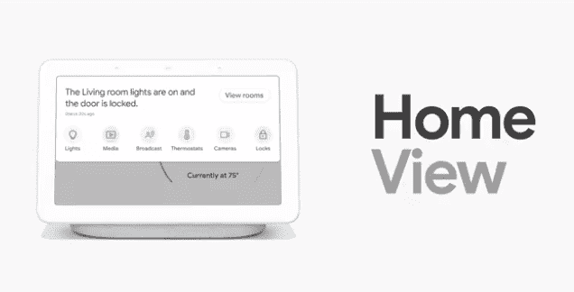
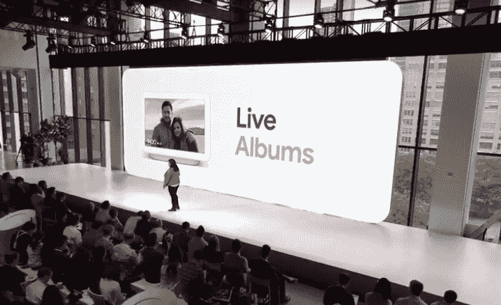

# 谷歌 Home Hub 智能显示屏和新谷歌 Chromecast 发布

> 原文：<https://www.xda-developers.com/google-home-hub-smart-display-google-chromecast-v3/>

谷歌正在和亚马逊赛跑:看哪家公司会第一个接管你的家。一端，你有亚马逊 Alexa 和所有支持 Alexa 的产品。另一方面，你有谷歌助手和所有支持助手的产品。亚马逊是第一个推出支持 Alexa 的智能显示器的市场，[亚马逊 Echo Show](https://www.xda-developers.com/youtube-back-amazon-echo-show-after-recent-tos-violation/) ，但谷歌在今年的 CES 上跟进，[宣布](https://www.xda-developers.com/google-assistant-android-auto-smart-displays-sony-lg-lenovo/)几家合作伙伴，如[联想](https://www.xda-developers.com/lenovo-smart-display-google-assistant-now-available/)和 JBL 将发布他们自己的谷歌助手智能显示器。现在，谷歌推出了他们自己的智能显示器，名为谷歌 Home Hub。

## Google Home Hub 功能

Google Home Hub 实际上是基于 Google Cast 平台，与 Chromecast 使用的平台相同。Google Home Hub 智能显示屏为仅支持语音的 Google Home 智能扬声器增加了一个屏幕。具体来说，Home Hub 有一个 7 英寸的触摸屏液晶面板，可以向你显示信息卡，详细介绍谷歌助手的语音响应。它可以显示您的查询答案，如当前天气、上班路上的交通状况、您设置的提醒、您的购物清单上的内容、新闻等。

如果您在美国和加拿大拨打国内电话，也支持拨打电话等命令。您还可以控制您的智能家用电器，例如从 Nest Cam 观看视频，控制色调灯等。它本质上是一款 Android 平板电脑，配有更好的麦克风和扬声器——是你厨房或床头柜的完美核心。为了帮助你更好地控制你的所有设备，Android 上的 Google Home 应用程序将获得新的设计，正如我们几个月前第一次详细介绍的那样。

谷歌主页中枢还允许您使用诸如[谷歌二重唱](https://www.xda-developers.com/multi-device-google-duo-calling-rolling-out/)(语音通话)、谷歌照片(查看照片和相册)、YouTube(流媒体视频)*、谷歌播放音乐(流媒体音乐)、谷歌播放电影(流媒体电视和电影)、谷歌地图(查看流量)和谷歌日历(查看日程)等应用程序。第三方服务当然受到支持——家庭中枢可以访问大量与谷歌助手集成的服务。例如，支持的音频服务包括 Pandora 和 Spotify，而支持的视频服务包括 HBO Now 和 Crackle。随着 Google Home 和 Home Mini 令人难以置信的成功，我们预计未来会有更多的服务与 Google Assistant 集成。

 <picture></picture> 

Home View in the Google Home Hub. Control smart devices via tap or voice.

Live Albums 是 Home Hub 的一项新的 Google 相册功能，可以自动创建新的相册，并自动向相册中添加照片。Live Albums 使用机器学习来自动挑选最适合您的照片。

 <picture></picture> 

Live Albums on the Google Home Hub

*Google Home Hub 用户可获得 6 个月的免费 YouTube Premium。

## Google Home Hub 规范

正如我们之前提到的，谷歌 Home Hub 有一个 7 英寸的触摸屏液晶面板。它支持 802.11 b/g/n/AC(2.4 GHz/5 GHz)Wi-Fi 连接，还支持手机上的媒体流(就像 Google Home 一样)。

它有一个全频扬声器，所以你可以听到房间另一端的助手的语音响应，还有远场麦克风，可以从远处拾取你的声音。语音匹配确保 Google Home Hub 仅在您的声音被识别的情况下显示个人信息。背面的静音按钮可以让您手动关闭语音反馈。最后，家庭中枢也有一个环境光和颜色传感器。谷歌开发了“Ambient EQ”来自动调整显示器的亮度和颜色。不幸的是(或者说幸运的是)，没有摄像头可以让你进行视频通话。

谷歌总部的测量值为 67。x 178.5 x 118 毫米(深 x 宽 x 高)，重 480 克。电源线长 1.5 米。

## Google Home Hub 定价和可用性

谷歌 Home Hub 将从 10 月 22 日开始在美国、英国和澳大利亚以 149 美元的价格提供粉笔(白/灰)、木炭(黑)、薄荷和粉红色。预购从今天开始，如果你购买谷歌 Chromecast Ultra 设备，你将节省 25 美元(优惠活动于 11 月 20 日结束。)

## 刷新了谷歌 Chromecast

早在 5 月份，更新的谷歌 Chromecast [出现在 FCC](https://www.xda-developers.com/google-chromecast-bluetooth/) 上。与第二代 Chromecast 相比几乎没有任何变化，很难将这款新机型视为第三代产品。这里的主要新“功能”是改进的 WiFi 支持，这意味着更快更稳定的连接。另一个增加的功能是能够像 Chromecast 音频一样工作，并进行多房间音频。用户要求这个已经很久了。

新的 Chromecast 的设计略有不同，并支持蓝牙，它还与谷歌 Home Mini 捆绑在一起，称为谷歌智能电视套件(T2)。新的谷歌智能电视套装将非常适合送给不太懂技术的朋友和家人，尽管我怀疑改进后的 Chromecast 中的蓝牙功能将对通过 Project Stream 进行游戏有用[。](https://www.xda-developers.com/google-project-stream-play-games-google-chrome/)

这是一个发展中的故事。随着时间的推移，可能会添加更多的详细信息。