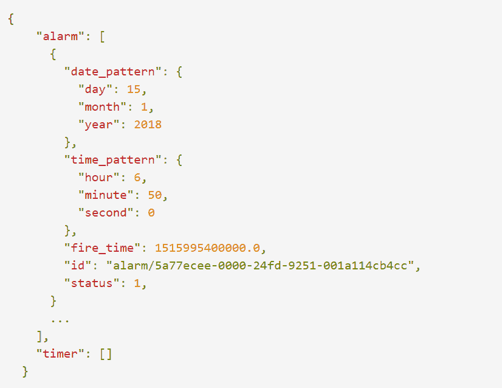

# Google Home 有一个未记录的本地 API，您现在可以访问它

> 原文：<https://www.xda-developers.com/google-home-local-api/>

谷歌不断增长的人工智能扬声器阵容 Google Home 为智能家居爱好者提供了丰富的可能性。问题是，它被锁得很紧。当访问警报数据、设置、蓝牙模式和其他设备上的信息时，你有两个选择:在智能手机和/或平板电脑上查看谷歌 Home companion 应用程序，或者大喊一个命令。到目前为止，Google Home 缺少一个合适的 API。

这并没有阻止勇敢无畏的谷歌主页开发者自己拼凑一个。Redditor [rithvikvibhu](https://www.reddit.com/user/rithvikvibhu) 煞费苦心地嗅出一个 Google Home 设备的流量，并记录下每个网络请求，将结果整理在 Github 上一个漂亮的备忘单中。到目前为止，他已经成功识别了均衡器设置、设备选项、夜间模式等的本地 GET 和 POST 命令，以及返回给定扬声器的 Wi-Fi 配置、其支持的时区和区域列表以及绑定的蓝牙设备名称的连接请求。

这是一个相对简单的过程。在你通过使用像 [Fling](https://play.google.com/store/apps/details?id=com.overlook.android.fing&hl=en) 这样的应用程序识别了你的 Google Home speaker 的 IP 地址之后，你可以通过在 Google Home 本地 API 文档中添加 URIs 来进行 GET 和 POST 调用。

例如，这个 URI 在谷歌家用扬声器上抓取了一个本地闹钟和定时器列表:

```
 /setup/assistant/alarms 
```

下面是 GET 调用(“X”标记是占位符):

```
 http: 
```

在与 Google Home 连接到同一网络的任何设备上导航到该地址，将返回一个 JSON 响应，其中包含**天、月、年以及闹钟预定响起的时间**:

 <picture></picture> 

Source: Google Home Local API

这个相关的 URI 在 Google Home 音箱上返回**闹钟和定时器音量**:

```
 /setup/assistant/alarms/volume 
```

POST 调用以十进制形式返回音量:

```
 0.8199999928474426 
```

如果你觉得自己很勇敢，这台 URI **会重启**一台谷歌 Home 设备:

```
 /setup/reboot 
```

Google Home 本地 API 的非官方文档可以在 rithvikvibhu 的 [Github 库](https://rithvikvibhu.github.io/GHLocalApi/)上找到，还有使用它所需的代码。但是请记住，这绝不是官方的——不要期望 API 的行为是可预测的。

* * *

[**来源:Google Home 本地 API**](https://rithvikvibhu.github.io/GHLocalApi/#connectivity) [**来源 2: /r/GoogleHome**](https://www.reddit.com/r/googlehome/comments/7qssr6/i_documented_ghs_local_api_by_sniffing_network/)