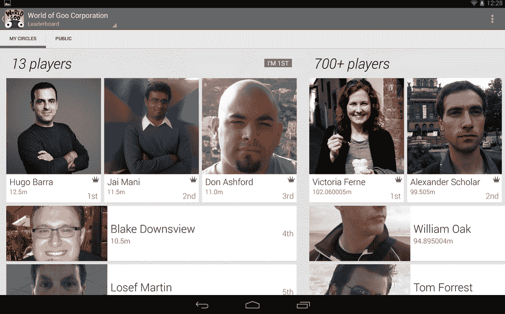

# Google+集成将于 2017 年最终从 Google Play 游戏中移除

> 原文：<https://www.xda-developers.com/google-integration-will-be-removed-from-google-play-games-in-2017/>

# Google+集成将于 2017 年最终从 Google Play 游戏中移除

Google+集成将于 2017 年 2 月最终从 Google Play 游戏中移除。相反，开发者将使用谷歌登录 API。

除了一些小众话题(和一些相当大的 Android 讨论圈)，Google+作为一个社交媒体平台未能流行起来。

这就是为什么谷歌一直([相当烦人](http://www.cnn.com/2013/11/08/tech/social-media/youtube-comment-backlash/))在他们可以的任何地方和任何时间推动 Google+。对于那些哀叹被迫注册社交媒体平台的人来说，幸运的是，谷歌已经收回了在其所有服务上强制整合 Google+的做法。去年，该公司宣布他们将[不再要求通过 Google+](https://googleblog.blogspot.com/2015/07/everything-in-its-right-place.html) 在 YouTube 上发表评论。今年年初，谷歌宣布任何[新的 Play Games 账户](https://android-developers.googleblog.com/2016/01/play-games-permissions-are-changing-in.html)都将拥有不与 Google+绑定的玩家 id。然而，昨天，该公司公开宣布，从 2017 年 2 月开始，所有 Google+集成将停止运行 。

* * *

## 不用 Google+玩游戏

自从 Google Play Games 于 2013 年年中发布以来，该服务允许用户查看你通过 Google+ circles 联系的玩家的统计数据。社交排行榜、礼物和实时多人游戏等功能依赖于返回 Google+个人资料中的朋友列表，以使 Android 游戏更加社交化。然而，这当然需要用户实际设置他们的 Google+账户，如果你的朋友都不使用这个平台，这可能很难实现。

 <picture></picture> 

Google Play Games/Google+ Social Leaderboard

从 2017 年 2 月开始，所有请求 Google+社交数据的游戏都将返回空列表。谷歌将不再使用 Google+账户作为 Play Games 社交整合的后端。相反，该公司正在采用谷歌登录 API 进行身份验证。这一变化统一了他们在不同平台上的方法，不再要求 Android 游戏玩家在 Google+上建立个人资料。游戏玩家可以继续使用他们现有的谷歌账户，该账户在安卓设备上的使用要广泛得多。

* * *

[**来源:安卓开发者博客**](https://android-developers.googleblog.com/2016/12/games-authentication-adopting-google.html)