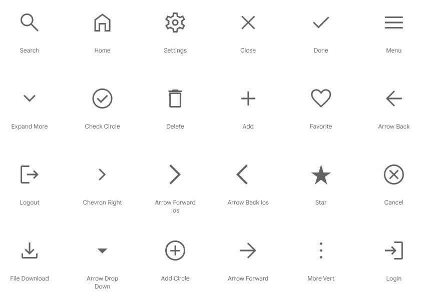

# 材料符号是谷歌新的现代图标库

> 原文：<https://www.xda-developers.com/google-material-symbols-release/>

软件开发人员可以通过许多不同的方式将常用图标添加到他们的应用程序、网站和 web 应用程序中。谷歌的材料图标集合多年来一直是一个受欢迎的选项，特别是对于任何旨在大致匹配材料设计外观的东西，现在谷歌发布了一个更新的集合。

新的材料符号库是 2500 多个图标的集合。该集合包括分为几个类别的常用按钮和图标:UI 操作、常用操作、社交、商业和支付、照片和图像、文本格式、通信、音频和视频、交通、活动、硬件、Android、隐私和安全、地图、旅行、品牌、家居和家庭。

 <picture></picture> 

Some of the UI icons

每个图标都可以配置颜色/背景填充、不同的权重(线条的粗细)、不同的等级和任何像素大小。旧的材质图标也有一些自定义选项，但大多数选项只能打开或关闭。例如，您不能在旧的材质图标库中将每个图标的权重更改为自定义值。

新图标主要是为在网络上以及 Android 和 iOS 应用程序上使用而设计的，但谷歌也为每个图标提供了 PNG 和 SVG 版本，用于其他目的。谷歌在 Apache License 2.0 下发布这些图标，这意味着任何人都可以在免费和商业项目中修改和发布这些图标。

除了新的材料符号集合之外，还有其他几个免费的图标库可供选择。 [Bootstrap Icons](https://icons.getbootstrap.com/) 拥有类似的设计语言和超过 1600 个图标，与谷歌的集合不同，包括了 Twitter 和 Facebook Messenger 等品牌标志。 [Font Awesome](https://fontawesome.com/) 是另一个受欢迎的选择，据[估计，它将在 2020 年](https://www.wappalyzer.com/technologies/font-scripts)成为继谷歌字体 API 之后最常用的网络字体脚本，但这项服务将一些功能限制在付费用户范围内(如额外的样式和 WordPress 插件)。

**来源:** [谷歌字体](https://fonts.google.com/icons?icon.set=Material+Symbols)

**Via:** [9to5Google](https://9to5google.com/2022/04/21/google-fonts-material-symbols/)