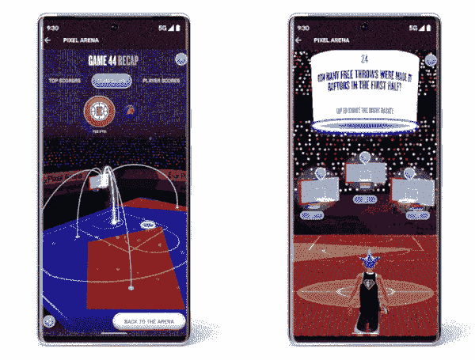

# 谷歌与 NBA 联手打造“像素竞技场”虚拟体验

> 原文：<https://www.xda-developers.com/google-nba-pixel-arena/>

谷歌经常与品牌或活动合作创建增强现实和虚拟体验，通常是以谷歌搜索移动应用程序中的临时功能的形式。这一次，谷歌与 NBA 合作，创建了一个所有移动设备都可以访问的“像素竞技场”，有一个角色定制器和几个与 NBA 有关的迷你游戏。

谷歌周一在博客中写道，“NBA 季后赛本周六回归，我们有一个改变游戏的虚拟体验，让你热爱的游戏更上一层楼。NBA 和谷歌 Pixel Arena 是一个基于现场游戏动作的虚拟空间，在这里你可以创建、玩、分享和庆祝你的 2022 年 NBA 季后赛技能。”

 <picture></picture> 

Source: Google

一旦你从 NBA 移动应用程序打开 Pixel Arena，无论是在 [iOS](https://apps.apple.com/gb/app/nba-tv/id484672289) 还是 [Android](https://play.google.com/store/apps/details?id=com.nbaimd.gametime.nba2011) 上，你都可以用不同球队的装备创建自己的头像。在现实生活的游戏中，3D 镜头 recaps 将根据 NBA 的数据出现在 Pixel Arena 法院，还有一个琐事模式，你可以玩这个模式来提升你的角色并解锁新的化妆品。谷歌表示，该模式是由谷歌和 NBA 联合开发的。

尽管它被称为“像素竞技场”，但虚拟体验对所有设备都是可用的——有点像现实生活中的体育场，通常以主要企业赞助商的名字命名(如得克萨斯州圣安东尼奥市& T 中心的[)。](https://en.wikipedia.org/wiki/AT%26T_Center)

在相关的体育新闻中，谷歌上周宣布将在 YouTube 上免费直播 15 场即将到来的职业棒球大联盟比赛。这种合作关系对任何没有有线电视订阅的棒球迷来说都是好消息，但这是本赛季的又一项独家协议，本赛季的比赛已经分散在不同的广播公司——例如，[苹果公司获得了其 Apple TV+订阅服务的周五双赛权利](https://www.xda-developers.com/live-baseball-is-coming-to-apple-tv-plus-whenever-we-get-baseball-again/)。

**来源:** [谷歌](https://blog.google/products/pixel/nba-google-pixel-arena/)