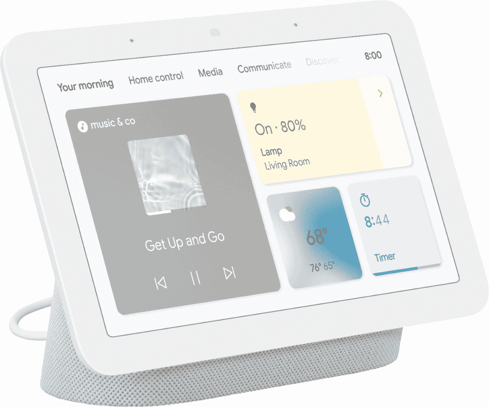

# Google Nest Hub(第二代)仍然是任何智能家居的绝佳补充

> 原文：<https://www.xda-developers.com/google-nest-hub-2nd-gen-fantastic-addition/>

自从 Google Nest Hub(第二代)发布以来，我一直在使用它。当我收到它的时候，我是它的粉丝，但是我越来越喜欢它了。它能做的很多事情让我感到惊讶，它已经令人惊讶地成为我家中使用最多的技术之一。如果你想为你的智能家居添置一件东西，并且你已经用过了常见的灯和智能扬声器，那么像 Google Nest Hub 这样的智能显示器很可能是你的下一个选择。

据我们所知，[谷歌正在开发一个可与基站](https://www.xda-developers.com/google-nest-hub-detachable-tablet-report/)分离的继任者，但我们不知道这有多远。也许等待它的推出是值得的，这样你就可以用比现在更低的价格买到这个小宝贝。Google Nest Hub 由 Google Assistant 提供支持，你可以播放音乐、播放播客、了解天气、在 Duo 上打电话等等。Google Nest Hub 的屏幕意味着你可以从 YouTube、网飞、Disney+上下载内容，并且只需用你的声音就可以选择其他服务。

 <picture></picture> 

Google Nest Hub (2nd Generation)

##### Google Nest Hub(第二代)

Google Nest Hub(第二代)是一款 7 英寸的智能显示器，是智能家居的完美补充，尤其是在厨房或床头柜上。

***关于这个** **文章** **:** 我在 2020 年 10 月为 IrishTech 收到了来自 Google Ireland 的 Google Nest Hub(第二代)。该公司对这篇文章的内容没有任何意见。*

## 我如何使用我的谷歌巢枢纽

Google Nest Hub 放在家里的任何地方都是令人惊讶的多功能，比我想象的要多得多。起初，我怀疑它会有多大用处，它就放在我的床头柜上。它的睡眠追踪功能(当时是免费的)运行得非常好，能够快速查找东西或者有一个我的灯的视觉指示器非常酷。当我搬出去的时候，它成了我厨房的中心。

你看，最初，我以为 Nest Hub 的睡眠跟踪功能会成为它的头条特色之一。我以前从未使用过任何类型的智能显示器，虽然我很喜欢使用它，并发现它是一项很酷的技术，但我对它的价格没有印象。€100 英镑买一个美化了的睡眠追踪器和看起来很酷的闹钟？我觉得价格太高了，尽管它每天早上都会在主屏幕上给我谷歌日历提醒。现在我知道了，虽然睡眠跟踪是一个很好的功能，但这绝对不是我推荐使用它的原因。

Google Nest Hub 放在我的厨房柜台上，虽然它可以作为一个时钟来查看时间，但它更适合作为计时器。能够在烹饪时设置定时器，而不需要用我的手，并且能够看到这些定时器的可视化表示是非常好的。我也可以设置多个，随时保持多个，这样我就可以随时看到我在做什么和我需要做什么。当这些计时器运行时，我可以播放音乐，观看视频，甚至让谷歌帮我查找资料。我很惊讶我从中获得了这么多的效用，我想这真的很难再回到*而不是*使用它了。

不过，整个体验中最好的部分是它与我的其他谷歌产品的集成。我仍然可以用它来控制我的灯，我可以从我的手机播放音乐并将其投射到显示器上，我甚至可以从它控制我的 Chromecast。在我的 Chromecast works 上让它在网飞上播放*绝命毒师*，那种互操作性让我感到惊讶。我的厨房连接到我的客厅，我的 Chromecast(那是在客厅)连接到我的扬声器。

这是一件我不推荐使用 Google Nest Hub 的事情，那就是扬声器。这是*罚款*，它的工作，但音乐听起来质量相当低，我不会建议使用它很长时间。你至少可以将它连接到蓝牙扬声器上，这是我推荐的做法。它对观看视频和语音命令很好，但我发现音频质量相当刺耳。

## 我想从下一代 Google Nest Hub 中得到什么

老实说，谷歌在 Google Nest Hub 上取得了成功。我觉得如果你不一定想让你的家成为一个完整的智能家居，这有点像一个利基产品，但它绝对是你在冒险时应该做的第一件事。至于继任者，谷歌显然可以马上做出一些关键的改进。

首先，我认为谷歌应该提高扬声器质量，原因很简单:有了谷歌的 Nest 智能扬声器，你可以选择升级和选择更好的扬声器。有 Nest Audio，还有 Google Home Max，Max 比 Nest Audio 好。Max 已经停产，这使得寻找它有点困难，尽管如果你去找的话，在一些地方你可以找到二手的。鉴于它也是一个扬声器，它并不需要更新任何软件，所以你通常可以选择旧的产品。

接下来，我认为 Nest Hub 可以受益于稍微大一点的显示屏。当我们谈论智能显示器时，通常越大越好，因为它们允许从更远的地方看到它。这显然是有所取舍的(例如，如果你的储物柜在床边的话，会占用更多空间)，但我认为，对于任何涉及消费视觉媒体或希望从更远的地方看到它的事情来说，更大的显示器是有意义的。这将我们引向谷歌巢枢纽最大。

谷歌 Nest Hub Max 在美国有售，谷歌的建议是，它在厨房里会做得很好。请记住，虽然它也超过两倍的价格。还值得一提的是，虽然谷歌 Nest Hub Max 有 10 英寸的显示屏和更好的扬声器，但它在 2019 年底推出，从未更新过，这意味着软件更新可能会在 Nest Hub Max 上变慢，然后在常规 Nest Hub 上变慢，人们担心第三方应用程序*可能会在未来*遇到问题。谷歌 Nest Hub Max 在美国以外的地方也很难买到，这取决于你住在哪里。总的来说，尽管 Nest Hub Max 拥有更大的显示屏和更好的扬声器，但推荐它的风险更大，尽管你仍然可以在一些地区作为第一方购买它。我们需要的是一个固定的智能显示屏更新，以实现支持和更新承诺，并将产品升级到当前的技术标准。

然而，如果你正在寻找一个稍微高级一点的智能家居，那么谷歌 Nest Hub(或 Nest Hub Max)绝对是一个值得考虑的选择。随着继任者的出现，它的价格也很可能会下降。

 <picture></picture> 

Google Nest Hub (2nd Generation)

##### Google Nest Hub(第二代)

Google Nest Hub(第二代)是一款 7 英寸的智能显示器，是智能家居的完美补充，尤其是在厨房或床头柜上。