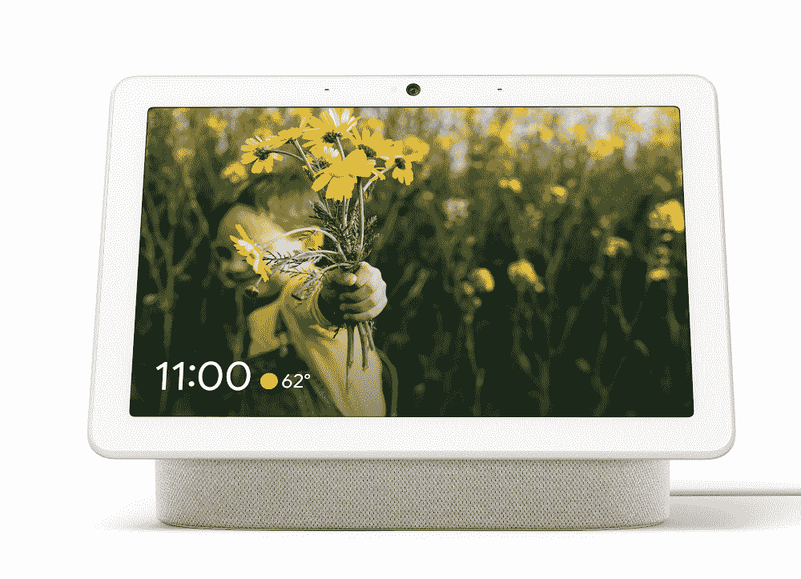

# 【更新 2:现已上市】谷歌 Nest Home Hub Max 正式宣布配备 10 英寸显示屏和摄像头

> 原文：<https://www.xda-developers.com/google-nest-hub-max-officially-announced/>

**更新 2(美国东部时间 2019 年 9 月 9 日下午 1:30):**谷歌 Nest Hub Max 终于可以在美国、英国和澳大利亚购买了。

**更新 1 (7/24/19 @美国东部时间下午 3:25):**谷歌终于给出了 Nest Hub Max 的上市日期。

谷歌的数字助理系列现在极具竞争力。亚马逊曾经对竞争对手的巨大领先优势早就消失了，现在你甚至不能称之为领先。谷歌希望通过其最新的智能家居产品 Nest Hub Max 进一步削弱这一领先地位。在今天的谷歌 I/O 大会上，谷歌宣布了谷歌 Home Hub 的重大改进。自从三月份谷歌在他们的互联主页上意外地泄露了这款设备的信息，我们就已经知道了。

Nest Hub Max 配备了 10.1 英寸的液晶显示屏，是一款智能显示器，运行谷歌熟悉的智能显示 UI。但毫无疑问，这款设备最突出的特点是内置摄像头。索尼 IMX277 传感器与 GoPro Hero 7 Black 中的传感器相同，拍摄分辨率为 12MP。谷歌在其 [Pixel 智能手机系列](https://www.xda-developers.com/google-pixel-3a-3a-xl-specs-features-price/)中以其出色的相机而闻名，因此很难想象 Nest Hub Max 的图片质量会有什么不同。这款相机将用于 Nest Hub Max 的许多功能，最明显的是它通过 Google Duo 进行视频通话的能力。这里一个有趣的特点是，广角镜头将使用软件跟随用户在画面上移动，确保焦点始终在他们身上。

这款相机还采用了人脸识别技术。这意味着 Nest Hub Max 将识别人并显示与他们相关的信息。例如，它可以显示一个人在那天有什么活动，他们上班的路线等等。这对于多人使用该设备的家庭尤其有用。谷歌还打算将这款设备用作厨房里的电视。它可以显示来自 YouTube 的视频，帮助人们烹饪，了解他们的电视节目，等等。

 <picture></picture> 

Google Nest Hub Max

谷歌显然也关注用户对隐私的担忧。该设备背面有一个专用开关，可以关闭摄像头和麦克风。它通过切断实际的电力供应来做到这一点，因此没有变通办法。谷歌还表示，任何面部识别数据都完全保存在设备上，这意味着用户隐私得到了很好的保护

在内部，Nest Hub Max 有一个 Amlogic T931 SoC 和 2GB 的 RAM。这是对具有 AMLogic S905D2 的标准家庭集线器的一个小改进。10.1 英寸显示屏的分辨率为 1280x800，相当于 150ppi。立体声扬声器应该给设备一个体面的音频范围，改善上述视频通话的体验。

谷歌 Nest Hub Max 将于今年夏天在美国发布(你现在可以[加入等候名单](https://store.google.com/product/google_nest_hub_max_tech_specs))。它的售价为 229 美元，当然比 Home Hub 更贵 Home Hub 的价格降至 129 美元——但鉴于 Nest Hub Max 带来的改进，价格上涨在一定程度上是合理的。

**来源:[谷歌](https://www.blog.google/products/google-nest/hub-max-io/)**

* * *

## 更新:9 月 9 日发布

早在 5 月份宣布，谷歌 Nest Hub Max 终于有了发布日期。谷歌已经确认该设备将于 9 月 9 日上架。Hub Max 是一款更大的智能显示器，配有 10 英寸屏幕，售价 229 美元。您可以加入[谷歌商店等待名单](https://store.google.com/product/google_nest_hub_max)，以便在上线时更新。

**来源:[CNET](https://www.cnet.com/news/google-confirmed-nest-hub-max-has-a-release-date-sept-9/)**

* * *

## **更新 2:现已推出**

正如之前宣布的那样，谷歌 Nest Hub Max 现已在美国、英国和澳大利亚上市。它有两种颜色(粉笔和木炭),售价 229 美元，可在谷歌商店、T2 百思买、家得宝、T4 塔吉特和其他商店买到。为了展示 Nest Hub Max 可以做什么，谷歌[分享了它可以执行的 101 个任务的列表](https://www.blog.google/products/google-nest/nest-hub-max-features/)。