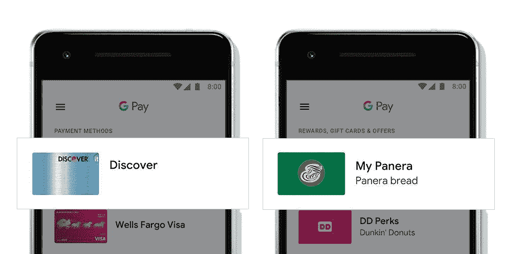

# 谷歌支付在全球推出，取代安卓支付和谷歌钱包

> 原文：<https://www.xda-developers.com/google-pay-android-pay-google-wallet/>

今年 1 月，[谷歌宣布推出 Google Pay](https://www.xda-developers.com/google-google-pay-android-pay-google-wallet-unified-brand/) ，这是其移动和网络支付平台的一个总括品牌。它将搜索巨头的所有服务集中在一个屋檐下，周二，谷歌开始了全球推广

在 Google Pay 出现之前，谷歌的支付平台涵盖了所有领域。2015 年，谷歌将谷歌钱包的点击支付、应用内支付和在线结账功能剥离出来，成为一个独立的应用和服务——Android Pay。但是搜索巨头谷歌钱包的存在搅浑了水，尽管功能减少了——它只支持美国和英国用户之间的点对点支付，这是贝宝的 Venmo。

 <picture></picture> 

Source: Google

通过 Google Pay，谷歌打造了更具凝聚力的体验。新的 Android Google Pay 应用程序与它取代的 Android Pay 应用程序具有相同的功能，包括非接触式支付集成、礼品卡管理、快速在线结账、奖励积分提醒、虚拟信用卡号码，以及对借记卡、银行账户和其他支付形式(如 PayPal)的支持。可以肯定的是，除了新材料设计灵感的动画和新的 Google Pay 主页标签显示附近支持 Google Pay 的商店列表外，没有太多变化。但在接下来的几个月里，该应用将继承谷歌钱包的点对点支付功能，并允许用户发送和请求资金。

在那之前，已经改名为 Google Pay Send 的谷歌钱包将会继续存在。

谷歌消费者支付部门的高管 Gerardo Capiel 和 Varouj Chitilian 在一篇博客文章中写道:“今天开始推出的(Google Pay)应用只是我们计划中的一部分。”。“我们目前正在努力将 Google Pay 引入所有谷歌产品，因此无论你是在 Chrome 上购物还是与你的助手一起购物，你都将使用保存在你谷歌账户中的卡获得一致的结账体验。我们还在网上和商店里与合作伙伴合作，所以你会在网站、应用程序和世界各地你最喜欢的地方看到 Google Pay。”

在后端，谷歌已经将带有 Google API 的 Pay 折叠到了 Google Pay 中。对于希望通过谷歌接受支付的商家来说，现在的摩擦少了很多:当一家商店或应用程序调用新的 API 时，它会自动确定用户是否启用了 Google Pay，如果启用了，就允许他们用保存的信用卡或借记卡支付。Google Pay API 不会处理支付，而是将凭证传递给支付处理器，如 Braintree 或 Stripe。(Hotel Tonight、Airbnb、Doordash 等应用已经占据了优势。)

 <picture></picture> 

Source: Google

Google Pay 应用程序和 Google Pay Send 今天在 Android 上推出，尽管新的用户界面还没有向所有人展示。为了让人们加快速度，谷歌发布了四个新的 YouTube 视频，主题包括 Google Pay 如何加密支付信息，如何向 Google Pay 添加新卡，以及哪些商店支持 Google Pay，

* * *

[**来源:谷歌**](https://www.blog.google/topics/shopping-payments/say-hello-to-google-pay/)

[**Via:VentureBeat**](https://venturebeat.com/2018/02/20/google-pays-big-global-rollout-begins/)