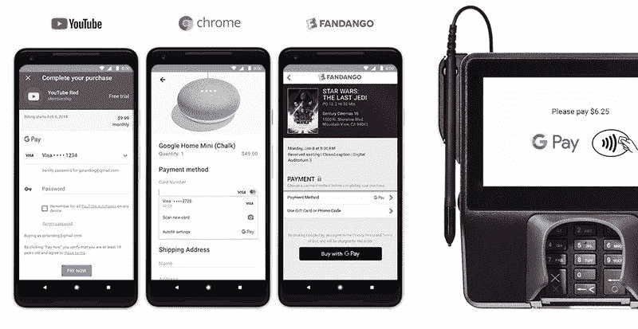

# Google Pay 准备将 Google Pay 发送功能集成到主应用程序中

> 原文：<https://www.xda-developers.com/google-pay-send-money-integrate-app/>

在移动支付系统领域，谷歌直到今年早些时候还有点身份危机。他们的服务曾经包括 Android Pay、谷歌钱包和用谷歌支付。Android Pay 应用程序是一个使用 NFC 进行支付的数字钱包。谷歌钱包是一种点对点的支付服务，供人们发送和接收资金。[使用谷歌支付](https://www.xda-developers.com/pay-with-google-officially-launched/)使用谷歌支付 API，用户可以通过谷歌助手或网络浏览器，使用谷歌账户上的任何信用卡进行支付。为了减少混乱，谷歌在 2018 年初引入了“ [Google Pay](https://www.xda-developers.com/google-google-pay-android-pay-google-wallet-unified-brand/) 品牌，以统一这些服务。然而，谷歌钱包[仍然是一个独立的应用](https://www.xda-developers.com/google-pay-android-pay-google-wallet/)(尽管它被更名为“谷歌支付发送”)。现在，Google Pay 发送功能似乎即将集成到主应用程序中。

谷歌支付服务。来源:谷歌。

我们被告知，这种整合将发生在最初推出付费服务的时候。具体来说，集成将在“未来几个月内”推出，尽管在过去的四个月里我们没有听到任何进一步的消息。无论如何，以前的谷歌钱包功能在标准支付应用中已经完全可用，此外，点对点支付甚至在英国也可用(支付发送应用[在英国](https://support.google.com/pay/send/answer/6285508?co=GENIE.Platform%3DAndroid&hl=en)不可用)。)

这种整合是由 XDA 公认的开发者[quinny 899](https://forum.xda-developers.com/member.php?u=3563640)([强大的奎因应用](http://quinny898.co.uk/)的基隆·奎因)发现的，并得到了我们的确认。卸载 Google Pay Send 应用程序后，我们能够在标准应用程序中激活点对点支付功能，并成功发送付款。正如你在下面的截图中看到的，底部工具栏出现了一个新的“汇款”标签。点击这个按钮会把我们带到一个页面，在那里我们可以向现有的联系人或新的联系人发送或请求资金。甚至可以在此页面上进行群组请求。

一旦这项功能在美国和英国推出，你将不再需要安装单独的 Google Pay Send 应用程序来利用点对点支付功能。目前，如果你想向其他人发送或从其他人那里接收钱，你必须同时安装这两个应用程序。

我们会密切关注我们发现的任何新的薪酬特征。随着时间的推移，这项服务变得越来越有用，新增功能包括支持[手机登机牌和活动门票](https://www.xda-developers.com/google-pay-mobile-boarding-passes-event-tickets/)(...就像钱包一样，不是吗？)和[通过谷歌助手](https://www.xda-developers.com/google-assistant-google-pay-integration/)汇款。