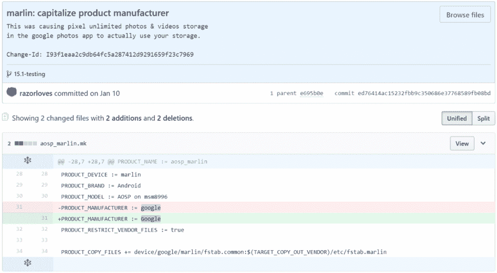
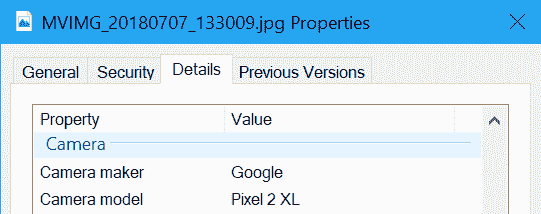
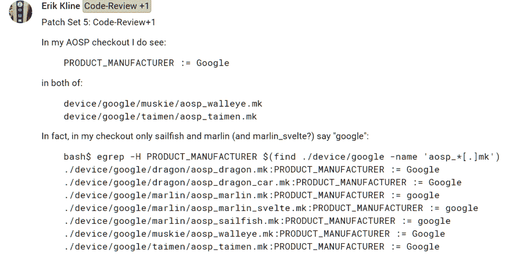

# 一个打字错误如何打破了谷歌照片在定制 rom 上对谷歌像素的无限原始质量备份

> 原文：<https://www.xda-developers.com/google-photos-broken-unlimited-backup-google-pixel-custom-rom/>

# 一个打字错误如何打破了谷歌照片在定制 rom 上对谷歌像素的无限原始质量备份

对于运行定制 rom 的 Google Pixel/Pixel XL 机主来说，Google Photos unlimited 原始质量备份在相当一段时间内被打破。原因如下。

购买谷歌 Pixel 智能手机的好处之一是谷歌照片中免费、无限制的原始质量照片备份。考虑到 Pixel 智能手机令人难以置信的相机质量，这是一个巨大的好处，这在很大程度上归功于谷歌相机软件。如果你有一台谷歌 Pixel、谷歌 Pixel XL、谷歌 Pixel 2 或谷歌 Pixel 2 XL，你应该用许多高质量的照片填满你的照片库，尽管你必须在 2021 年 1 月之前这样做。然而，如果你过去在你的第一代 Pixel 或 Pixel XL 上运行过基于 AOSP 的定制 ROM，你可能会注意到，上传谷歌相机应用程序拍摄的照片仍然会计入你在谷歌照片中的存储限制。这都是因为 AOSP 的一个印刷错误，这个错误刚刚被修复。

XDA 资深会员 [razorloves](https://forum.xda-developers.com/member.php?u=614507) first [早在今年一月就发现了这个 bug 的修复](https://github.com/razorloves/android_device_google_marlin/commit/ed76414ac15232fbb9c350686e37768589fb08bd)。问题是，谷歌相机应用程序拍摄的照片被错误地标记为“谷歌”，而不是“谷歌”，导致它们被计入你的存储限制。

 <picture></picture> 

EXIF data from a photo taken via Google Camera on the Google Pixel 2 XL.

这是因为 Google Pixel (sailfish)和 Google Pixel XL (marlin)的构建脚本中出现了一个简单的输入错误，将标志“PRODUCT_MANUFACTURER”设置为小写的“Google”。需要澄清的是，这个 bug 并没有影响 Pixel 智能手机的普通 ROM，因为谷歌可能有一个内部构建脚本，用于发布官方软件。此外，这个 bug 并没有*影响 Pixel 2 智能手机上基于 AOSP 的 rom。只有 AOSP 的构建脚本受到影响，因为我们论坛上的开发者的工作基于 AOSP，所以所有基于 AOSP 的定制 rom 都受到影响。(我们应该注意的是，在 razorloves 发现这个问题后，定制的 rom 已经实施了好几个月了，所以如果你从我们的论坛刷新一个 ROM，你就没有什么可担心的了。)*

 <picture></picture> 

A Googler confirming that the bug only affected the first-generation Pixel smartphones

对这个问题的修复是[在 7 月 3 日提交](https://android-review.googlesource.com/c/device/google/marlin/+/712924)给 AOSP，并在 7 月 6 日 LineageOS 团队成员[建议【razorloves 上游变更后不久合并。razorloves 正在努力将 LineageOS 15.1 引入谷歌 Pixel XL，现在](https://review.lineageos.org/c/LineageOS/android_device_google_marlin/+/219187)[对 A/B 设备的官方支持已经到来](https://www.xda-developers.com/lineageos-15-1-supports-a-b-devices-moto-z2-force/)。