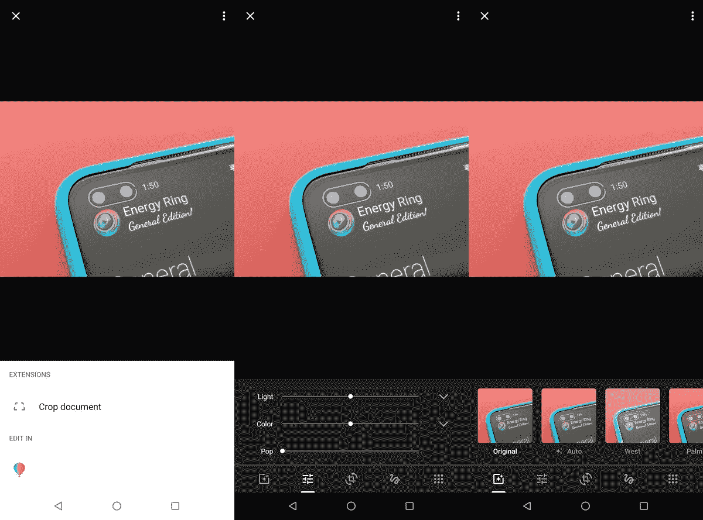
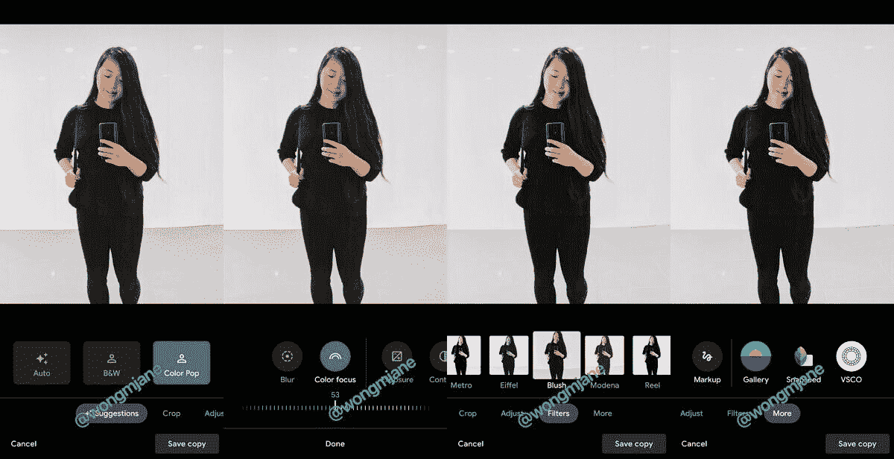

# 谷歌照片正在测试一个带有更大按钮的新编辑器用户界面

> 原文：<https://www.xda-developers.com/google-photos-new-editor-ui-larger-buttons/>

# 谷歌照片正在测试一个带有更大按钮的新编辑器用户界面

谷歌照片应用程序正在测试一个新的带有更大按钮的编辑器用户界面。这项功能是由逆向工程师简·满春·王发现的。

新编辑器用户界面

谷歌照片似乎正在测试一个新的编辑器用户界面，更大的按钮将使用户更容易编辑他们的照片。该服务之前在夏天接受了一次大规模的重新设计，但没有彻底改变编辑器的用户界面。这些变化是由[简·满春·王](https://twitter.com/wongmjane)发现的，她以逆向工程应用和揭示开发中的功能而闻名。

现在，Google 相册中的编辑器 UI 看起来就像你在 Snapseed 或 Adobe Lightroom 中找到的一样，带有曝光、对比度等设置的滑块。

 <picture></picture> 

Old Editor UI

重新设计的用户界面具有大按钮，下面有一个滑块，可以用来进行微调。它看起来很像你在 iOS 上的苹果股票照片应用程序中找到的东西。这些控件更容易理解，也更加用户友好。最终，提供更易于使用的工具将鼓励 Google 相册直接在应用程序中编辑照片。用户可以保存他们正在编辑的照片的副本，以便原始照片保持不变。当然，如果你确实想使用另一个应用程序，修改后的编辑器用户界面似乎可以快速访问其他照片应用程序，包括 Snapseed 和 VSCO 相机。

 <picture></picture> 

New Editor UI

尚不清楚新的编辑器 UI 何时会在 Google 相册中广泛使用，但这看起来是一个受欢迎的变化，提供了一个更干净、更容易理解的布局。