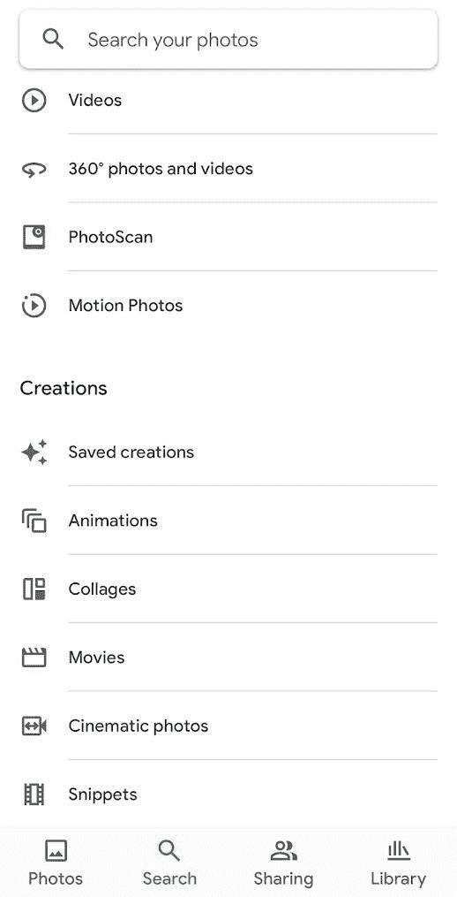

# 谷歌照片在少数用户中测试新的片段功能

> 原文：<https://www.xda-developers.com/google-photos-tests-snippets/>

据报道，谷歌照片正在测试一项名为 Snippets 的新功能。该功能目前仅面向少数用户，谷歌尚未透露任何关于该功能或更广泛推广的信息。幸运的是，在他们的设备上安装了 Snippets 功能的用户透露，它可以自动从较长的视频中创建较短的可共享剪辑。

首先被 *Reddit* 用户 u/CraftSquid426(通过 *Android Police* 发现的，谷歌照片中的片段功能似乎是一个新的创作类别，将加入现有的动画、拼贴画、电影和电影照片类别。它的图标是一小段电影，表明它将在你的手机上拍摄一小段视频，以创建一个简短的、可共享的剪辑。与谷歌照片的其他创作功能一样，Snippets 可能会使用机器学习来创建短片。

 <picture></picture> 

Credit: u/CraftSquid426

Android Police 进一步透露，照片应用程序还将在主页的主转盘中显示片段。这些自动创建的片段看起来像是较长视频的剪辑版本，试图突出视频的最佳部分。然而，片段目前似乎捕捉到了视频的随机部分，这表明机器学习算法需要更多的训练。值得一提的是，到目前为止，片段功能只出现在宠物的视频中。

*鸣谢:安卓警察*

目前，我们没有任何关于 Google 相册新片段功能的进一步信息，因为它在我们的任何设备上都不可用。一旦我们有更多的细节，我们一定会让你知道。

值得注意的是，新的 Snippets 功能是在谷歌宣布照片应用程序的三大变化后一周推出的——一个[图书馆标签 UI 改造](https://www.xda-developers.com/google-photos-library-tab-ui-overhaul/)，一个[分享标签设计刷新](https://www.xda-developers.com/google-photos-sharing-tab-design-refresh/)，以及[新的截图功能](https://www.xda-developers.com/google-photos-easier-manage-edit-screenshots/)。

你对 Google 相册的新片段功能有什么看法？你认为它是一个有用的补充还是只是一个你可能不会使用的噱头？请在下面的评论区告诉我们。

* * *

**来源:** [Reddit](https://www.reddit.com/r/googlephotos/comments/t5z20l/i_found_a_potential_new_mode_snippets_in_google/)

**Via:** [安卓警察](https://www.androidpolice.com/google-photos-tests-mysterious-snippets-tag/#update-2022-03-31-16-10-est-by-will-sattelberg)