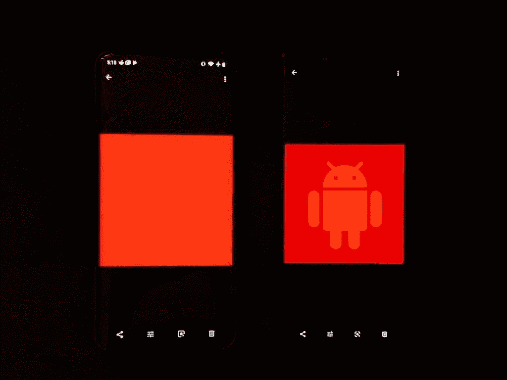

# 谷歌照片 4.21 增加了 P3 图像支持，一些有缺陷的照片浏览器

> 原文：<https://www.xda-developers.com/google-photos-wide-color-image-support-buggy-photo-viewer/>

当谈到拍照时，Android 智能手机相机通常被认为是图像质量最高的。然而，它们都缺乏的一个主要方面是图像捕捉的颜色范围。当前 Android 智能手机相机捕捉的所有图像都保存在 sRGB 色彩空间中，而我们今天拥有的许多智能手机显示器支持的色彩空间比 sRGB 大 25%。此外，几乎所有 Android 相机传感器都已经能够捕捉 sRGB 色彩空间之外的更鲜艳的颜色。这意味着 Android 设备不能捕捉和显示我们自己的硬件能够捕捉和显示的所有颜色。

幸运的是，就在几个月前，谷歌宣布[宽彩色照片终于将登陆 Android](https://android-developers.googleblog.com/2019/05/wide-color-photos-are-coming-to-android.html) ，并为开发者提供了帮助他们开发宽彩色应用的技巧。具有讽刺意味的是，谷歌自己的照片应用程序不支持查看宽彩色照片，直到他们最新的 4.21 谷歌照片应用程序更新，现在推出。

 <picture></picture> 

Photos 4.20 (Left) vs. Photos 4.21 (Right)

新的照片更新最终引入了宽彩色照片查看支持。在上面的照片中，两部手机显示相同的图像，但在不同版本的照片应用程序上。左边的手机还是 Photos 4.20 版本，右边的手机是 Photos 4.21 版本。这两款手机上显示的图像是 P3 色彩空间中红色 Android 徽标的宽彩色图像，该色彩空间比 sRGB 大 25%。图像中使用的颜色是 P3 色彩空间中较深的红色，因此如果没有支持宽色的应用程序，较深的红色就无法渲染，看起来与 sRGB 红一样。这就是上面比较中发生的情况——左边的旧照片版本不能渲染 P3 图像的更深的红色，所以它只是显示为 sRGB 红。Android 的标志是难以区分的，因为较深的 P3 红色都夹到了最深的 sRGB 红色。很酷，对吧？

在软件方面，有很多事情正在进行。色彩管理可能会变得非常复杂，但简单地说，应该使用 sRGB 显示器校准来正确显示正常的 sRGB 内容，当显示 P3 图像时，显示器应该从 sRGB 显示器校准切换到 P3 显示器校准。这是 Android 中支持应用程序的大致处理方式。然而，谷歌的色彩管理系统仍然是新的，几乎没有在 Android 中使用，正因为如此，没有多少原始设备制造商有机会真正测试它，以发现在实现谷歌在 Android 8.1 Oreo 中引入的色彩管理系统方面的问题。谷歌照片将是迄今为止支持色彩管理的最大应用，用户已经面临一些问题。

在[/r/一加子编辑](https://www.reddit.com/r/oneplus/)中，许多拥有更新照片应用的一加手机用户在谷歌照片[【2】](https://www.reddit.com/r/oneplus/comments/cjjt0j/weird_green_tintbug_in_google_photos/)[【3】](https://www.reddit.com/r/oneplus/comments/ciuzfa/google_photos_applying_a_tint_to_my_photos/)中查看图片时，面临着奇怪的绿色或黄色色调问题。这发生在除了自然配置文件之外的每个显示配置文件上，这是因为自然配置文件是唯一正确管理颜色的配置文件。生动的配置文件报告支持宽色域切换，但配置文件的 P3 校准有一个更温暖的白点，也就是人们看到的绿色/黄色色调。这是因为在最新的照片应用程序更新中查看任何图像都会将显示校准切换到 P3 校准，即使图像不在 P3。理想情况下，如果图像在 sRGB 之外的颜色空间，照片应用程序应该只将显示校准切换到图像的颜色空间。但是，如果生动显示配置文件的正常校准和 P3 校准共享同一个白点，则总是切换到 P3 校准不会成为问题，这是应该的。在 Google 相册帮助社区中，也有用户对最新更新有问题的情况。在[这个线程](https://support.google.com/photos/thread/10547723?hl=en)中，该问题很可能是由于[Razer Phone 2](https://www.xda-developers.com/razer-phone-2-review-testing-the-battery-life-and-performance-of-the-gaming-powerhouse/)/[Xiaomi Mi 9](https://www.xda-developers.com/xiaomi-mi-9-review/)的正常校准和 P3 校准之间的不同传输特性(伽马/色调响应)导致了 sRGB 到 P3 颜色转换的混乱。

虽然谷歌似乎最终推动了更广泛的颜色支持，但像这样的例子表明，谷歌需要放慢速度来帮助原始设备制造商建立适当的支持。照片应用程序更新在谷歌的设备上没有任何问题，在他们的任何显示配置文件上。但由于更新给某些手机带来的问题，谷歌可能不得不暂时取消这一改变，这将有损于采用宽颜色的过程。上个月[我们发现谷歌正在谷歌相机应用程序中开发宽彩色图像捕捉支持](https://www.xda-developers.com/google-camera-coming-with-wide-color-capture-support-possibly-with-google-pixel-4/)，我们推测它将首次出现在 [Pixel 4](https://www.xda-developers.com/google-pixel-4-leaks-rumors/) 的相机中。对谷歌来说，在照片应用中加入 P3 图像查看支持的时机似乎已经完全成熟，其他原始设备制造商效仿也是有道理的。