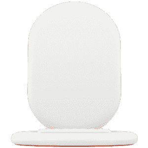
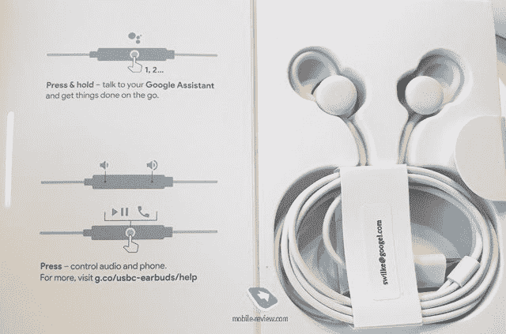

# 谷歌 Pixel 3 和 Pixel 3 XL:规格、功能、定价和可用性

> 原文：<https://www.xda-developers.com/google-pixel-3-google-pixel-3-xl-specs-features-pricing-availability/>

我们已经看到谷歌 Pixel 3 在 XDA 论坛(*两次*)，在 Reddit 上，在出租车上，在火车上，在中国商店里，在俄罗斯黑市上泄露，但最终，我们亲眼看到了谷歌 Pixel 3 和谷歌 Pixel 3 XL。今天，谷歌正式发布了他们最新的 Pixel 旗舰智能手机以及一个名为 Pixel Stand 的无线充电底座。尽管许多泄密事件抢走了谷歌的风头，但今天的谷歌制造事件最终平息了关于这两款设备的无尽猜测。以下是你需要知道的关于谷歌 Pixel 3 和谷歌 Pixel 3 XL 的一切:谷歌的一对强大的旗舰智能手机，采用高通骁龙 845 芯片组，支持无线充电，顶级摄像头，最新版本的 Android Pie，是的，还有一个缺口(在 XL 上。)

## 谷歌 Pixel 3 和 Pixel 3 XL 设计

去年的谷歌 Pixel 2 和谷歌 Pixel 2 XL 有一个双色调的背部:顶部由玻璃制成，底部由塑料涂层铝制成。在正面，上一代设备具有非常 2017 年的设计。我的意思是，Pixel 2 和 Pixel 2 XL 在顶部和底部都有厚边框。2018 年，我们看到智能手机设备制造商遵循 Essential 和苹果的领导，尽可能减少底部挡板，并通过使用带凹槽的显示面板来减少顶部挡板。谷歌采取了不同的设计方法。

### 谷歌像素 3

谷歌 Pixel 3 与谷歌 Pixel 2 相比似乎没有太大区别，只是屏幕尺寸增加了 0.5 英寸，并增加了第二个前置摄像头。较小的 Pixel 3 不像较大的同类产品那样有显示屏凹口，但也没有三星 Galaxy S9 上的无凹口、无边框设计。然而，Pixel 3 的设计仍然非常高端。双色调背面在 Pixel 3 上回归，但这一次，底部由玻璃制成，以允许无线充电。然而，这是非常微妙的，有些东西你真的无法从营销渲染中分辨出来。谷歌 Pixel 3 将有**明显的白色，只有黑色，而不是粉色**，Pixel 2 的标志性彩色电源按钮也在这里回归。

如果你曾经拿过 Pixel 2，Pixel 3 会有宾至如归的感觉。指纹扫描仪位于两个窗格之间过渡区域的右下方，单个后置摄像头位于设备的左上方，在它旁边，LED 闪光灯、音量和电源按钮位于设备的右侧，USB Type-C 端口位于底部。

### 谷歌 Pixel 3 XL

害怕它。逃离它。缺口仍然存在。**没错，Pixel 3 XL 有一个大缺口**。尽管坚持“像素超高”理论，但显示屏缺口的存在在过去几个月里已经多次得到证实。如果你是这么想的话，谷歌并不是简单地抄袭苹果；缺口绝对是一个设计选择。我不怀疑，如果谷歌真的想要，他们可以在即将到来的[华为 Mate 20](https://www.xda-developers.com/huawei-mate-20-notch-render-specifications/) 和[一加 6T](https://www.xda-developers.com/oneplus-6t-marketing-renders/) 上看到“水滴”标志。然而，这将意味着牺牲有用的组件空间。事实上，谷歌已经用双前置摄像头、一个扬声器和一个接近传感器包装了 notch 区域。因此，谷歌故意利用凹口区域，就像 LG 对 LG V40 ThinQ 的做法一样，就像华为对华为 Mate 20 Pro 的做法一样。(尽管一些智能手机，如 [Vivo NEX](https://www.xda-developers.com/vivo-nex-india-launch/) 和即将推出的[小米 Mix 3](https://www.xda-developers.com/xiaomi-mi-mix-3-bezel-less-pop-up-camera/) 和 [Honor Magic 2](https://www.xda-developers.com/honor-magic-2-honor-play-launch/) 由于采用了弹出式摄像头，已经基本消除了边框，但这项技术是否真正准备好了还有待观察。)

在底部，仍然有一个相当大的挡板容纳一个扬声器。不幸的是，底部的边框没有变小，但有趣的是，Pixel 3 XL 的大小基本上与 Pixel 2 XL 相同。在背面，该设备有一个双色背面，底部由玻璃制成，支持无线充电。就像它的小兄弟一样，Pixel 3 XL 有三种颜色:明显的白色，只是黑色，而不是粉红色。就像去年的 Pixel 2 XL 一样，Pixel 3 XL 上也有彩色的电源按钮。指纹扫描仪、后置摄像头传感器、USB Type-C 端口和按钮的位置与 Pixel 2 XL 相同，但 SIM 卡托盘被移到了底部。

## 谷歌 Pixel 3 和 Pixel 3 XL 规格

### 显示

对于拥有令人难以置信的色彩和深黑色的有机发光二极管技术的粉丝来说，你会很高兴地知道 Pixel 3 和 Pixel 3 XL 都有有机发光二极管面板。当我们查看谷歌 Pixel 2 XL 的显示屏时，我们发现它的精确度令人难以置信。然而，颜色准确度[并不是每个人都喜欢的](https://www.xda-developers.com/november-update-pixel-2-pixel-2-xl-screen-color-modes/)，这就是为什么谷歌让你从一些颜色模式中选择。不过，这一次，他们采用了适应性模式。我们将研究设备的显示校准，看看面板到底有多好，请继续关注。

至于实际的显示面板规格，谷歌 Pixel 3 拥有 **5.5 英寸 FHD+ 18:9 有机发光二极管**显示屏，而谷歌 Pixel 3 XL 拥有 **6.3 英寸 QHD+ 18.5:9 有机发光二极管**显示屏。

### CPU 和 GPU

由于[出色的软件调整](https://www.xda-developers.com/google-pixel-fastest-android-phone-eas/)，谷歌 Pixel 设备已经成为市场上性能最好的 Android 设备之一。我们预计 Pixel 3 和 Pixel 3 XL 在这方面不会有什么不同。Pixel 3 和 Pixel 3 XL 都采用了**高通骁龙 845** 片上系统，尽管三星 Galaxy S10 等即将推出的设备可能会采用下一代高通骁龙 8150，但根据过去的历史，Pixel 3 应该能够在现实世界的性能方面赶上下一代设备。

高通骁龙 845 芯片组采用 Adreno 630 GPU，而[基于](https://www.xda-developers.com/oneplus-6-speed-gaming-review/) [我们在 OnePlus 6 和 POCO F1 上的测试](https://www.xda-developers.com/xiaomi-poco-f1-design-display-gaming-performance-review/)，应该可以轻松应对[最新的 Android 游戏](https://www.xda-developers.com/fortnite-mobile-android-testing-performance/)。当然，我们会对 Pixel 3 进行常规性能测试，看看它与现有设备相比表现如何。在我们拿到一加 6T 和 Razer Phone 2 之后，我们将看到 Pixel 3 如何对抗 2018 年的精华。

### 随机存取存储

第三代谷歌 Pixel 设备将再次拥有**4gb 的 LPDDR4X RAM** 。对于大多数用户来说，4gb 的内存对于日常使用来说应该绰绰有余。但如果你曾经使用过 6 或 8gb RAM 的智能手机(像 Razer 手机，OnePlus 5/5T/6，POCO F1 等。)，您就会知道额外的内存在实际使用中会有所不同。首先，让你的应用程序在使用后长时间保持在内存中打开，可以加快你的工作流程。额外的内存还可以帮助手机游戏玩家切换到其他应用程序，而不会在后台终止游戏。我们不确定 4GB 内存是否会成为谷歌未来的标准，但我们肯定会开始注意到额外内存的缺乏，尽管谷歌使用了 zRAM。

### 储存；储备

你可以在 Pixel 3 或 Pixel 3 XL 之间进行选择，后者带有 **UFS 2.1** 的 **64GB** 或 **128GB** 内部存储。这两款设备**都没有 microSD 卡插槽**，正如谷歌设备所预期的那样，所以如果你真的需要超过 128GB 的存储空间，你将不得不依赖云。幸运的是，谷歌的云服务非常适合保存你的多媒体文件:有 [YouTube Premium](https://www.xda-developers.com/google-play-music-both-youtube-premium-music-premium/) 、谷歌照片、 [Google One](https://www.xda-developers.com/google-one-new-paid-cloud-storage-service/) 等等。在 2022 年 1 月 31 日之前，可以免费、无限制地将原始质量的照片和视频上传到 Google 相册。提醒一下，Pixel 2 用户[在 2021 年 1 月 15 日之前可以享受同样的促销活动](https://www.xda-developers.com/unlimited-original-quality-photo-pixel-2/)。

华为和三星等竞争对手现在提供 512GBs 内部存储的设备(分别是保时捷设计的华为 Mate RS 和三星 Galaxy Note 9)，但仍然很少看到内部存储容量如此之高的设备。尽管如此，我们还是希望至少能看到像一加在 OnePlus 6 上提供的 256GB 存储模式。

### 照相机

当三星和华为等公司发布带有三个后置摄像头传感器阵列的智能手机时，谷歌只能用一个后置摄像头。Pixel 3 和 Pixel 3 XL 在额外的摄像头传感器方面缺乏什么，它们在软件方面进行了弥补。谷歌的相机软件是如此之好，以至于该公司认为你不需要两个或三个后置摄像头，而且他们有结果来支持它。谷歌的 Pixel 智能手机一直是市场上最好的手机相机之一，如果不是最好的话。谷歌相机的 HDR+和人像模式功能提高了智能手机摄影的门槛，这些现有的功能将继续在 Pixel 3 和 Pixel 3 XL 上施展魔法。因此，听到 Pixel 3 和 Pixel 3 XL 都配备了一个**单后置 12.2MP** **相机传感器和一个 f/1.8 光圈**时，不要失望。

然而，在正面，实际上*是*一个辅助摄像头传感器——这意味着有**双 800 万前置摄像头，光圈为 f/1.8**。谷歌没有用它来做任何疯狂的事情，如 [LG V40 的电影镜头](https://www.xda-developers.com/lg-v40-thinq-lg-watch-w7-announced/)，但辅助广角镜头应该可以帮助你拍出更好的集体自拍。事实上，谷歌正在推出一个新的“ [Top Shot](https://www.xda-developers.com/google-pixel-3-top-shot-selfies/) ”功能，它可以帮助你拍摄完美的自拍，只捕捉笑脸，并确保每个人都包括在照片中。Pixel 2 的面部修饰功能获得了一个新的“柔和”和“自然”选项，以更好地支持不同的面部肤色。我们将在下面更详细地介绍这些新的相机功能。

谷歌希望你在每个可以拍照的应用程序中利用 Pixel 3 的拍照能力，因此，他们从 Pixel 2 中带回了 [Pixel Visual Core](https://www.xda-developers.com/google-pixel-visual-core-play-store-image-processing/) 协处理器。[像](https://www.xda-developers.com/google-pixel-visual-core-instagram-snapchat-whatsapp/) Snapchat、WhatsApp、Instagram 等应用程序使用 Pixel Visual Core 来获得谷歌相机的 HDR+处理，而不必自行实现。这意味着 Pixel 3 将在 Snapchat 等应用程序中给你最好的照片，即使你正在进行 Snapchat Alpha 重新设计。

*谷歌 Pixel 3 XL [相机样品](https://www.xda-developers.com/google-pixel-3-xl-sample-photos-wireless-charging/)由* [*罗泽克*](https://rozetked.me/reviews/2839-eksklyuziv-pervoe-znakomstvo-s-pixel-3-xl) 在*一家预生产单位拍摄。未压缩的相机样本可在处查看[。](https://drive.google.com/drive/folders/1vfue-ZMNQG79SY1Pblrm5lO8-BS6yMb1)*

最后，视频录制与上一代产品相比保持不变。谷歌 Pixel 3 和谷歌 Pixel 3 XL 都可以每秒 30 帧的最高分辨率 3840x2160 进行录制。谷歌令人难以置信的电子图像稳定(EIS)被包括在内，硬件光学图像稳定(OIS)也存在，所以你可以在移动中拍摄漂亮、稳定的视频。慢动作仍然被限制在 720p@240fps，而 OnePlus 6 管理 480fps，华为 P20 Pro 和三星 Galaxy Note 9 管理 960fps。

### 电池和充电

虽然谷歌 Pixel 3 的电池容量比其前身略大(**2915 mah**对 2,700mAh)，但谷歌 Pixel 3 XL 的电池容量比 Pixel 2 XL 略小(**3430 mah**对 3,520mAh)。由于升级的高通骁龙 845 的好处，Pixel 3 的两个单元都应该比它们的前辈更节能，新 Pixel 旗舰产品的电池寿命应该与去年的型号相当，即使 Pixel 3 和 Pixel 3 XL 的显示屏分别比 Pixel 2 和 Pixel 2 XL 略大。与快速充电标准相比，USB 供电标准[非常快。它没有兰博基尼 OPPO Find X 的 super vooc](https://www.xda-developers.com/charging-comparison-oneplus-huawei/)快得离谱，但它完成了任务。

作为奖励，Pixel 3 和 Pixel 3 XL 都具有无线充电功能。这当然不是谷歌第一次涉足无线充电(谷歌 Nexus 4 到谷歌 Nexus 6 都有)，所以很难说这一功能背后的原因是苹果在 iPhone X 上做到了这一点。不管原因是什么，看起来谷歌至少通过 [Pixel 支架](https://www.xda-developers.com/google-pixel-3-xl-specs-features-pics-rumors/)(高达 10W)提供了相当不错的无线充电速度，赶上了竞争对手——但稍后会有更多关于这一点的报道。

### 摘要

这里有一个表格总结了我们到目前为止讨论过的规格。

| 

种类

 | 

谷歌像素 3

 | 

谷歌 Pixel 3 XL

 |
| --- | --- | --- |
| 尺寸和重量 | 145.6 x 68.2 x 7.9 毫米，148 克 | 158 x 76.6 x 7.9 毫米，184 克 |
| 建设 | 混合涂层铝框架。双色软触摸玻璃背面，活动边缘的可挤压框架 | 混合涂层铝框架。双色软触摸玻璃背面，活动边缘的可挤压框架 |
| 软件 | 含 3 年操作系统和 3 年安全补丁更新的 Android Pie | 含 3 年操作系统和 3 年安全补丁更新的 Android Pie |
| 显示 | 5.5 英寸 1080x2160 (18:9)有机发光二极管显示屏。大猩猩玻璃 5。HDR 支持。 | 6.3 英寸 1440x2960 (18.5:9)凹槽有机发光二极管显示屏。大猩猩玻璃 5。HDR 支持。 |
| 片上系统 | 采用 Adreno 630 GPU 的高通骁龙 845 | 采用 Adreno 630 GPU 的高通骁龙 845 |
| 协同处理器 | 像素可视 CoreTitan 安全芯片 | 像素可视 CoreTitan 安全芯片 |
| 随机存取存储 | 4GB LPDDR4X | 4GB LPDDR4X |
| 储存；储备 | 64GB/128GB，无 microSD 卡插槽 | 64GB/128GB，无 microSD 卡插槽 |
| 电池 | 2915 毫安时 | 3430 毫安时 |
| 后置摄像头传感器 | 12.2MP f/1.8，1.4μmVideo 录制:4k @ 30fps，OIS+EIS 慢动作:720 p @ 240 fps 双像素自动对焦，零快门延迟(ZSL)，快速准确的图像超分辨率(RAISR) | 12.2MP f/1.8、1.4μ视频录制:4k @ 30fps、OIS+EIS 慢动作:720 p @ 240 fps 双像素自动对焦(PDAF)、零快门延迟(ZSL)、快速准确的图像超分辨率(RAISR) |
| 前置摄像头传感器 | 双 810 万像素(主镜头为 f/1.8，次镜头为广角镜头，f/2.2，97 度视野)视频录制:1080p | 双 810 万像素(主镜头为 f/1.8，次镜头为广角镜头，f/2.2，97 度视野)视频录制:1080p |
| 港口 | USB 3.1 型，nanoSIM 托盘 | USB 3.1 型，nanoSIM 托盘 |
| 连通性 |  |  |
| 安全性 | 后置指纹扫描仪，支持 StrongBox Keymaster 的防篡改硬件安全模块 | 后置指纹扫描仪，支持 StrongBox Keymaster 的防篡改硬件安全模块 |
| 声音的 | 双前置扬声器，无 3.5 毫米耳机插孔 | 双前置扬声器，无 3.5 毫米耳机插孔 |
| 充电 | 通过 Pixel Stand 无线充电高达 10W，通过 USB PD 2.0 无线充电高达 18W | 通过 Pixel Stand 无线充电高达 10W，通过 USB PD 2.0 无线充电高达 18W |
| IP 等级 | IP68 -防水防尘 | IP68 -防水防尘 |

## 谷歌 Pixel 3 和 Pixel 3 XL 软件功能

作为所有 Android 智能手机的旗手，这两款谷歌旗舰产品推出最新版本的 Android 是很自然的:Android Pie。虽然他们不是第一批推出 Android 9 的设备(值得夸耀的是索尼 Xperia XZ3 T1)，谷歌 Pixel 团队与 AOSP 团队的密切合作意味着该设备将总是比任何其他设备更快地获得最新的 Android 平台功能和安全更新——即使 T2 Essential T3 紧随其后。谷歌 Pixel 3 和 Pixel 3 XL 除了 3 年的每月安全补丁更新之外，至少应该收到 Android Q 和 Android R 的更新。随着 Project Treble 在 Android Pie 中的完成，如果 Pixel 3 获得 Android S，我们不会感到惊讶，因为这些设备应该能够只进行框架更新。

关于软件特性，以下是 Pixel 2 和 Pixel 3 的共同特性:

*   [活动边沿](https://www.xda-developers.com/google-pixel-2-active-edge-google-pixel-3/)。挤压像素启动谷歌助手或静音闹钟，定时器，通知和电话。
*   [现在播放](https://www.xda-developers.com/how-google-pixel-2-now-playing-works/)。识别在背景中播放的歌曲。
*   一直在展出。AOD 将显示屏保持在低功耗状态，同时通过 Now Playing 显示时间、日期、天气、电池电量、充电状态和歌曲。
*   [数字健康](https://www.xda-developers.com/digital-wellbeing-google-pixel-xl-google-pixel-2-xl/)。通过记录你的使用情况来抑制你的智能手机瘾，并在晚上减少你的手机使用。
*   [AR 贴纸](https://www.xda-developers.com/google-pixel-2-three-new-ar-sticker-packs/)。在增强现实中显示来自媒体的流行人物和其他通用图像的贴纸。
*   谷歌相机 HDR+、人像模式和动态照片。

以下是谷歌 Pixel 3 的一些新软件功能(可能会也可能不会在早期的 Pixel 手机上推出):

*   **Top Shot** ，可以让你“得到微笑，而不是眨眼，还可以拍出让所有人都在照片里的狂热自拍(不用自拍杆)。”Top Shot 捕捉一系列帧，并使用机器学习，根据对象是否在微笑、眨眼和/或看着相机来确定哪个图像是最好的。为了节省空间，Top Shot 会压缩不重要的图像，但重要的图像会保持高质量。当该功能可用时，谷歌相机应用程序将显示“智能拍摄”建议。
*   **照相亭。**该功能允许您放下手机，同时设备上的人工智能确定何时自动拍摄照片。人工智能可以判断用户何时在微笑或做鬼脸，并捕捉多种选择供你考虑。这有点像独立的[谷歌剪辑](https://www.xda-developers.com/google-clips-camera-cost-249-smart/)。
*   **Super Res Zoom:** 用 AI 提高放大图像的质量。
*   **被摄体跟踪自动对焦。**Pixel 3 将跟踪帧中的对象，而不是让您点击来对焦。
*   **夜视:**利用 AI 自动识别光线不佳的情况，只为拍出更好的弱光镜头。这一功能也将出现在较旧的 Pixel 设备上。
*   **驾驶模式:**如[之前报道的](https://www.xda-developers.com/automatic-do-not-disturb-driving-mode/)，驾驶模式会检测到你在行驶中的车辆，并启用免打扰。
*   **人像模式改变:**调整焦深、色彩流行和拍摄对象。
*   **游乐场**(更多 AR 贴)。也来到像素 2 和像素。
*   **脸部修图【柔化】和【自然】选项。**
*   **翻转到数字健康中的 Shhh** ，这可以让你[翻转你的手机来静音通知](https://www.xda-developers.com/digital-wellbeing-flip-to-silence-google-pixel-2/)。
*   **快速配对 2.0:** 期待蓝牙耳机和扬声器更快的连接和更好的可靠性。
*   **谷歌相机应用中的谷歌镜头建议**。这让谷歌镜头[实时工作](https://www.xda-developers.com/google-pixel-3-real-time-google-lens-google-camera/)。
*   **自适应色彩模式:**根据光线自动改变色彩模式。
*   **支持[特效](https://www.xda-developers.com/download-google-pixel-3-live-wallpapers-port/)的新动态壁纸**一直在展示。
*   **Gmail 中的智能撰写**。这已经在桌面客户端上推出，但现在正在进入 Pixel 智能手机。
*   **Google Duplex:**Google Assistant 可以为你打实际的电话，比如预约和处理 robocalls。11 月推出。
*   **来电筛选:**自动筛选垃圾来电。今天发布，并将出现在更早的 Pixel 设备中。

最后，这里有一个视频展示了谷歌 Pixel 3 的大部分功能。这个视频是从一个泄露的名为“像素提示”的系统应用程序中截取的。

## 谷歌 Pixel 3 和 Pixel 3 XL 配件

### 像素支架

这就是你一直在等待的配件——谷歌 Pixel Stand 无线充电底座。我们知道 Pixel 3 设备将支持无线充电已经有一段时间了，并且将会有一个名为 Pixel Stand 的无线充电底座，但是直到上个月的[，我们才最终第一次看到了这个配件。Pixel Stand 从 USB Type-C 端口接收电源，支持 10W 快速无线充电，与其他快速无线充电器相匹配。鉴于华为 Mate 20](https://www.xda-developers.com/google-pixel-3-wireless-charging-pixel-stand/) [等竞争对手支持快速无线充电](https://www.xda-developers.com/huawei-mate-20-pro-cases-nm-card-wireless-charger/)，谷歌在这里保持竞争力非常重要。

 <picture></picture> 

Google Pixel Stand wireless charging dock

当你将谷歌 Pixel 3 放在 Pixel 支架上时，你会在为对接模式设计的 Always on 显示屏上享受到一个特殊的谷歌助手 UI。当与 Pixel Stand 这样的“可信坞站”对接时，谷歌助手可以告诉你天气，设置定时器/闹钟/提醒，打电话，阅读你的信息，播放新闻/音乐，玩游戏。它还可以旋转谷歌相册。

Pixel Stand 售价 79 美元，今天就可以预订。从技术上讲，它可以与任何支持 Qi 的设备兼容，但它是专门为谷歌 Pixel 3 设计的。

### 有线像素芽

去年，谷歌推出了无线 Pixel Buds 耳塞，不仅可以用于媒体播放，还可以控制谷歌助手。谷歌不得不发布一些东西，因为他们移除了 Pixel 2 的耳机插孔，今年也不例外。今年的像素耳塞是[有线](https://www.xda-developers.com/google-pixel-3-xl-unboxing-leak/)，USB Type-C 耳塞。随着一加为一加 6T 发布 [USB Type-C 子弹，我们预计会看到更多的设备制造商捆绑有线耳机配件，如果他们的设备没有 3.5 毫米耳机插孔的话。](https://www.xda-developers.com/oneplus-6t-no-headphone-jack-type-c-bullets/)

 <picture></picture> 

Wired Pixel Buds for the Google Pixel 3 XL. Credits: Mobile-Review

### 案例

谷歌做出了明智的选择，去年发布了一套名为“织物套”的 Pixel 2 保护套。在我看来，这些案例在手里感觉棒极了。鉴于这些产品的受欢迎程度，谷歌 Pixel 3 和谷歌 Pixel 3 XL 也将推出这种面料保护套也就不足为奇了。甚至有一种新的暗粉色可供搭配“非粉色”版本。

谷歌还启动了一个名为“[谷歌我的保护套](https://store.google.com/product/custom_case_landing#!/)”的新项目，让客户创建和订购定制保护套。

### 多方面的

在零售包装盒中，您还可以获得一个 USB Type-C 到 Type-A 适配器、一个 USB Type-C 到 3.5 毫米耳机插孔适配器和一个 SIM 托盘弹出工具。所有标准配件，尽管许多用户似乎没有意识到 USB Type-C 到 Type-A 适配器作为 USB OTG 加密狗工作良好。

## 谷歌 Pixel 3 和 Pixel 3 XL 的定价和供货情况

谷歌不会廉价出售他们的智能手机，这是肯定的。你将会花一大笔钱来买一台这样的设备。有很多理由选择 Pixel 而不是其他智能手机，但选择 Pixel 的三个最佳理由是性能、摄像头和软件更新。其他一切都是额外的，事实上，通常会被其他价格范围内或更低的设备所掩盖。但你会发现很难找到另一款能在这三个领域击败 Pixel 3 的智能手机，尽管如果价格难以承受，一加 6T 或小米 POCO F1 可能是更好的选择。

### 定价

你将免费获得 6 个月的新 YouTube 付费服务。这是各种型号的价格。

| 

设备

 | 

储存；储备

 | 

价格(美国/欧盟/加拿大)

 |
| --- | --- | --- |
| 谷歌像素 3 | 64GB | 799 美元/€859/999 加元 |
| 谷歌像素 3 | 128GB | 899 美元/€959/1129 加元 |
| 谷歌 Pixel 3 XL | 64GB | 899 美元/€959/1129 加元 |
| 谷歌 Pixel 3 XL | 128GB | 949 美元/€1059/1259 加元 |

### 有效性

谷歌 Pixel 3 和 Pixel 3 XL 将于 10 月 18 日通过威瑞森无线在美国上市。它还将于 11 月 11 日开始在欧洲各国销售。Pixel 3 将在比 Pixel 2 更多的国家上市，如下图所示。

[设备](https://store.google.com/product/pixel_3)的预购从今天开始。在许多地方预订这款设备，除了其他好处之外，你还可以免费获得一个谷歌 Pixel 支架。请向您当地的运营商咨询最优惠的价格。

## 谷歌 Pixel 3 和 Pixel 3 XL 论坛

每一款新的、受欢迎的 Android 设备都应该在 XDA 上有一个论坛，Pixel 3 系列也不例外。事实上，鉴于 Pixel 3 在 Android 开发者社区中的重要性，我们希望 XDA 论坛成为 Pixel 3 爱好者聚集的地方。如果你有兴趣和你的发烧友们谈论 Pixel 3 或者 Pixel 3 XL，那么看看下面的 XDA 论坛。在这里你可以找到新闻、指南、应用程序、主题、光盘、内核、附件等等...一旦设备开始到达消费者手中！

[**谷歌像素 3 论坛**](https://forum.xda-developers.com/pixel-3)

[**谷歌 Pixel 3 XL 论坛**](https://forum.xda-developers.com/pixel-3-xl)