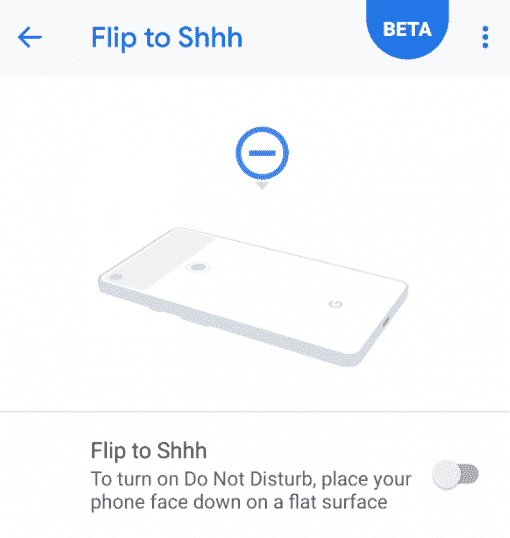

# 谷歌像素 3 XL 相机，软件，设计，音频和像素站审查

> 原文：<https://www.xda-developers.com/google-pixel-3-xl-camera-software-design-pixel-stand/>

速度、简单性和安全性。自从谷歌的 Chrome OS——基于 Linux 内核的桌面/笔记本电脑操作系统——问世以来，这三个词就一直被用来描述它。但我认为谷歌的 Android 智能手机 Pixel 系列也体现了 Chrome OS 座右铭中的三个 S。与大多数 Android 设备制造商相比，谷歌在 Pixel 系列上的做法截然不同。谷歌没有将所有可以想象到的软件功能与所有可能的传感器打包在一起，而是专注于以用户最少的努力带来最佳的相机性能。Pixel phone 的每一次新的迭代也带来了一些新的非相机软件功能，以及许多隐藏的性能和安全增强，最终结果是一部拥有最好的谷歌软件的智能手机。谷歌 Pixel 3 XL 智能手机拥有大量新的谷歌相机功能和干净的 Android Pie 界面，并添加了一些有用的功能，但它也有争议的显示屏缺口。

在这篇评论中，我们探索了 Pixel 3 XL 的设计、软件、摄像头、音频和配件，以帮助您做出明智的决定，确定这款手机是否名副其实。一旦我们花更多的时间使用这款设备，我们将对 Pixel 3 的性能、电池寿命和显示屏进行评估。这是我的想法的总结，当然，我会在下面进一步详细说明。

*   我喜欢的:
    *   它带有 Android 9 Pie，谷歌提供 3 年的每月安全补丁更新和 3 年的 Android 平台更新。
    *   一个伟大的相机，即使像我这样的摄影初学者也可以使用。HDR+一如既往地出色，由于更新的像素视觉核心，甚至更快。新的广角镜头也增强了人像模式。有了 Top Shot 和运动追踪自动对焦，我就不用那么担心手不稳了。由于 Super Res Zoom，Pixel 3 XL 仅使用一个后置摄像头。
    *   仅从前几代产品来看，它有望成为市场上最安全的消费级安卓智能手机。
    *   扬声器声音洪亮清脆。Pixel USB-C 耳塞可产生出色的音频输出。
    *   柔软的触摸玻璃背面拿在手上感觉很棒，我很想裸体使用这款设备。
    *   融合视频稳定(谷歌结合 OIS 和 EIS 的算法)使视频录制在移动中真正稳定。
*   我不喜欢的是:
    *   缺口有多大可能会让人有点分心。底部挡板比我想要的要大。
    *   通过 Pixel 支架进行无线充电不如竞争对手的产品快。
    *   Pixel 3 XL 上的 3，430mAh 被竞争对手提供的 4，000mAh+电池所掩盖，尽管完整的电池寿命评估将在未来的文章中发布。
    *   4gb 内存在 6 或 8gb 内存的旗舰智能手机中已经过时。谷歌使用 zRAM 有所帮助(他们设置的是 512MB)，但与 OnePlus 6 相比，我在 Pixel 2 XL 和 Pixel 3 XL 上经历了更多的应用程序重绘。我将在以后的文章中测试该软件将应用程序保存在内存中的能力。
    *   它真的很贵，我担心这种设备不会在市场上获得很大的吸引力，因为它的价格很高。考虑到与 POCO F1 和 OnePlus 6 相比，印度的[设备贵了多少，你还不如把它一笔勾销。](https://www.xda-developers.com/google-pixel-3-pixel-3-xl-india-pricing-availability/)
    *   不支持 60FPS 的 4K 视频录制，这很奇怪，因为其他具有相同芯片组和图像传感器的设备也支持它。

接下来，这里有一张比较较小的谷歌 Pixel 3 和较大的谷歌 Pixel 3 XL 规格的表格。

### 规格表(单击展开)

| 

种类

 | 

谷歌像素 3

 | 

谷歌 Pixel 3 XL

 |
| --- | --- | --- |
| 尺寸和重量 | 145.6 x 68.2 x 7.9 毫米，148 克 | 158 x 76.6 x 7.9 毫米，184 克 |
| 建设 | 混合涂层铝框架。双色软触摸玻璃背面，活动边缘的可挤压框架 | 混合涂层铝框架。双色软触摸玻璃背面，活动边缘的可挤压框架 |
| 软件 | 含 3 年操作系统和 3 年安全补丁更新的 Android Pie | 含 3 年操作系统和 3 年安全补丁更新的 Android Pie |
| 显示 | 5.5 英寸 1080x2160 (18:9)有机发光二极管显示屏。大猩猩玻璃 5。HDR 支持。 | 6.3 英寸 1440x2960 (18.5:9)凹槽有机发光二极管显示屏。大猩猩玻璃 5。HDR 支持。 |
| 片上系统 | 采用 Adreno 630 GPU 的高通骁龙 845 | 采用 Adreno 630 GPU 的高通骁龙 845 |
| 协同处理器 | 像素可视 CoreTitan 安全芯片 | 像素可视 CoreTitan 安全芯片 |
| 随机存取存储 | 4GB LPDDR4X | 4GB LPDDR4X |
| 储存；储备 | 64GB/128GB，无 microSD 卡插槽 | 64GB/128GB，无 microSD 卡插槽 |
| 电池 | 2915 毫安时 | 3430 毫安时 |
| 后置摄像头传感器 | 索尼 IMX363 (12.2MP f/1.8，1.4μm)视频录制:4k @ 30fps，OIS+EIS 慢动作:720 p @ 240 fps 双像素自动对焦，零快门延迟(ZSL)，快速准确的图像超分辨率(RAISR) | 索尼 IMX363 (12.2MP f/1.8，1.4μm)视频录制:4k @ 30fps，OIS+EIS 慢动作:720 p @ 240 fps 双像素自动对焦(PDAF)，零快门延迟(ZSL)，快速准确的图像超分辨率(RAISR) |
| 前置摄像头传感器 | 索尼 IMX355(双 810 万像素，主镜头为 f/1.8，辅助镜头为广角镜头，f/2.2，97 度视野)视频录制:1080p@30fps | 索尼 IMX355(双 810 万像素，主镜头为 f/1.8，辅助镜头为广角镜头，f/2.2，97 度视野)视频录制:1080p@30fps |
| 港口 | USB 3.1 型，nanoSIM 托盘 | USB 3.1 型，nanoSIM 托盘 |
| 连通性 |  |  |
| 安全性 | 后置指纹扫描仪，支持 StrongBox Keymaster 的防篡改硬件安全模块 | 后置指纹扫描仪，支持 StrongBox Keymaster 的防篡改硬件安全模块 |
| 声音的 | 双前置立体声扬声器，无 3.5 毫米耳机插孔，3 个带噪音抑制功能的麦克风 | 双前置立体声扬声器，无 3.5 毫米耳机插孔，3 个带噪音抑制功能的麦克风 |
| 充电 | 通过 Pixel Stand 无线充电高达 10W，通过 USB PD 2.0 无线充电高达 18W | 通过 Pixel Stand 无线充电高达 10W，通过 USB PD 2.0 无线充电高达 18W |
| IP 等级 | IP68 -防水防尘 | IP68 -防水防尘 |

**关于这篇评论**:我有[谷歌 Pixel 3 XL](https://www.xda-developers.com/google-pixel-3-google-pixel-3-xl-specs-features-pricing-availability/) 的国际版。Pixel 3 XL 的评测单元是谷歌在 10 月 9 日的最后一天提供的。因此，我和这个单位相处了大约 5 天。出于这个原因，一旦我有更多的时间使用这款设备，我会写下我对电池寿命和性能的想法。我也会把展示分析交给[迪伦·拉加](https://www.xda-developers.com/author/dylan-raga/)。最后，我没有评论 [Google Duplex 或 Night Sight](https://www.xda-developers.com/google-pixel-3-google-pixel-3-xl-minor-features/) 功能，因为在本文发表时，评论者还看不到它们。

* * *

## 谷歌 Pixel 3 XL 设计

### 让我们来谈谈那个缺口

随着智能手机行业趋向于更小的边框，设备制造商不可避免地要寻找新的方法来减小顶部边框的尺寸。显示器凹口趋势是由夏普的 Aquos S2 和 T2 的 Essential 手机开创的，但随着苹果 iPhone X 的普及，使用凹口显示器可以让公司通过在通常封装在顶部边框区域的传感器周围构建显示器来减小顶部边框的尺寸。缺口的大小取决于设备制造商愿意移除多少组件。例如，OnePlus 6 的凹槽相当小，但为辅助前置摄像头牺牲了更大的扬声器和空间。LG V40 ThinQ、华为 Mate 20 Pro 和谷歌 Pixel 3 XL 都设计了相当大的凹口: [LG V40 ThinQ](https://www.xda-developers.com/lg-v40-thinq-lg-watch-w7-announced/) 的凹口区域容纳了双前置摄像头和单个扬声器，[华为 Mate 20 Pro](https://www.xda-developers.com/huawei-mate-20-pro-cases-nm-card-wireless-charger/) 的凹口区域容纳了单个前置摄像头、扬声器和用于 3D 面部识别的传感器，谷歌 Pixel 3 XL 的凹口区域容纳了双前置摄像头和单个大扬声器。谷歌决定使用开槽 OLED 面板是一种妥协，既满足了想要更小边框的用户，也满足了想要更好的自拍相机和扬声器的用户。

这是否意味着你必须喜欢谷歌的设计决策？不，事实上，我同意你们许多人的看法，Pixel 3 XL 的凹槽**可能会分散**的注意力。自从发布以来，在使用 OnePlus 6(注意，有适当的凹槽隐藏功能)后，切换到 Pixel 3 XL 感觉有点奇怪。Pixel 3 XL 是我在智能手机上见过的最大的缺口，虽然我个人已经克服了它，但我不会告诉你你应该对它有什么感觉。亲自看，**缺口真的和照片上看起来的一样大**。如果你期待的与你在网上看到的有所不同，那么你会让自己失望的。话虽如此，但如果有机会，我还是建议亲自看一看这款设备——在亲自拿过 Pixel 3 XL 之后，你可能会有不同的感觉。最后，如果你想隐藏缺口的话，有很多方法可以隐藏缺口。

底部挡板是一个完全不同的故事。不幸的是，它很大。Razer 在 Razer Phone 2 上使用[整个底部边框作为一个巨大的扬声器](https://www.xda-developers.com/razer-phone-2-is-here-with-snapdragon-845-chroma-lighting-wireless-charging-and-huge-speakers/),而 Pixel 3 XL 容纳了一个单独的(按大多数标准来说相当大)扬声器。我不确定在不像[华为 Mate 20](https://www.xda-developers.com/huawei-mate-20-notch-render-specifications/) 那样将扬声器移到底部的情况下，底部边框还可以减少多少，但如果 Honor 可以在大多数旗舰品牌已经实现的基础上减少其廉价设备上的底部边框[，那么我不禁想知道是否可以做得更多。](https://www.xda-developers.com/how-the-honor-8x-got-its-ultra-slim-chin/)

### 那后面

自从我对谷歌 Nexus 4 的糟糕体验以来，我一直对玻璃制造持怀疑态度。有玻璃背面的老式智能手机容易破裂，对我来说它们太滑了。自从拥有了背面带软触摸玻璃的 OnePlus 6，我就改变了对玻璃的看法。柔软的触摸玻璃手感极佳，大猩猩玻璃的改进意味着玻璃背面比以往任何时候都更耐用。我仍然使用 OnePlus 6 和 Pixel 3 XL 的外壳，但只是因为我倾向于保护我的设备，以避免划痕和其他外观缺陷。不过，我不介意在没有外壳的情况下使用 Pixel 3 XL，因为握起来感觉很棒。设备的两侧有点滑，但幸运的是，我的手指通常会放在后部，在那里他们会感觉到柔软的触摸玻璃。(有些人，比如罗恩·阿马迪奥和马克斯·布朗利，[说](https://twitter.com/RonAmadeo/status/1049756561533558785)他们的设备太容易被划伤，但是我自己没有遇到过这个问题。)

谷歌每年绝对钉钉的设计方面是像素后部的双色调颜色选择。我收到的 Pixel 3 XL 是“纯黑色”的，当光照在上面时，看起来几乎是暗灰色。我个人是白色的粉丝(社区通常称之为“熊猫”)，但我对谷歌今年使用的任何颜色选择都没有疑虑。

### 缺失通知 LED

虽然我喜欢永远显示和新的像素支架，但我讨厌通知 LED 被移除。甚至谷歌也警告说，启用“总是显示”可能会导致电池使用量增加。对于那些希望通过禁用“始终显示”来最大限度延长电池寿命的用户来说，如果他们不唤醒设备进行检查，他们现在将无法知道他们是否有任何新的通知。我不再定制通知 LED，因为我过去在切换 rom 时总是重置出厂设置，但我知道当完全定制以满足您的需求时，通知 LED 会非常有用。

* * *

## 谷歌 Pixel 3 XL 软件功能

### 缺口隐藏

在 Pixel 3 XL 公布之前，一些用户可能已经看到了这张图片，它显示了这款设备有一个“隐藏”的凹槽。图片中凹口被隐藏的原因是旧版本的谷歌 Chrome 在状态栏中没有颜色，默认是黑色的。Pixel 3 XL 上的凹槽容纳了 Android Pie 的状态栏；如果一个应用程序要求状态栏是某种颜色，那么凹口区域将采用那种颜色。例如，在谷歌 Chrome 浏览器中浏览 XDA 主页时，状态栏会变成橙色。打开设置应用程序，槽口会变成白色。在状态栏后面显示内容的应用程序(如谷歌地图或 Pixel Launcher)也会在凹口区域显示内容。它的工作方式没有什么特别之处:它只是一个被上移的状态栏。

因为它只是一个状态栏，这意味着它可以被操纵。谷歌在开发者设置中添加了内置的凹口隐藏功能，这只是现有“显示剪切”开发者选项的扩展。选择新的“隐藏”选项会激活一个名为“DisplayCutoutNoCutout”的 RRO 覆盖，该覆盖会强制显示剪切区域变黑，将纵向模式下的状态栏高度降低到 28dp，将顶部圆角半径降低到 70px，并降低下拉快速设置图块的激活区域。这有效地将像素 3 XL 变成了像素 2 XL。隐藏缺口的另一种方法是在不向下移动的情况下使状态栏区域变黑，这就是我们的 Nacho Notch 应用程序所做的。

### 手势

谷歌在谷歌 I/O 2018 上发布的第二个 Android P 开发者预览版中引入了手势导航。与一加、小米或华为的手势不同，Android Pie 手势不会释放任何屏幕空间。相反，传统的后退、主页和最近应用概览的 3 按钮布局被后退和主页药丸的 2 按钮布局所取代。home pill 可以快速向右滑动以返回到上一个应用程序，或者滑动并按住以进入新的横向最近应用程序概览。在“最近使用的应用程序”概览中，您可以继续按住并移动 home pill 来选择最近使用的应用程序。最近的应用程序概览也可以通过在导航栏的任何地方向上滑动来访问。

谷歌已经将这种形式的导航[设置为 Pixel 3 和 Pixel 3 XL 的默认](https://www.xda-developers.com/google-pixel-3-will-only-offer-gesture-navigation-and-not-standard-buttons/)，无法禁用它。在现有的 Android Pie 中，你可以通过进入设置- >系统- >手势- >向上滑动 home 键并取消选中切换来禁用手势。通过 framework-res 叠加，谷歌在 Pixel 3 上取消了这一选项。这意味着您需要 root 访问权限来恢复切换，这样您就可以完全禁用手势。

然而，有一种方法可以恢复 3 按钮导航栏布局，而不涉及 root。Android Nougat 中的[隐藏导航栏调谐器](https://www.xda-developers.com/nav-bar-customization-was-hidden-in-stock-nougat-all-along-and-it-never-needed-root/)仍然存在于 Android Pie 中，即使你无法直接访问界面。我们论坛上的一个名为[自定义导航栏](https://forum.xda-developers.com/android/apps-games/app-custom-navigation-bar-customize-t3590967)的应用为导航栏调谐器提供了一个 GUI，你可以用它来修改导航栏按钮。如果你这样做，你将失去通过长按 home 键触发谷歌助手的能力(尽管 Active Edge 仍然工作)。此外，图标不会随着导航栏的其余部分自动改变颜色——这意味着在一些应用程序中，导航栏按钮仍然是白色的，而背景是白色的。最后，导航手势实际上并没有被禁用，仍然可以使用，尽管我并不认为这有什么不好。

### 来电显示

讨厌电话推销员？那你可能会喜欢来电显示。该功能让机器人(谷歌助手)代表你接听电话，并预先写好信息，询问他们的姓名以及他们为什么给你打电话。来电者的任何回应都被转录下来供你阅读，你可以通过告诉谷歌助手询问更多信息(“告诉我更多”)，请求来电者的身份(“你是谁？”)，或者告诉打电话的人他们的最后一条信息不可理解(“我听不懂。”)如果你想接电话，你所要做的就是点击绿色的电话图标。如果你想挂断，你只需按红色的电话图标。

来电过滤是一个非常简单明了的功能。不幸的是，这并不能解决问题，即使接到垃圾邮件发送者的电话，也表明你的号码是在线的，因此他们会给你回更多的垃圾邮件。尽管如此，这并不是该功能的错误，所以我真的不能把它记下来。不过，尽量少用来电过滤。你可能会冒犯那些不喜欢被机器人筛选的人。谷歌 Pixel 3 和谷歌 Pixel 3 XL 已经提供了呼叫筛选功能，并将于下个月在谷歌 Pixel 和谷歌 Pixel 2 上提供。

*在像素 3 XL 上调用加网。抄写并不完美，但它表达了重点。*

支持始终显示的全新动态壁纸

### 考虑到谷歌 Pixel 3 的新动态壁纸已经在网上发布，并且在新像素公布之前[已经移植到其他设备上](https://www.xda-developers.com/download-google-pixel-3-live-wallpapers-port/)，这里没有任何惊喜。尽管如此，我们还是要提到这个功能，因为新的 Live Wallpapers 的“永远显示”支持只能在 AOSP 实现了“永远显示”的设备上使用。这意味着它只能在 Pixel 2 和 Pixel 3 上工作，尽管我听说在 Pixel 2 上运行这些并启用“始终显示”会导致闪烁问题。在 Pixel 3 上，大多数动态壁纸的效果都很微妙——一些轮廓、形状或字符在这里和那里——但它真的很整洁。只有三星真正以一种真正创造性的方式使用了永远展示的壁纸和[现在的 gif](https://www.xda-developers.com/samsung-galaxy-s8-galaxy-note-8-always-on-display-gif/)，但谷歌的实施正在缩小差距。

操场

### 很容易把 Playground 想成只是 AR 贴纸的重新贴牌。从某种意义上说，它们仍然是你可能会使用一次或两次，并且永远不会再使用的东西，除非你想向你的朋友和家人炫耀。但谷歌增加的新功能确实增加了一些价值:人物可以与画面中的其他人物和人互动，贴纸建议会根据屏幕上的内容出现，贴纸可以从前置摄像头放置，人物可以对你的面部表情做出反应。这些新功能让 Playground 感觉比 AR 贴纸更“活”。个人认为，AR 贴从一开始就应该是这样的。

老实说，我不认为我能在相机上或通过截图充分捕捉到这些效果，所以我建议你查看谷歌关于该功能的官方视频。我在谷歌制造活动和我的评测小组中使用时，它的效果和预期的完全一样。就像我之前说的，我没有看到任何人使用 Playground 超过几次，并且在每个 OEM 添加了他们自己的功能后，增强现实贴纸的新鲜感已经消失了。但是谷歌的比其他的更精致，所以我能理解他们为什么要推出这个功能。

老实说，我不认为我能在相机上或通过截图充分捕捉到这些效果，所以我建议你查看谷歌关于该功能的官方视频。我在谷歌制造活动和我的评测小组中使用时，它的效果和预期的完全一样。就像我之前说的，我没有看到任何人使用 Playground 超过几次，并且在每个 OEM 添加了他们自己的功能后，增强现实贴纸的新鲜感已经消失了。但是谷歌的比其他的更精致，所以我能理解他们为什么要推出这个功能。

驾驶模式

### Pixel 3 现在在连接设备设置中有一个专用的“驱动模式”。在推出之前，我们已经见过这个功能[，所以我们知道它应该做什么:如果通过运动检测或某些蓝牙连接检测到用户正在驾驶，则打开勿扰模式和/或启动 Android Auto。正如我所担心的，这是一个相当不一致的功能，我很快就关闭了。我曾经在慢慢行走时让 Pixel 3 进入驾驶模式。当我在飞机上时，我也曾让驾驶模式自动打开安卓自动模式。我喜欢这个功能至少在它打开之前警告你，这样你就可以在它被激活之前停止它，但是我发现自己在不需要的时候关闭它太多次了。](https://www.xda-developers.com/android-pie-driving-mode-android-auto-do-not-disturb/)

翻到嘘

### 翻转到 Shhh 手势可以让你通过翻转手机来打开勿扰模式，正如预期的那样。你把手机翻过来，大约 3 秒钟后它会静音，然后把它翻过来或者拿起它立即取消静音。这项功能在其他设备上已经存在多年了——2016 年年中的摩托罗拉 Moto G4 就有——所以 Pixel 3 没有完善它会很尴尬。我们不完全确定为什么这个功能是 Pixel 3 独有的，考虑到[我们能够手动启用它](https://www.xda-developers.com/digital-wellbeing-flip-to-silence-google-pixel-2/)，谷歌在今年早些时候的谷歌 I/O 上展示了这个功能。

有趣的是，谷歌的[商业广告](https://www.youtube.com/watch?v=5eD_lhnyW9k)展示了一堆翻转到 Shhh *不会有帮助的场景。你必须将设备翻转到平坦的表面上才能触发它，所以仅仅将它放在口袋中不会打开勿扰模式。*

现在正在播放和活动边缘

 <picture></picture> 

Flip to Shhh in Digital Wellbeing

### 谷歌 Pixel 2 的两个功能又回到了 Pixel 3 上:名为 Now Playing 的环境音乐识别功能和名为 Active Edge 的挤压功能。如果你不熟悉 Now 游戏是如何工作的，这里有一本入门书[。如果你不熟悉 Active Edge 的功能，你基本上可以通过挤压手机两侧来启动谷歌助手或静音闹钟、定时器、通知和通话。这两个功能在 Pixel 3 上基本没有变化，但现在播放确实保留了以前识别的歌曲的历史，所以你不必再使用第三方应用程序。不过，我不确定 Pixel 2 何时会收到正在播放历史的](https://www.xda-developers.com/how-google-pixel-2-now-playing-works/)。

安全性

### Pixel 3 的安全性确实被谷歌的营销低估了，但得到了安全专家的广泛认可。很少有用户可能知道 Pixel 2 有一个[防篡改硬件安全模块](https://www.xda-developers.com/google-details-tamper-resistant-hardware-security-module-pixel-2/)。HSM 是独立于主 SoC 的分立芯片，用于安全交易。大多数用户不会注意到这些好处，但安全医疗和金融交易的潜在应用令人兴奋。今年，谷歌自豪地展示了 Pixel 3 和 Pixel Slate 中的新 Titan 安全模块。虽然我们没有任何确切的细节，但我们所知不多的是有希望的。你不需要知道任何关于安全的事情，就可以知道谷歌 Pixel 是一款安全的智能手机——也许是最安全的消费智能手机。我总是建议我不太懂技术的朋友和家人购买 Chromebook，我也会推荐谷歌 Pixel，因为我信任的所有开发者都对 Pixel 的安全性有信心。

关于定制开发的思考

### 第一代谷歌 Pixel 发布几个月后，几乎没有为该设备定制的 rom 和内核。许多社区成员指责设备使用 A/B 分区进行[无缝更新](https://www.xda-developers.com/list-android-devices-seamless-updates/)，但 A/B 分区实际上[对开发者来说相当有用](https://www.xda-developers.com/how-a-b-partitions-and-seamless-updates-affect-custom-development-on-xda/)。事实上，Pixel 设备的高价格以及这些设备运行几乎所有的 Android(即开发人员要“修复”的东西更少)是缺乏定制开发的原因。尽管如此，你会在我们的论坛上找到大量关于 Pixel 和 Pixel 2 的定制 rom 和内核，所以我们怀疑 Pixel 3 在未来也会有一个健康的开发社区。我推荐 Pixel 的原因——速度、简单性和安全性——也是开发者选择 Pixel 3 或 Pixel 3 XL 的主要原因，不管它们的价格如何。我知道 XDA 知名开发商 Dees_Troy 和 topjohnwu，分别是和 Magisk 的主要开发商，已经下了订单。

关于人脸解锁的思考

### 你们中的一些人可能会失望地得知 Pixel 3 上没有面部解锁功能。就连 Android Lollipop 的“智能锁”功能中的老面孔解锁也不见了。当你思考为什么的时候，它应该是有意义的。老脸解锁不可思议的没有安全感，被一张照片轻松打脸。OnePlus 5T、OnePlus 6 和小米 POCO F1 等设备上的面部解锁功能虽然比智能锁版本更安全，但仍然不够安全，无法在解锁设备之外使用。谷歌选择了广角镜头作为第二前置摄像头镜头，所以没有像小米 Mi 8 EE 或苹果 iPhone X 那样的结构光 3D 扫描仪模块。Pixel Imprint(Pixel 后置指纹扫描仪的术语)仍然工作得相当好，所以我对缺乏面部解锁并不太失望。不过，我希望下一代 Pixel 要么有显示指纹扫描仪，要么有结构光 3D 扫描仪。

你们中的一些人可能会失望地得知 Pixel 3 上没有面部解锁功能。就连 Android Lollipop 的“智能锁”功能中的老面孔解锁也不见了。当你思考为什么的时候，它应该是有意义的。老脸解锁不可思议的没有安全感，被一张照片轻松打脸。OnePlus 5T、OnePlus 6 和小米 POCO F1 等设备上的面部解锁功能虽然比智能锁版本更安全，但仍然不够安全，无法在解锁设备之外使用。谷歌选择了广角镜头作为第二前置摄像头镜头，所以没有像小米 Mi 8 EE 或苹果 iPhone X 那样的结构光 3D 扫描仪模块。Pixel Imprint(Pixel 后置指纹扫描仪的术语)仍然工作得相当好，所以我对缺乏面部解锁并不太失望。不过，我希望下一代 Pixel 要么有显示指纹扫描仪，要么有结构光 3D 扫描仪。

* * *

谷歌 Pixel 3 XL 音频

## 在我谈论音频质量之前，我只想说我绝不是一个音响发烧友。虽然我过去浏览过发烧友论坛以获得关于耳机的建议，但我没有资格使用我不拥有的设备来客观地评价扬声器质量或音频输出质量。我的这些想法是基于我亲耳听到的。我相信音频质量是你需要亲身体验才能真正感受到的，所以把我的想法作为一个指南。

关于像素 USB-C 耳塞的思考

### Pixel USB-C 耳塞的音频输出令人难以置信——在高音量下具有出色的低音和最小的失真。我唯一的疑虑是，机器人谷歌助理的声音在最大音量下可能听起来刺耳。我通过听 YouTube 上的 [Vue](https://www.youtube.com/watch?v=FzyAjoBLzY8&feature=youtu.be) 并按照 [AudioCheck](https://www.audiocheck.net/soundtests_headphones.php) 上的指导测试了音频输出质量，Pixel USB-C 耳塞顺利通过。我可以通过 Pixel USB-C 耳塞听到低至 30Hz、高至 17kHz 的频率，当然，你的里程数可能会有所不同。

这是否意味着我已经克服了没有耳机插孔的问题？在使用 Pixel 2 XL 好几个月，并计划在未来广泛使用[一加 6T](https://www.xda-developers.com/oneplus-6t-no-headphone-jack-type-c-bullets/) 和 Pixel 3 XL 之后，我肯定会实现这一目标。Pixel USB-C 耳塞是 Pixel 3 套装的一个很好的补充，尽管这意味着每当你想听任何音乐时，你都必须记得随身携带它们。

关于演讲者素质的思考

### 我简单测试了一下扬声器的响度和清晰度。我在 OnePlus 6、谷歌 Pixel 2 XL 和谷歌 Pixel 3 XL 上听了一段高质量的《红天鹅》。我把所有 3 个设备放在一张桌子上，站在离所有 3 个设备等距离的地方，并且在我再也听不到任何一个设备的音乐之前，尽可能地走远。在响度方面，OnePlus 6 最响，其次是 Pixel 3 XL，然后是 Pixel 2 XL。然而，当我在一个封闭的房间里在每台设备上播放这首歌时，我注意到 OnePlus 6 的扬声器音频有些失真，而 Pixel 3 XL 的感觉更干净。

我简单测试了一下扬声器的响度和清晰度。我在 OnePlus 6、谷歌 Pixel 2 XL 和谷歌 Pixel 3 XL 上听了一段高质量的《红天鹅》。我把所有 3 个设备放在一张桌子上，站在离所有 3 个设备等距离的地方，并且在我再也听不到任何一个设备的音乐之前，尽可能地走远。在响度方面，OnePlus 6 最响，其次是 Pixel 3 XL，然后是 Pixel 2 XL。然而，当我在一个封闭的房间里在每台设备上播放这首歌时，我注意到 OnePlus 6 的扬声器音频有些失真，而 Pixel 3 XL 的感觉更干净。

* * *

谷歌 Pixel 3 XL 相机测试

## 关于谷歌相机 6.1，顶部拍摄，主体跟踪自动对焦，照相亭，谷歌镜头建议和超分辨率变焦的想法

### 在我们开始相机对比测试之前，我想谈谈我对谷歌相机所有新功能的看法。

**谷歌摄像头 6.1** :我喜欢这个新设计。在不同模式间滑动比打开侧边栏菜单更有意义，后者通常令人沮丧。调整人像模式拍摄的深度和添加彩色 Pop 效果的能力可以将一张已经很棒的照片变成一张优秀的照片。RAW capture 支持非常棒，尽管我个人依赖 Google Camera 的后期处理来为我完成所有工作。在 HEVC 编码视频也是受欢迎的，特别是因为大多数播放设备应该支持 h265 解码。最后，在视频录制期间从外部麦克风录制音频的功能终于出现了！任何支持谷歌相机应用程序的设备都将获得新版本，但该应用程序的端口已经为那些没有像素的人准备好了。

*   **顶拍**:十次有九次，谷歌相机为我合成了完美的照片。我还没有遇到过需要使用 Top Shot 的镜头，但我很高兴知道当我拍摄一个我不能回去重新拍摄的镜头时，它就在那里。Top Shot 基本上保存了一堆备选图像(它们被压缩以节省空间)，如果推荐的图像不合你的心意，你可以从中挑选。
*   **主体追踪自动对焦:**我真的真的很喜欢这个新功能。当你试图拍摄一个像动物一样的移动物体时，这是很神奇的。你只需点击它，相机就会保持聚焦在物体上。将这一点与 Top Shot 结合起来，你几乎可以保证有一张很棒的照片，即使你最初的照片没有达到目标。
*   **Photobooth:** 这个有点傻，但是效果还不错。其他设备已经有类似的“微笑检测”功能，但 Pixel 3 上的 Photobooth 更进一步，它可以识别你或一群人何时做出愚蠢的表情。我只尝试了一次，没有任何识别问题，但我不知道在光线不好的情况下这项功能会有多快崩溃。
*   **Google Lens 建议:**我还是把 Google Lens 看成一个噱头，但是比 Bixby Vision 好，大概也比 HiVision 好。如果你手边没有纸和笔，或者很匆忙，需要快速扫描卡片，你可能会发现新的实时谷歌镜头识别会派上用场。只要确保你的注意力集中在小文本上，否则你会在任何 URL 中出现错别字。(我第一次尝试时就遇到了这种情况。)
*   **Super Res Zoom:** 一个你不必考虑，但仍会欣赏的功能的好名字。这显然只在 1.2 倍变焦或更高变焦时有效，如果没有检测到任何手部动作，甚至[会自动移动镜头](https://twitter.com/backlon/status/1051589500340764672)。Super Res Zoom 提供的改进在夜间拍摄时最为明显。
*   日夜拍摄对比——OnePlus 6 对比谷歌 Pixel 2 XL 对比谷歌 Pixel 3 XL

### 这一部分由丹尼尔·马尔凯纳撰写。

就标准摄影体验而言，这并不是像素相机的巨大飞跃。一般来说，虽然你可以看到一个共同的线程分开像素 2 和像素 3，大部分是调整和照片相对相同。一些人抱怨 Pixel 2 的色彩平衡过于冷静，看起来谷歌通过 Pixel 3 纠正了这一点。虽然有照片显示蓝色色调，但像素 3 改变了事情。然而，他们没有采用更黄的色彩平衡，而是采用了洋红色。我还注意到，Pixel 3 的快门速度明显较低，以便在夜间拍摄时降低 ISO 和噪点。虽然这有可能创造出更清晰的图像，但你确实有手部动作模糊照片的风险，就像 Night 001 的情况一样，Pixel 2 的 ISO 是两倍，但快门速度也是两倍。像素 3 保持在 200 ISO 以下，但达到了 1/25，这是手持摄影的最低要求，即使有 OIS 补偿。《004 之夜》就是一个例子，这有利于 Pixel 3 使用慢速快门，拍摄更加清晰，天空中的噪音也少得多。这是一种权衡，看起来谷歌愿意冒险获得更好的形象。

正如我前面提到的，Pixel 3 传感器确实有明显的洋红色偏移，虽然这在白天拍摄时很明显，但《009 之夜》显示了强烈的洋红色偏移如何改变图像的感觉。这几乎让人分心，不清楚这是谷歌的意图还是我们部门的缺陷。超级分辨率变焦是一项令人惊叹的技术。在夜间拍摄中有一个非常明显的区别，它提供了更好的曝光，色彩和更多的细节。我们需要将其与三星 Galaxy Note 9 或 iPhone XS 上的合适的长焦传感器进行比较，看看这是否可以取代双传感器解决方案，但在大多数竞争对手依赖数字变焦而不是第二个传感器的夜间拍摄中，像素将有明显的领先优势。

如果你喜欢 Pixel 2 的相机体验，你会发现 Pixel 3 非常相似，这反映了谷歌坚持从 IMX362 到 IMX363 进行非常小的传感器更新。这可能会让谷歌感到担忧，因为苹果等竞争对手正在使用与新 iPhone XS 和 XS 马克斯相同的叠加图像的基本概念。Pixel 3 的差异和好处可能会归结为新的软件技巧，如夜视模式和超分辨率变焦，前者我们需要等待一段时间才能看到实现，后者为手机的功能增加了一个明显的好处。

下面，你会发现我们采取的图片，以比较 3 个设备。第一张图片来自 OnePlus 6，第二张图片来自谷歌 Pixel 2 XL，最后第三张图片来自谷歌 Pixel 3 XL。

视频记录

### *这一部分由[丹尼尔·马尔凯纳](https://www.xda-developers.com/author/daniel-marchena/)撰写。*

当你知道合适的光线会是一个问题时，比如在室内或黄昏时，你需要 60FPS，但愿意降低到 30 以节省噪音，请使用 AutoFPS。我们注意到，这种模式下的稳定运动感觉不自然，就像谷歌 Pixel 1 没有 OIS，而是只依赖于 EIS。Pixel 3 可能依赖于这种模式的电子稳定，因为在我们的黄昏拍摄中，你可以看到它有多平滑。我们需要更多的时间来测试相机，看看在这种模式下使用了什么样的稳定来得出结论性的结果。除此之外，它的表现很像 Pixel 2，它应该如此，最大的变化是新的真正的立体声录音。虽然这还达不到 HTC 无损录音或 LG 的水平，但与 Pixel 2 相比，这是一个很好的改进。它仍然缺乏降噪功能，因为 Pixel 3 使用了 3 个麦克风，而不是苹果等竞争对手使用的 4 个麦克风。

当你知道合适的光线会是一个问题时，比如在室内或黄昏时，你需要 60FPS，但愿意降低到 30 以节省噪音，请使用 AutoFPS。我们注意到，这种模式下的稳定运动感觉不自然，就像谷歌 Pixel 1 没有 OIS，而是只依赖于 EIS。Pixel 3 可能依赖于这种模式的电子稳定，因为在我们的黄昏拍摄中，你可以看到它有多平滑。我们需要更多的时间来测试相机，看看在这种模式下使用了什么样的稳定来得出结论性的结果。除此之外，它的表现很像 Pixel 2，它应该如此，最大的变化是新的真正的立体声录音。虽然这还达不到 HTC 无损录音或 LG 的水平，但与 Pixel 2 相比，这是一个很好的改进。它仍然缺乏降噪功能，因为 Pixel 3 使用了 3 个麦克风，而不是苹果等竞争对手使用的 4 个麦克风。

下午 1080p 带自动 FPS 模式

#### 下午 1080p 带自动 FPS 模式

黄昏时的 4K@30FPS

#### 黄昏时的 4K@30FPS

4K@夜间 30FPS

#### 4K@夜间 30FPS

* * *

谷歌 Pixel 3 XL 配件

## 像素支架

### 谷歌在 Pixel 3 上重新推出了无线充电功能，他们还销售一款名为 Pixel Stand 的无线充电器配件。这是一个光滑的充电垫，可以倾斜支撑你的设备放在桌子上。我个人更喜欢这种方式，因为它能让你在办公桌上看到一直展示的。虽然你可以将 Pixel 3 水平放置在支架上，但 Always on Display 不支持横向模式，所以这将是一种有点尴尬的体验。

谷歌在 Pixel 3 上重新推出了无线充电功能，他们还销售一款名为 Pixel Stand 的无线充电器配件。这是一个光滑的充电垫，可以倾斜支撑你的设备放在桌子上。我个人更喜欢这种方式，因为它能让你在办公桌上看到一直展示的。虽然你可以将 Pixel 3 水平放置在支架上，但 Always on Display 不支持横向模式，所以这将是一种有点尴尬的体验。

谷歌助手和始终显示集成

#### 不过，Pixel 支架不仅仅是一个普通的无线充电器。它与 Google Assistant 和 Pixel 3 的 Always on Display 进行了一些集成，这是其他 Qi 无线充电器所不具备的。您可以查看您的 Google 相册、您当天的视觉快照，并访问“我的一天”Google Assistant 例程的快捷方式。它还与谷歌时钟应用程序集成，显示一个特殊的用户界面，可以改变颜色来帮助你醒来。最后，当手机停靠在 Pixel 支架上时，您可以让手机自动启用免打扰模式。

我注意到的一件有趣的事情是，Google 相册中的图片可以垂直叠放。这是因为你的许多照片太宽了，无法在 Pixel 3 的显示器上正确显示，所以最好用多个图像填满屏幕，而不是将单个图像放在屏幕中央。

我注意到的一件有趣的事情是，Google 相册中的图片可以垂直叠放。这是因为你的许多照片太宽了，无法在 Pixel 3 的显示器上正确显示，所以最好用多个图像填满屏幕，而不是将单个图像放在屏幕中央。

充电速度

#### Pixel 支架通过一个 USB Type-C 端口供电。谷歌 Pixel 3 支持通过 Pixel 支架和其他 10W 无线充电器进行 10W 无线充电。(Pixel 支架可以为其他智能手机充电，但只有 5W 的功率。)我对 Pixel 支架提供的无线充电速度没有太大印象。我只能记录单个充电周期的数据，所以我现在还不能给出完整的数字，但将 Pixel 3 XL 从 5%充电到 100%需要大约 2 小时 37 分钟，将 Pixel 3 XL 从 5%充电到 50%需要 59 分钟。当时该设备没有运行后台服务，也没有显示谷歌相册。该设备也变得非常温暖，电池温度最高可达 43.5 摄氏度。随着 [Razer Phone 2](https://www.xda-developers.com/razer-phone-2-is-here-with-snapdragon-845-chroma-lighting-wireless-charging-and-huge-speakers/) 和 [Huawei Mate 20 Pro](https://www.xda-developers.com/huawei-mate-20-pro-cases-nm-card-wireless-charger/) 的无线充电器提供 15W 的功率，谷歌声称提供最快的无线充电器的说法是短暂的。不过，Razer 和华为的无线充电器是否会像谷歌的 Pixel Stand 那样提供酷炫的永远显示集成，还有待观察。

织物外壳质量

### 我*喜欢*我的 Pixel 2 XL 上的织物外壳。我把布质表壳和一加标志性的砂岩表壳放在一起，因为它的质地非常结实，看起来很漂亮，拿在手上感觉很棒。这就是为什么我很兴奋地看到我的评论包里有 Pixel 3 XL 的新面料包。虽然我喜欢新外壳上微妙的闪光效果(这真的很难在相机上捕捉到)，但这种外壳感觉像是从 Pixel 2 的织物外壳略微降级。不要误会我的意思，Pixel 3 XL 上的面料外壳仍然比亚马逊上的大多数外壳要好，但感觉不如去年的外壳有质感。我很久没有使用 Pixel 3 XL 上的外壳了，所以我无法告诉你它在安顿下来后的感觉或它有多耐用。

盒子里有什么

### 谷歌为你提供了一个 USB Type-C 到 Type-A 适配器，一个 USB Type-C 到 3.5 mm 耳机插孔适配器和一个 SIM 卡托盘弹出工具，尽管你可能会根据你的地区或运营商获得其他配件。这是 TK Bay 在纽约参加谷歌制造活动时做的拆箱视频。

谷歌为你提供了一个 USB Type-C 到 Type-A 适配器，一个 USB Type-C 到 3.5 mm 耳机插孔适配器和一个 SIM 卡托盘弹出工具，尽管你可能会根据你的地区或运营商获得其他配件。这是 TK Bay 在纽约参加谷歌制造活动时做的拆箱视频。

* * *

结论

## 在 Pixel 3 和 Pixel 3 XL 推出之前，我很少怀疑我会抓住这两个型号。除了一些 Pixel 2 用户遇到的可怕延迟等重大问题，Pixel 3 在所有真正重要的领域都比 Pixel 2 略有升级:摄像头和软件。有了 Pixel 3，我知道我每个月都会按时获得每月的安全更新，并将从 Android 升级到 Android s。Pixel 3 的摄像头改进相对于 Pixel 2 来说相当小，但 Pixel 2 过去是，现在仍然是市场上最好的移动拍摄者之一。如果你想从第一代 Pixel 或 Nexus 6P/Nexus 5X 升级，如果你负担得起，Pixel 3 肯定是值得的升级。

这个月，我们看到了一批新的智能手机上市。Razer Phone 2、Google Pixel 3、华为 Mate 20 和一加 6T 只是本月发布的几款主要设备。尽管我向高度重视相机质量和安全性的人强烈推荐 Pixel 3，但我会等一个月，看看用户评论如何。我只拥有这款设备 5 天，但我将在即将到来的 Pixel 3 XL 性能和电池寿命评测中继续使用它。请继续关注 XDA 的更多 Pixel 3 报道！

这个月，我们看到了一批新的智能手机上市。Razer Phone 2、Google Pixel 3、华为 Mate 20 和一加 6T 只是本月发布的几款主要设备。尽管我向高度重视相机质量和安全性的人强烈推荐 Pixel 3，但我会等一个月，看看用户评论如何。我只拥有这款设备 5 天，但我将在即将到来的 Pixel 3 XL 性能和电池寿命评测中继续使用它。请继续关注 XDA 的更多 Pixel 3 报道！

* * *

哪里可以买到谷歌 Pixel 3？

## 下表显示了 Pixel 3 和 Pixel 3 XL 的各种存储版本的价格。Pixel 3 只有 4GB RAM 型号，因此没有价格差异。

设备

| 

储存；储备

 | 

价格(美国/欧盟/加拿大)

 | 

谷歌像素 3

 |
| --- | --- | --- |
| 64GB | 799 美元/€859/999 加元 | 谷歌像素 3 |
| 128GB | 899 美元/€959/1129 加元 | 谷歌 Pixel 3 XL |
| 64GB | 899 美元/€959/1129 加元 | 谷歌 Pixel 3 XL |
| 128GB | 949 美元/€1059/1259 加元 | Pixel Stand 配件在美国售价 79 美元，在英国售价 69 美元。请参考您所在国家的谷歌商店列表，了解谷歌 Pixel 3、谷歌 Pixel 3 XL 和 Pixel 支架的确切价格。 |

Pixel Stand 配件在美国售价 79 美元，在英国售价 69 美元。请参考您所在国家的谷歌商店列表，了解谷歌 Pixel 3、谷歌 Pixel 3 XL 和 Pixel 支架的确切价格。

[**从谷歌商店**购买谷歌 Pixel 3](https://store.google.com/product/pixel_3)

[**从谷歌商店**购买谷歌 Pixel 3](https://store.google.com/product/pixel_3)

[**从谷歌商店购买 Pixel 支架**](https://store.google.com/product/pixel_stand)

[**从谷歌商店**购买 Pixel 支架](https://store.google.com/product/pixel_stand)

* * *

谷歌 Pixel 3 和 Pixel 3 XL 论坛

## 在等待 Pixel 3 到货的同时，想找个地方和 XDA 会员聊天吗？查看下面每个设备的 XDA 论坛。

在等待 Pixel 3 到货的同时，想找个地方和 XDA 会员聊天吗？查看下面每个设备的 XDA 论坛。

[**加入谷歌 Pixel 3 论坛**](https://forum.xda-developers.com/pixel-3)

[**加入谷歌 Pixel 3 论坛**](https://forum.xda-developers.com/pixel-3)

[**加入谷歌 Pixel 3 XL 论坛**](https://forum.xda-developers.com/pixel-3-xl)

[**加入谷歌 Pixel 3 XL 论坛**](https://forum.xda-developers.com/pixel-3-xl)