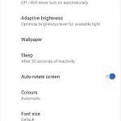

# 谷歌 Pixel 3 XL 的规格，功能，摄像头，以及与 Pixel 2 XL 的比较

> 原文：<https://www.xda-developers.com/google-pixel-3-xl-specs-features-pics-rumors/>

对于谷歌 Pixel 智能手机系列的粉丝来说，这是疯狂的一周。在今年上半年主要来自行业来源的持续泄露之后，我们现在已经有三个单独的谷歌 Pixel 3 XL 出现在公众面前。第一次和[第二次](https://www.xda-developers.com/google-pixel-3-xl-clearly-white-leak/)泄露源自我们自己的论坛，虽然他们透露了新的设计和一些基本的硬件规格，但泄密者无法分享进一步的细节，因为这些设备不起作用。然而，这个月，几个主要来自乌克兰和俄罗斯的博客和 YouTubers 用户拿到了被盗的预生产 Pixel 3 XL 设备。我们已经看到了一个[全拆箱视频](https://www.xda-developers.com/google-pixel-3-xl-unboxing-leak/)、[安兔兔基准破局](https://www.xda-developers.com/google-pixel-3-xl-video-antutu/)、[样照](https://www.xda-developers.com/google-pixel-3-xl-sample-photos-wireless-charging/)，甚至全评测。鉴于现在有多少 Pixel 3 XLs 在市场上，我们甚至还没有触及到在该设备预计于 10 月份发布之前会有多少泄露的表面。为了帮助你理解我们已经看到的过多泄露，这里总结了我们迄今为止所知道的关于谷歌 Pixel 3 XL 的一切。

在文章的最后，我们有一个表格总结了我们认为我们知道的谷歌 Pixel 2 XL 和谷歌 Pixel 3 XL 之间的差异。该表格没有涉及任何细节，因此我们建议在之后查看表格*，我们将更深入地描述 Pixel 3 XL 中的新功能。最后，为了提高页面加载速度，本文中的所有图片都以缩略图的形式发布。请单击或点击图像以打开查看器，以更高的分辨率查看图像。*

*注意:本文中的所有信息都基于谷歌 Pixel 3 XL 泄露的预生产单元。我们不能保证我们在这些设备上看到的硬件规格和软件功能将与生产设备相匹配，尽管它们很有可能匹配。*

**2018 年 8 月 31 日**更新:本文更新了关于发布日期、[连接信息](https://www.xda-developers.com/google-pixel-3-pixel-3-xl-lte-band-71-t-mobile/)和 Pixel Stand 软件的更多细节。

* * *

# 我们对谷歌 Pixel 3 XL 的了解

* * *

## 谷歌 Pixel 3 XL 设计

泄密给我们留下了很少的想象空间——我们基本上从各个角度了解了该设备的每个细节。首先，我们在这里讨论一下显而易见的:**它有一个凹口**。事实上，是一个很大的缺口。我们没有得到一个基本的手机风格的切口或[华为 Mate 20 风格的水滴切口](https://www.xda-developers.com/huawei-mate-20-notch-render-specifications/)。我们得到了一个比我们在其他设备上看到的凹口延伸得更深的凹口。如果你是一个讨厌刻痕的人或者只是勉强容忍刻痕的人，谷歌 Pixel 3 XL 的设计将是一个主要的推迟。我已经克服了我对刻痕的厌恶，发现 Pixel 3 XL 的刻痕是可以忍受的。然而，凹口只是设备的一个方面。Pixel 3 XL 提供了很多东西，所以你应该考虑这个缺口是否真的如此难以忍受，以至于 Pixel 3 XL 的其他亮点不足以弥补它。虽然我们还没有确认凹口区域中的摄像头传感器将被用于什么目的，但有几个可能性，我们将在下面讨论。

谷歌 Pixel 2 XL 唯一的其他主要设计变化是背面使用的材料。谷歌 Pixel 2 XL 有一个塑料涂层的铝背，但迄今为止大多数泄密者都表示 Pixel 3 XL 有一个玻璃背。虽然，一个早期的评论家[说这个设备有一个塑料机身](https://twitter.com/khoroshev/status/1032330567495364610)。有趣的是，[午夜黑](https://www.xda-developers.com/oneplus-6-specifications-pricing-availability/)的 OnePlus 6 尽管是由玻璃制成，但摸起来像是柔软的塑料，所以谷歌可能在 Pixel 3 XL 上实现了类似的表面处理。无论如何，该设备几乎肯定支持 Qi 无线充电，我们将在下面进一步详细讨论。

后置摄像头、指纹扫描仪、电源按钮、音量按钮和 USB Type-C 端口的位置保持不变。甚至彩色电源按钮也有所回归，因为清晰的白色型号带有浅绿色电源按钮，而纯黑色型号则带有橙色电源按钮。立体声扬声器回归，尽管顶部扬声器与 Pixel 2 XL 上的扬声器相比明显较小，因为它必须适合凹槽区域。端口位置唯一真正的变化是 nano-SIM 卡托盘，它从谷歌 Pixel 2 XL 的左侧移到了谷歌 Pixel 3 XL 的底部。

正如预期的那样，没有 3.5 毫米的耳机插孔，也没有安装 microSD 卡的插槽。我们也不知道这个装置是否防水。

* * *

## 谷歌 Pixel 3 XL 显示屏

我们知道它有一个凹口，毫无疑问它将是一个 [**有机发光二极管**面板](https://www.xda-developers.com/google-pixel-3-xl-notched-oled-lg/)，但关于显示屏将有多大还有些困惑。 [CAD 渲染图](https://www.xda-developers.com/google-pixel-3-pixel-3-xl-renders-leak/)显示的是 **6.2 英寸显示屏**，尽管安兔兔中透露的[软件信息显示的是 6.7 英寸显示屏(根据泄露的分辨率，纵横比为 18.5:9)。](https://www.xda-developers.com/google-pixel-3-xl-video-antutu/) [*Rozetked*](https://rozetked.me/reviews/2839-eksklyuziv-pervoe-znakomstvo-s-pixel-3-xl) 认为这是 6.2 英寸的显示屏(尽管他们并不真正确定)，而[*Mobile-Review*](https://mobile-review.com/review/google-pixel-3xl-fl.shtml)认为这是 6.7 英寸的显示屏。无论实际的显示器尺寸是多少， *Rozetked* 声明该设备基本上与 Pixel 2 XL 的尺寸相同。他们甚至声明 Pixel 3 XL 也适用于同样的情况！

至于屏幕分辨率，AnTuTu 和 AIDA64 报的是 **1440x2960 分辨率**。*手机评论*称显示屏亮度低于三星 Galaxy Note 9 的亮度。评测者还表示，显示屏和 iPhone X 上的显示屏一样精确，但他没有提供任何数据来支持这一点。我们没有关于面板质量和校准的其他信息。

如果根据我们对 Pixel 2 XL 的体验，它可能会[准确地再现颜色](https://www.xda-developers.com/pixel-2-xl-xda-display-analysis/)——可能*也会*准确地默认[以满足大多数消费者的舒适](https://www.xda-developers.com/november-update-pixel-2-pixel-2-xl-screen-color-modes/)。幸运的是，谷歌将为用户提供禁用色彩管理和提高饱和度的选项。我们可能会在 Pixel 3 XL 上看到“自然”、“增强”和“饱和”显示配置文件的回归。不过，谷歌似乎也会在 Pixel 3 XL 上推出新的自动色彩模式。正如我们[在 Android P 开发者预览版 2 的拆解](https://www.xda-developers.com/pixel-2-android-p-automatic-color-mode/)中首次发现的，并由*移动评论*发布的截图证实，这种自动颜色模式将“在生动和准确的颜色之间进行调整。”我们不完全确定这种自动颜色模式将如何工作，因为“自然”配置文件应该根据应用程序是否实现它来自动管理颜色。我们的显示器分析师 Dylan Raga 认为，对于没有明确设置色彩空间的内容，这种新的色彩配置文件将选择 sRGB 而不是宽色彩，尽管我们将在设备发布时发现。

 <picture></picture> 

Google Pixel 3 XL automatic color mode. Credits: [Mobile-Review](https://mobile-review.com/review/google-pixel-3xl-fl.shtml)

* * *

## 谷歌 Pixel 3 XL 性能

### CPU 和 GPU

谷歌 Pixel 3 XL 将由最新的**高通骁龙 845** 片上系统和 **Adreno 630 GPU** 驱动。这意味着它应该能够轻松处理最新的游戏，如 Android 上的堡垒之夜移动，至少根据我们自己的测试[。毫无疑问， **Pixel 3 XL 将成为市场上速度最快的设备之一**，无论是在原始基准性能还是实际使用中。唯一的问题是，它将如何比较](https://www.xda-developers.com/fortnite-mobile-android-testing-performance/)[与](https://www.xda-developers.com/oneplus-6-speed-gaming-review/) OnePlus 6 和其他骁龙 845 设备，如[最近推出的](https://www.xda-developers.com/xiaomi-poco-f1-specs-pricing-availability-india/)小米 Poco F1。传闻一加 6T 也将于 10 月份发布，如果去年 Razer 手机的继任者不久后发布，我们也不会感到惊讶。

但不仅仅是最新的高通骁龙片上系统使谷歌 Pixel 系列成为市场上最快的安卓智能手机之一。毕竟，谷歌 Pixel 2 能够跟上 2018 年的最新旗舰，[除非我们谈论的是 Artem Russakovski 的特定单元](https://twitter.com/ArtemR/status/1024367645892591616)。由于谷歌的软件调整，他们的智能手机即使与许多具有相同 SoC 的手机相比也非常流畅。例如，谷歌 Pixel 的 [EAS 调谐](https://www.xda-developers.com/google-pixel-fastest-android-phone-eas/)是帮助它保持高性能的一个方面。他们的性能工程师已经实施了许多其他调整，以使像素快速设备，尽管一些变化[在来自开发者](https://android.googlesource.com/device/google/taimen/+/af1cb8d0a2ece5acded6f5ccf51a79af3577ad42)的反馈[后被恢复](https://twitter.com/t_murray/status/1004142658757881858?s=19)。我们相信，谷歌 Pixel 3 XL 将延续谷歌发布智能手机的趋势，几乎没有或完全没有延迟。

### 随机存取存储

与其他智能手机制造商不同，谷歌似乎在 Pixel 3 XL 中坚持使用 4gb 内存。当像一加这样的公司开始通过在其智能手机中包括 6GB 和 8GB 的 RAM 变体来推动智能手机应该有多少 RAM 的界限时，人们就这些智能手机在内存中分配进程的效率以及是否真的有必要超过 4gb 的 RAM 进行了一些辩论。在 OnePlus 3 发布后不久，我们[发现](https://www.xda-developers.com/how-to-fix-the-oneplus-3s-memory-management-almost-double-the-apps-in-memory/)该公司限制了多少后台应用程序将留在内存中。这种做法后来在软件更新中被取消，在未来的一加手机中不再出现，这样做是为了提高电池寿命和性能。许多 Android 爱好者认为额外的 RAM 只是为了营销，而不是为了实际用途。

但最近，随着 Android 应用程序开始消耗越来越多的内存，导致最近使用的应用程序在重新打开时被重新启动，我看到爱好者们的观点发生了转变。即使在正常使用中，我在谷歌 Pixel 2 XL 上也经历过频繁的应用程序重绘，而我的 OnePlus 6 能够将应用程序保存在内存中。如果有一些后台服务，像堡垒之夜手机[这样的游戏在 4gb 内存的设备上就会慢得像爬行一样](https://trello.com/c/ZuzamiXL/273-slow-performance-on-certain-android-4gb-ram-devices)，这在我对 8gb 内存的 OnePlus 5 和 OnePlus 6 进行游戏测试时从未发生过。谷歌似乎坚持认为 4gb 的内存对于他们的旗舰智能手机来说已经足够了(尽管公平地说，他们[试图用 zRAM](https://source.android.com/devices/tech/debug/jank_jitter#page-cache) 来弥补)。毕竟，拥有更多 RAM 意味着设备必须为 RAM 供电，从而缩短电池寿命。在内存管理方面，我并不声称自己比谷歌的性能工程师知道得更多，但消费者开始注意到 4gb 内存和 6/8gb 内存的设备之间的差异——也许是时候让谷歌重新考虑了。

### 储存；储备

像去年的型号一样，谷歌 Pixel 3 XL 应该有一个 64GB 和 T2 128 GB 的存储型号。我们不知道谷歌是否会提供 256GB 甚至 512GB 的存储模式，就像一些公司已经做的。当然，这款设备不会像之前的几乎所有谷歌设备一样拥有可扩展存储空间。无限制的原始质量 Google Photos 促销活动将于 2020 年底对 Pixel 2 用户结束，但我们不知道 Pixel 3 XL 用户是否会获得相同的优惠。至于存储速度，我们预计 UFS 2.1 至少和[可能是 UFS 3.0](https://www.xda-developers.com/3-samsung-galaxy-s10-models-may-launch-w-one-having-triple-cameras/) ，这是在今年年初推出的。

* * *

## 谷歌 Pixel 3 XL 软件

该设备将与 **Android 9 Pie** 一起推出。它至少应该获得 Android Q 和 Android R 的升级，并且应该获得 3 年的安全补丁更新。我们预计谷歌 Pixel 2 XL 上已经存在的以下功能将在 Pixel 3 XL 上有所回报:

*   [活动边缘挤压特征](https://www.xda-developers.com/google-pixel-2-active-edge-google-pixel-3/)。挤压您的手机启动助理或静音闹钟，定时器，通知和来电。
*   [现在打](https://www.xda-developers.com/how-google-pixel-2-now-playing-works/)。识别背景中播放的歌曲。
*   一直显示，可能带[壁纸支持](https://www.xda-developers.com/android-pie-wallpaper-support-always-on-display/)。将显示屏保持在低功耗状态，以显示时间、日期、天气、电池电量、充电状态和正在播放的歌曲。
*   [数字健康](https://www.xda-developers.com/digital-wellbeing-google-pixel-xl-google-pixel-2-xl/)。通过监控你的使用情况来控制你的智能手机成瘾，并在晚上减少使用。
*   [AR 贴](https://www.xda-developers.com/google-pixel-2-three-new-ar-sticker-packs/)。在增强现实中显示人物和其他图像的贴纸。

此外，以下是我们在泄露中发现的新功能:

*   **新的谷歌相机应用 UI** 。用户界面有标签，你可以滑动来改变相机模式，而不是在当前版本中展开菜单。
*   谷歌相机应用程序中的“谷歌镜头建议”。目前还不清楚这是否只是控制谷歌镜头是否可以从谷歌相机应用程序访问，或者这是否是拍照后自动使用谷歌镜头。
*   "**向上滑动 home 键**"手势切换**设置- >系统- >手势中缺少**。人们对谷歌是否会在 Pixel 3 XL 上提供新的 Android Pie 手势导航[【T5 only】还是只是默认启用有些困惑。手势设置的截图显示，缺少控制该功能的选项。它有可能被移动到像素启动器设置，但我们认为这不太可能。然而，这并不能证实 Pixel 3 XL 只提供手势控制，而不是标准的 3 按钮导航按钮，因为这些单元都配备了预发布软件。](https://www.xda-developers.com/google-pixel-3-will-only-offer-gesture-navigation-and-not-standard-buttons/)

* * *

## 谷歌 Pixel 3 XL 相机

像它的前辈一样，**我们期待 Pixel 3 XL 拥有市场上最好的相机之一**。尽管华为 P20 Pro 和即将推出的华为 Mate 20 等智能手机将有三个后置摄像头，但 Pixel 智能手机使用单个后置摄像头也很好。这要归功于谷歌在谷歌相机应用中令人难以置信的软件算法。谷歌相机应用程序的端口[在我们的论坛](https://www.xda-developers.com/google-camera-port-hub/)上非常受欢迎，因为它们能够[提高 Essential Phone 等设备](https://www.xda-developers.com/essential-phone-camera-quality-fix/)的相机性能(尽管我们发现 OnePlus 6 上的普通 OxygenOS 相机[优于谷歌相机端口](https://www.xda-developers.com/oneplus-6-stock-camera-vs-google-camera-mod/)，至少目前如此。)谷歌相机的 [HDR+](https://www.xda-developers.com/google-camera-hdr-xiaomi-redmi-note-3/) 和[人像模式](https://www.xda-developers.com/pixel-2-portrait-mode-port-non-google-android-oreo/)使 Pixel 2 成为市场上最好的智能手机相机之一，因此我们预计谷歌相机的魔力将在 Pixel 3 XL 上同样有效。

至于相机规格，AnTuTu 和 AIDA64 都报道 Pixel 3 XL 有一个**单后置 12.2MP 相机传感器，光圈为 f/1.8**。后置摄像头能够以 30fps 的速度录制 **4k 视频**。与 Pixel 2 的单前置摄像头传感器 f/2.4 光圈相比，似乎有**双 800 万像素摄像头传感器 f/1.8 光圈**。根据 EXIF 的数据，前置摄像头现在似乎有了**自动对焦**，而不是像大多数前置摄像头那样有固定的焦距，这意味着它可以像后置摄像头一样聚焦物体。双前置摄像头可用于更好的自拍，称为“[超级自拍](https://www.xda-developers.com/google-pixel-3-xl-dual-front-camera-super-selfies/)”据报道，第二个相机传感器是广角镜头。据说面部修饰功能将更新为新的“自然”和“柔和”选项。

最后，[像素视觉核心](https://www.xda-developers.com/google-pixel-visual-core-play-store-image-processing/)芯片[据说将获得升级](https://www.xda-developers.com/google-pixel-3-xl-dual-front-camera-super-selfies/)，这将有助于产生令人难以置信的低光照片。Pixel 2 上的 Pixel 视觉核心是 Snapchat、WhatsApp、Instagram 等应用程序用来拍摄更好照片的[。值得注意的是，Snapchat 在拍照时会对相机取景器进行截图(甚至在](https://www.xda-developers.com/google-pixel-visual-core-instagram-snapchat-whatsapp/)[新 Snapchat Alpha](https://www.xda-developers.com/enable-snapchat-alpha-faster/) 上也是如此)，但由于 Pixel 视觉核心，在 Pixel 2 上拍摄的照片质量明显更高。

Rozetked [拿着相机兜了一圈](https://www.xda-developers.com/google-pixel-3-xl-sample-photos-wireless-charging/)炫耀它的质量。请记住，这些照片是在谷歌相机应用程序的狗粮版本的前期制作设备上拍摄的，因此它们可能不代表最终产品。尽管如此，很容易看出 Pixel 3 XL 能够拍摄出令人惊叹的照片。你可以通过 *Rozetked 在[这个 Google Drive 文件夹](https://drive.google.com/drive/folders/1vfue-ZMNQG79SY1Pblrm5lO8-BS6yMb1)中查看未压缩的相机样本。*

“照片的 EXIF 数据中的一个重要发现表明，谷歌 Pixel 3 图像现在是在更宽的显示器 P3 色彩空间中捕获的，而不是在更老、更不饱和的 sRGB/Rec.709 色彩空间中。这意味着谷歌 Pixel 3 的摄像头将捕捉更多的颜色，而不是在过时的 sRGB/Rec.709 颜色空间中捕捉的颜色，该空间几乎包括所有其他 Android 智能手机，包括三星 Galaxy Note 9/三星 Galaxy S9，华为 P20 Pro 和谷歌 Pixel 2。自 iPhone 7 以来，iPhone 一直拥有广泛的色彩捕捉能力，现在看起来谷歌也想加入进来，其他所有原始设备制造商也应该这样做。”——迪伦·拉加，XDA 的显示器分析师。

* * *

## 谷歌 Pixel 3 XL 电池和充电

与 Pixel 2 XL 相比，Pixel 3 XL 的电池容量略小，为 3430 mAh 对 3,520 mAh。这两款设备的电池寿命可能不会有太大差异。不过，三星 Galaxy Note 9 和小米 Poco F1 的 4000 毫安时电池或华为 Mate 20 的[4200 毫安时](https://www.xda-developers.com/huawei-mate-20-specifications-features-rumor/)电池更受欢迎。我的 Pixel 2 XL 的电池寿命很长，所以我不太担心 Pixel 3 XL 的电池寿命很差。此外，该设备几乎肯定会支持 [USB 供电，用于快速充电](https://www.xda-developers.com/charging-comparison-oneplus-huawei/)。

自从 Pixel 3 XL 的第一张真实照片以来，我们一直在想这款设备是否支持无线充电。我们在 Android P beta 2 中发现代码[暗示了一系列无线充电底座](https://www.xda-developers.com/android-p-wireless-charging-dock-google-pixel-3/)，我们推测这将是为 Pixel 3 设备准备的。我们甚至在谷歌应用程序中发现了“ [Pixel Stand](https://www.xda-developers.com/google-pixel-3-pixel-stand-wireless-charging-dock/) ”无线充电底座的证据。最后，**无线充电支持** [前几天刚刚为设备确认了](https://www.xda-developers.com/google-pixel-3-xl-sample-photos-wireless-charging/)，虽然我们还不知道 Pixel Stand 会是什么样子。

然而，我们确实知道当 Pixel 3 XL 停靠在 Pixel 支架上时，[谷歌助手的用户界面会是什么样子。](https://www.xda-developers.com/google-assistant-google-pixel-3-pixel-stand/)

* * *

## 谷歌像素 3 XL 安全

正如预期的那样，该设备将保留**后置指纹扫描仪**。谷歌没有像最近的一些旗舰设备那样包括显示指纹扫描仪。一些人预计谷歌最近将追随的另一个智能手机趋势是加入高级面部识别功能，如一加的[基于软件的面部识别技术](https://www.xda-developers.com/oneplus-face-unlock-oneplus-5t/)和 Poco F1 的红外传感器支持的面部识别。目前还不清楚 Pixel 3 XL 是否会支持更先进的面部识别技术。到目前为止，没有一个泄密者对是否包括这一功能有信心。我们知道谷歌正在谷歌助手中开发一个[面部匹配功能](https://www.xda-developers.com/google-assistant-face-match/)，所以如果 Pixel 3 设备上将包含一种比可信面部功能更安全的新形式的面部解锁，我们不会感到惊讶。如果我们了解到任何潜在的面部解锁功能，我们会让你们都知道。

像谷歌 Pixel 2 一样，Pixel 3 和 Pixel 3 XL 将采用**防篡改硬件安全模块** (HSM)。然而，由于该设备将推出 Android 9 Pie，它还将在 HSM 拥有一个**[strong box key master](https://developer.android.com/about/versions/pie/android-9.0#hardware-security-module)**。这将允许 Pixel 3 XL 以令人难以置信的安全方式检查密钥的完整性，使安全交易成为可能，如验证通过胰岛素泵注射的胰岛素。密钥证明也能抵抗 CPU 级别的攻击，如 Spectre 和 Meltdown。如需了解更多详细信息，我们建议收听 Google I/O 2018 上的“[Android 安全新功能](https://www.youtube.com/watch?v=r54roADX2MI)”演讲。

* * *

## 谷歌 Pixel 3 XL 配件

我们期待官方案例的出现，尽管我们还不知道会提供什么样的案例。我们不知道无线谷歌 Pixel Buds 这次是否会上市，因为谷歌似乎正在制造有线 Pixel Buds。[有线像素芽](https://www.xda-developers.com/google-pixel-3-xl-unboxing-leak/)可以通过长按中央按钮启动谷歌助手。根据小册子，标准的音量控制按钮也将出现。我们已经谈到了 Pixel Stand 无线充电底座，但遗憾的是，这些最新泄露的信息没有显示更多关于它们的信息。

在盒子里，你当然会得到充电砖和支持 USB PD 的 USB Type-C 电缆。您还将获得一个 USB Type-C 至 3.5 毫米耳机插孔适配器和一个 USB Type-C 至 USB Type-A 适配器。

* * *

## 谷歌 Pixel 3 XL 定价和可用性

10 月 4 日推出的谷歌 Pixel 和谷歌 Pixel 2。很可能谷歌 Pixel 3 **也将于 10 月 4 日**发布，尽管*彭博*报道称发布日期[实际上可能是 10 月 9 日](https://www.xda-developers.com/google-pixel-3-october-9th-event/)。由于我们已经接近发布日期，我们不希望任何硬件发生变化。泄露中看到的一些设备被标记为“DVT”，而其他设备被标记为“PVT”。在硬件工程中，我们感兴趣的设备有五种硬件版本:

1.  原型(类型)
2.  EVT(工程验证测试)-一个设计，寻找主要的硬件缺陷或需要的变化，可以采取多次 EVT 运行
3.  DVT(设计验证测试)-为大规模生产做好硬件准备
4.  PVT(生产验证测试)——大规模生产测试，测试可能出售给消费者的产品
5.  MP(大规模生产)-生产即将上市的产品

因此，在乌克兰和俄罗斯流传的 Pixel 3 XL 很可能代表着我们将在 10 月份看到的最终硬件。但是，软件仍然可以更改。谷歌可以继续对谷歌相机应用程序或我们见过的任何其他软件功能进行调整。

至于定价，Pixel 3 XL 是一款**高端设备，可能会以高价**出售。Pixel 2 XL 的起价为 850 美元，所以看到 Pixel 3 XL 的类似起价也不要惊讶。该设备将由富士康在 T2 制造，很可能是威瑞森无线在美国的独家产品。

* * *

## 谷歌像素 2 XL 与谷歌像素 3 XL -总结

| 

种类

 | 

谷歌 Pixel 2 XL(已确认)

 | 

谷歌 Pixel 3 XL(传闻)

 |
| --- | --- | --- |
| 规模 | 157.9 x 76.7 x 7.9 毫米 | 158 x 76.6 x 7.9 毫米(带摄像头凸起的 8.6 毫米) |
| 建设 | 塑料涂层铝背，活动边缘的可挤压框架 | 玻璃背面，活动边缘的可挤压框架 |
| 软件和功能 | Android 8.0 Oreo(可升级到 Android Pie)Active Edge，正在播放，始终显示，数字福利，AR 贴纸 | Android PieActive Edge，正在播放，始终显示，数字健康，AR 贴纸 |
| 显示 | 6.0 英寸 1440 x 2880 P-有机发光二极管显示屏，大猩猩玻璃 5，手动颜色模式选项 | 6.2 英寸 1440x2960 (18.5:9)凹槽有机发光二极管显示屏、自动色彩配置文件和手动色彩模式选项 |
| 片上系统 | 采用 Adreno 540 GPU 的高通骁龙 835 | 采用 Adreno 630 GPU 的高通骁龙 845 |
| 协同处理器 | 像素视觉核心 | 像素视觉核心 |
| 随机存取存储 | 4GB | 4GB(也可能有其他型号) |
| 储存；储备 | 64GB/128GB，无 microSD 卡插槽 | 64GB/128GB(可能有其他型号)，无 microSD 卡插槽 |
| 电池 | 3520 毫安时 | 3430 毫安时 |
| 后置摄像头传感器和功能 | 1220 万像素 f/1.8 视频录制:4k @30fpsPortrait 模式，HDR+，动态照片 | 1220 万像素 f/1.8 视频录制:4k @ 30fpsPortrait 模式，HDR+，动态照片 |
| 前置摄像头传感器和功能 | 单个 800 万像素 f/2.4 端口模式，HDR+，动态照片 | 双 800 万像素 f/1.8，支持自动对焦“超级自拍”，人像模式，HDR+，动态照片 |
| 港口 | USB Type-C，nanoSIM 托盘 | USB Type-C，nanoSIM 托盘 |
| 连通性 | Wi-Fi、蓝牙、NFC、LTE、GPS、eSIM | 

*   Wi-Fi 802.11 a/b/g/n/ac
*   蓝牙 EDR/乐
*   NFC 全球定位系统
*   LTE 频段:2/4/5/7/12/13/17/25/26/30/66/71/38/41

 |
| 安全性 | 后置指纹扫描仪，支持 StrongBox Keymaster 的防篡改硬件安全模块 | 后置指纹扫描仪，支持 StrongBox Keymaster 的防篡改硬件安全模块 |
| 声音的 | 立体声扬声器，无 3.5 毫米耳机插孔 | 立体声扬声器，无 3.5 毫米耳机插孔 |
| 充电 | USB PD | 无线充电，USB PD |
| IP 等级 | IP67 防尘/防水 | 未知的 |
| 颜色；色彩；色调 | 只有黑色，明显是白色，有点蓝色 | 黑色，白色 |
| 定价和可用性 | 2017 年 10 月起价 850 美元 | 未知价格，可能于 2018 年 10 月发布 |
| 配件 | 织物外壳，无线像素芽 | 像素支架，有线像素芽 |

如果我们了解更多关于即将推出的谷歌 Pixel 3 XL 的信息，我们会让你们都知道。请在下面的评论中告诉我们你对这款设备的想法！