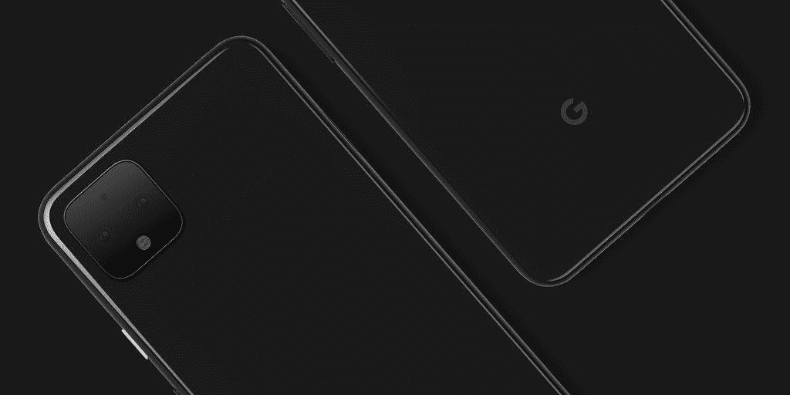

# 谷歌相机代码暗示谷歌像素 4 可能有一个长焦镜头

> 原文：<https://www.xda-developers.com/google-pixel-4-telephoto-lens-google-camera/>

当谷歌在 2016 年发布其第一款 Pixel 智能手机时，该公司展示了其相机软件在竞争中的领先优势。得益于像[夜视](https://www.xda-developers.com/google-pixel-night-sight-google-camera-review/)和超分辨率变焦这样的新功能，谷歌的像素相机继续给人留下深刻印象，但智能手机世界的其他部分正在赶上谷歌[，如果不是在变焦和低光等领域已经超过他们](https://www.xda-developers.com/huawei-p30-pro-camera-review-50x-zoom/)。到目前为止，谷歌 Pixel 智能手机在每个型号上都只有一个后置摄像头，但谷歌已经[证实](https://www.xda-developers.com/google-pixel-4-teaser/)这将随着 2019 年的 Pixel 而改变。谷歌 Pixel 4 将至少有两个后置摄像头，由于我们在最新的谷歌相机应用程序中发现的代码，看起来谷歌将在下一个 Pixel 上引入长焦镜头。

 *谷歌官方分享的谷歌 Pixel 4 营销渲染图。渲染确认了方形摄像头凸起，其中包含两个后置摄像头，一个 LED 闪光灯和一个未知的第三传感器。*

## 谷歌摄像头 6.3 从 Android Q Beta 5 泄露

近 4 个月前，谷歌[发布了](https://www.xda-developers.com/android-q-dp1-google-pixel-2-google-pixel-3/)下一个主要 Android 版本:Android Q 的首次公开预览。该公司已承诺在今年第三季度第一个 Android Q 稳定版本上线前 [6 个公开测试版](https://www.xda-developers.com/android-q-beta-release-schedule/)。Android Q beta 4 上个月早些时候在[推出](https://www.xda-developers.com/android-q-beta-4-released-google-pixel/)，第五个测试版应该很快就会发布，但是[一些幸运的用户](https://twitter.com/MishaalRahman/status/1146437359279456259)已经收到了下一个测试版。这个早期发布的 Android Q beta 5 的内部版本号为 QP1A.190626.001，安全补丁为 2019 年 8 月。这意味着该版本不仅是最近才制作的，而且也不打算向公众发布。幸运的是，收到 OTA 的用户之一在 [*APKMirror*](https://www.apkmirror.com/apk/google-inc/camera/camera-6-3-017-253834016-release/) 上分享了谷歌相机应用的更新版本 6.3，我们对其进行了检查，以寻找有关 Pixel 4 的线索。

## 谷歌 Pixel 4——“后置长焦”传感器 ID？

在浏览代码时，我们发现了对“Sabre”的更改，这是谷歌对 Super Res Zoom 的内部代号。一个名为“SABRE_UNZOOMED_TELEPHOTO”的新领域立即引起了我们的注意，然后让我们有了另一个有趣的发现:新的谷歌相机传感器 IDs。我们确认了这些新字段在 Google Camera 6.2 中不存在。

传感器 id 列表包括“前 IR”传感器、“前常规”传感器、“前宽”传感器、“后常规”传感器和“后远摄”传感器。还有“前逻辑”和“后逻辑”传感器，但“逻辑”最有可能是指根据 Android 9 Pie 的[多摄像头 API](https://source.android.com/devices/camera/multi-camera#implementation) 的“由两个或更多指向同一方向的物理摄像头设备组成的逻辑摄像头设备”。[谷歌 Pixel 3](https://www.xda-developers.com/google-pixel-3-xl-camera-software-design-pixel-stand/) 有两个前置摄像头(一个“常规”主镜头和一个广角镜头)和一个后置摄像头，所以在这个列表中仅有的两个不同寻常的 id 是“前置红外”传感器和“后置长焦”传感器。

假设 IR 代表红外线，那么这个 ID 可能是用于面部识别的 IR 传感器。虽然，说实话，我不确定为什么谷歌相机应用程序中会出现这条线。“后置长焦”ID 可能指的是后置的长焦相机，这将是 Pixel 手机的第一款。因为我们知道谷歌 Pixel 4 系列将是第一批双后置摄像头的像素，这意味着“后置长焦”ID 肯定*不是指之前 Pixel 智能手机的任何摄像头。另一方面，Pixel 3 具有前置广角摄像头，因此我们无法确认“前置广角”传感器 ID 是否也指 2019 款 Pixel 上的前置摄像头。最后，后置长焦相机的存在意味着官方渲染中显示的可能没有后置广角镜头，这可能会让一些人失望。*

如果谷歌 Pixel 4 确实有一个辅助后置长焦摄像头，那么我们真正能说的是，它将支持某种非数字变焦。在不知道长焦和主传感器焦距的情况下，我们无法对光学变焦做出估计。不过，我们可以猜测，谷歌将通过其数字[超分辨率变焦技术](https://ai.googleblog.com/2018/10/see-better-and-further-with-super-res.html)来补充长焦镜头的变焦。我怀疑我们会看到与 [OPPO Reno 10X Zoom 或华为 P30 Pro](https://www.xda-developers.com/oppo-reno-10x-zoom-vs-huawei-p30-pro/) 不相上下的结果，但谷歌今年可能会再次给我们带来惊喜。

## 夜视的细微改进？

我们还发现了暗示夜视即将发生变化的代码，尽管我们不完全确定它们是什么意思。有一个参数提到了“天空分割”，另一个参数提到了与“乌贼”相关的功能，这是谷歌对夜视的代号。一个名为“getOptimize_sky”的方法和另一个名为“setSky_segmentation_gpu”的方法听起来像是谷歌正在对夜视算法进行改进，以更好地区分天空，但我们不确定最终结果会是什么。没有任何字符串或其他文件，我们可以看看这里发生了什么，但我们将继续关注未来的谷歌摄像头更新，以了解更多信息。

* * *

*感谢 PNF 软件为我们提供了使用许可 [JEB Decompiler](https://www.pnfsoftware.com/?aid=xdadev) ，这是一款针对 Android 应用的专业级逆向工程工具。*